# Ayagawa
## 298
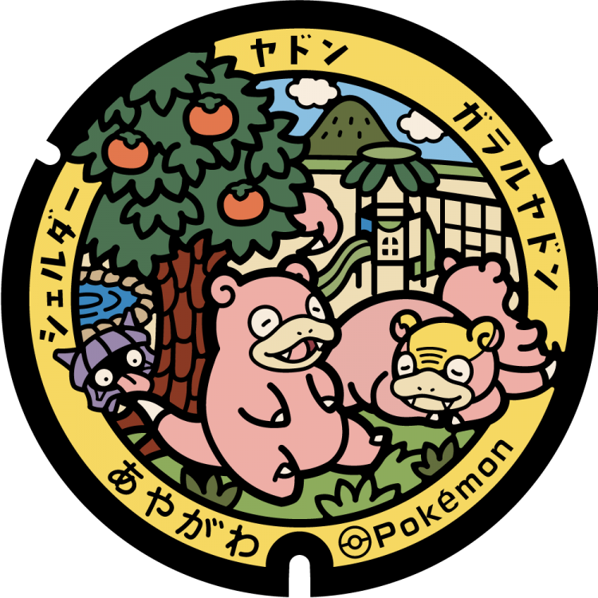
### Pokémon Featured: Slowpoke, Galarian Slowpoke, Shellder
### Coordinates: 34.247395, 133.932774
---
# Utazu
## 97
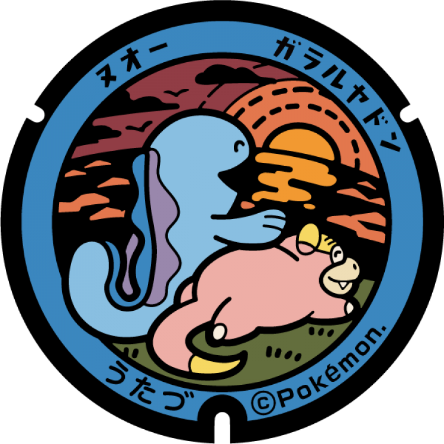
### Pokémon Featured: Galarian Slowpoke, Quagsire
### Coordinates: 34.313426, 133.807526
---
# Mannō
## 43
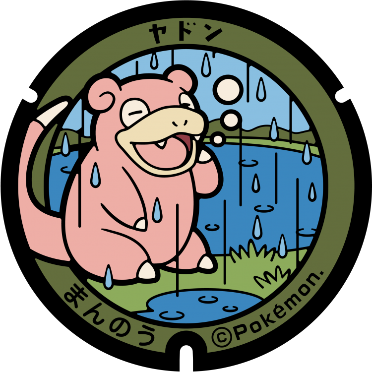
### Pokémon Featured: Slowpoke
### Coordinates: 34.173339, 133.871387
---
# Tadotsu
## 42
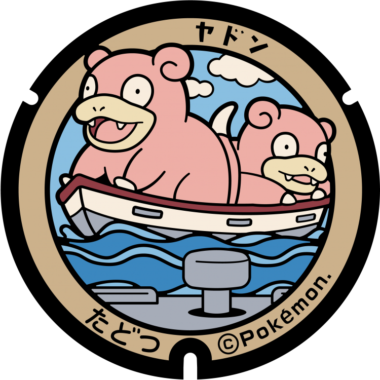
### Pokémon Featured: Slowpoke
### Coordinates: 34.272282, 133.757247
---
# Kotohira
## 41
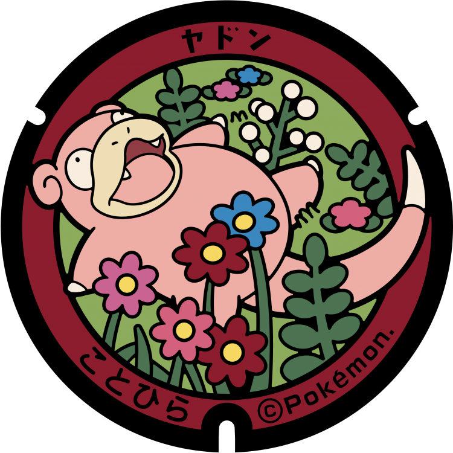
### Pokémon Featured: Slowpoke
### Coordinates: 34.187735, 133.819896
---
# Ayagawa
## 40

### Pokémon Featured: Slowpoke
### Coordinates: 34.250399, 133.917073
---
# Naoshima
## 39
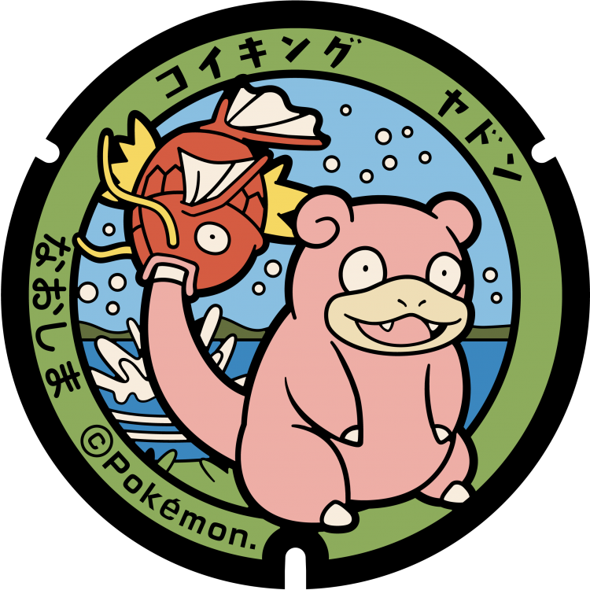
### Pokémon Featured: Slowpoke, Magikarp
### Coordinates: 34.455827, 133.975492
---
# Miki
## 38
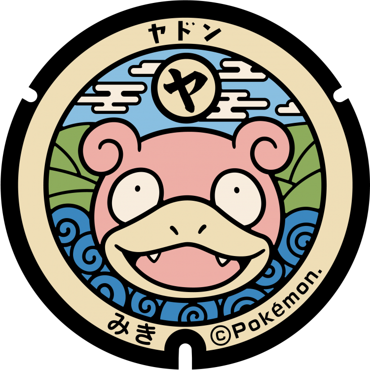
### Pokémon Featured: Slowpoke
### Coordinates: 34.268586, 134.134567
---
# Shōdoshima
## 37
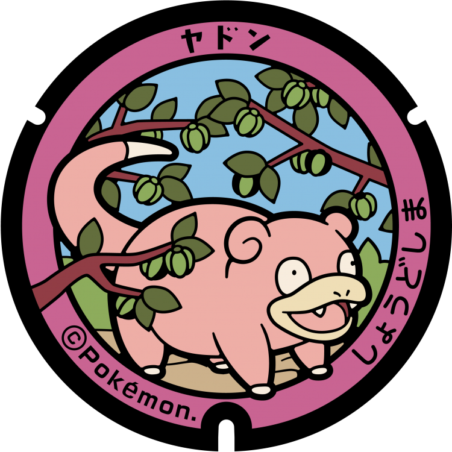
### Pokémon Featured: Slowpoke
### Coordinates: 34.470854, 134.23587
---
# Tonoshō
## 36

### Pokémon Featured: Slowpoke, Ditto
### Coordinates: 34.482694, 134.187512
---
# Mitoyo
## 35
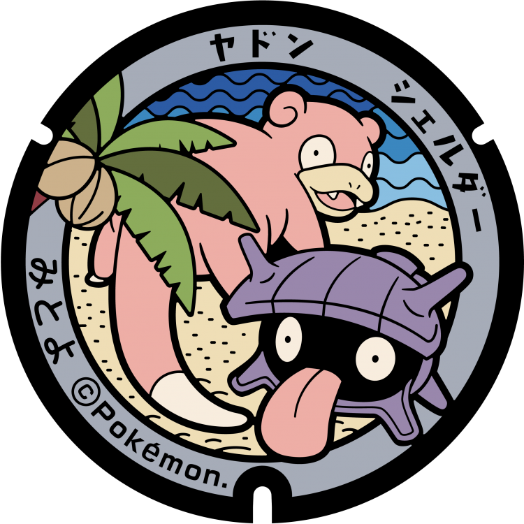
### Pokémon Featured: Slowpoke, Shellder
### Coordinates: 34.268799, 133.632222
---
# Higashikagawa
## 34
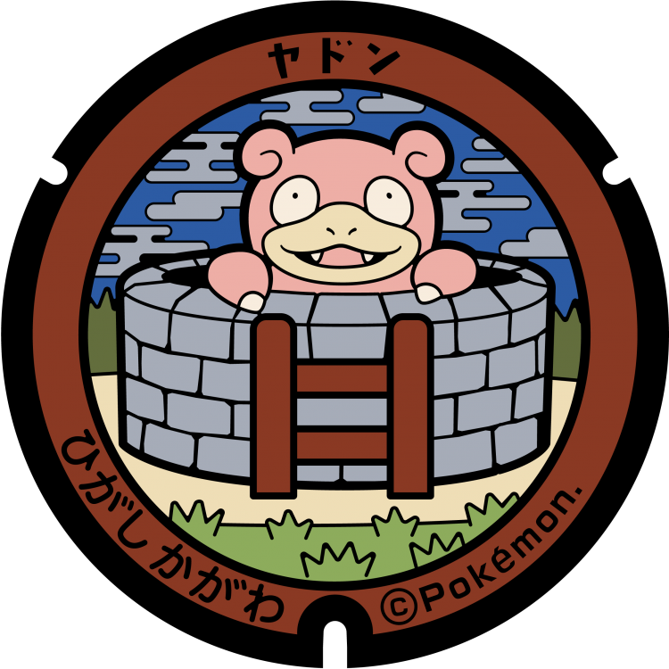
### Pokémon Featured: Slowpoke
### Coordinates: 34.251174, 134.333457
---
# Sanuki
## 33
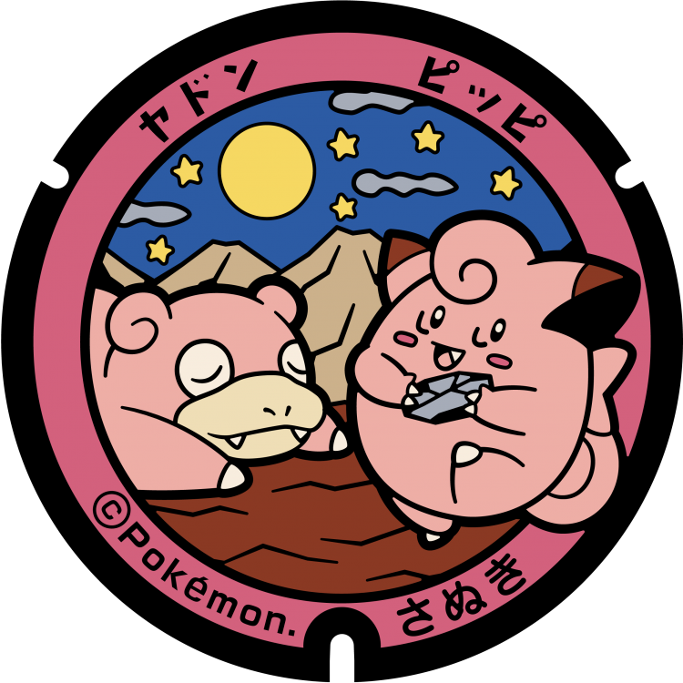
### Pokémon Featured: Slowpoke, Clefairy
### Coordinates: 34.321305, 134.173241
---
# Kan'onji
## 32
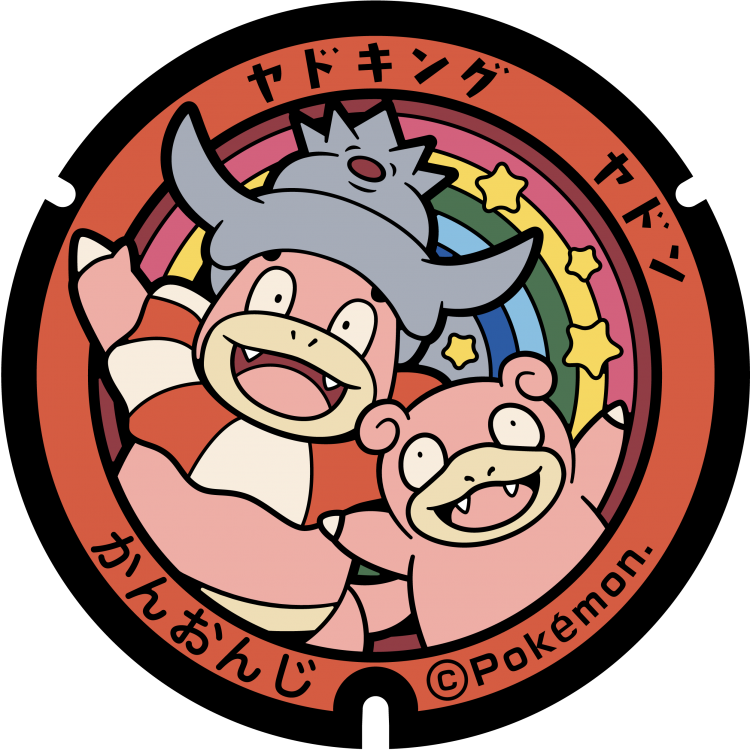
### Pokémon Featured: Slowpoke, Slowking
### Coordinates: 34.125275, 133.655211
---
# Zentsūji
## 31
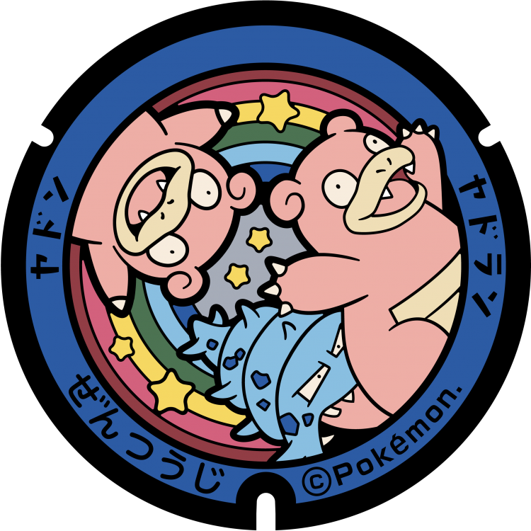
### Pokémon Featured: Slowpoke, Slowbro
### Coordinates: 34.22531, 133.7773
---
# Sakaide
## 30

### Pokémon Featured: Slowpoke
### Coordinates: 34.312992, 133.856292
---
# Marugame
## 29
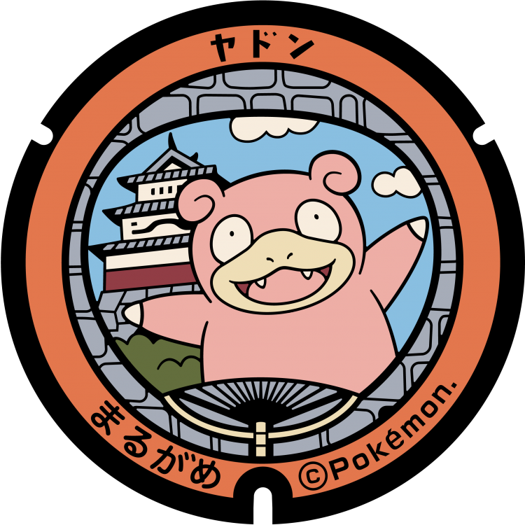
### Pokémon Featured: Slowpoke
### Coordinates: 34.292014, 133.793951
---
# Takamatsu
## 28
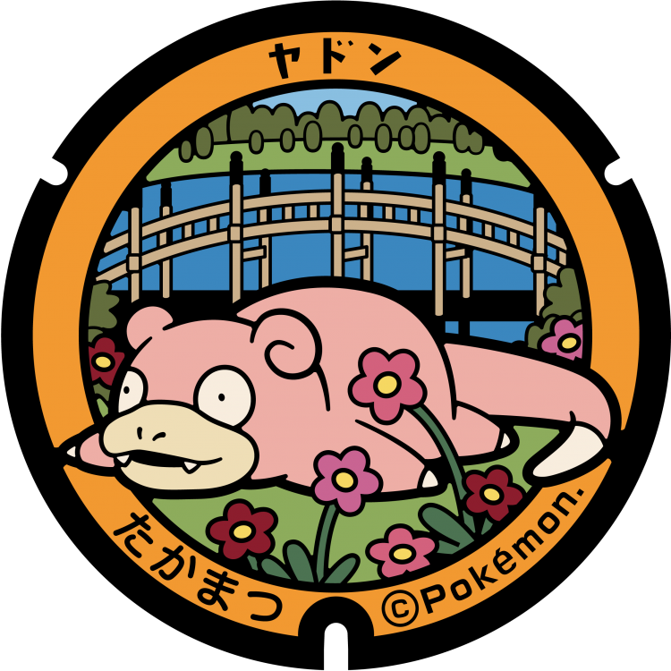
### Pokémon Featured: Slowpoke
### Coordinates: 34.338888, 134.049052
---