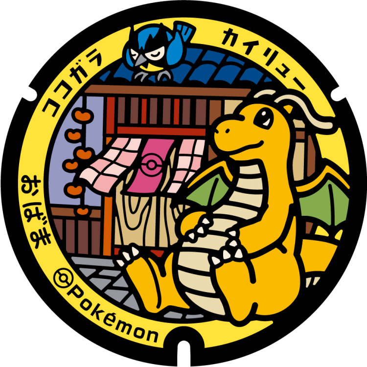
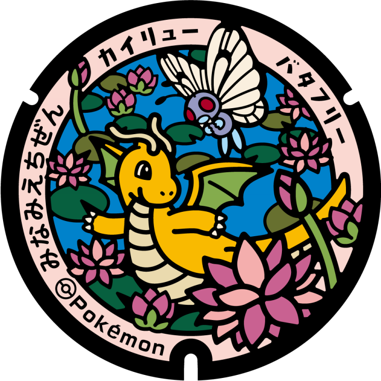
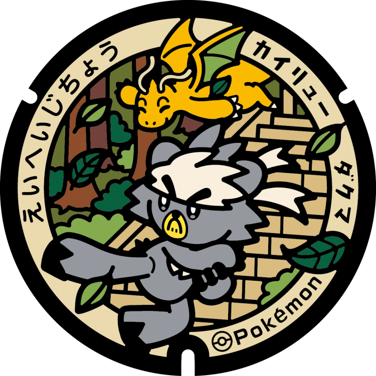
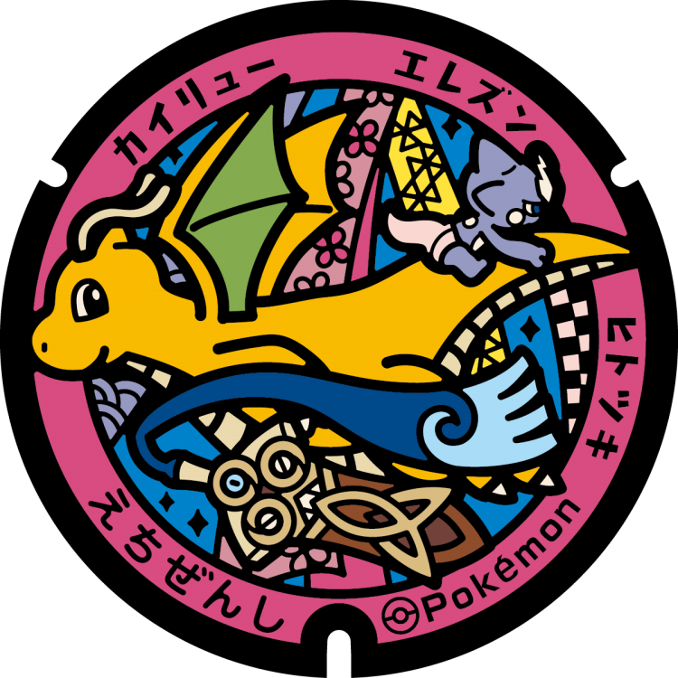

# Ikeda
## 368

### Pokémon Featured: Dragonite, Dragonair, Dratini
### Coordinates: 35.890505, 136.339213
---
# Obama
## 367

### Pokémon Featured: Dragonite, Rookidee
### Coordinates: 35.494981, 135.741761
---
# Minamiechizen
## 366

### Pokémon Featured: Dragonite, Butterfree
### Coordinates: 35.82915, 136.2028
---
# Tsuruga
## 365

### Pokémon Featured: Dragonite, Stunfisk
### Coordinates: 35.661865, 136.074281
---
# Ōno
## 364

### Pokémon Featured: Dragonite
### Coordinates: 35.984502, 136.485931
---
# Mihama
## 341

### Pokémon Featured: Dragonite, Mareanie, Wiglett
### Coordinates: 35.604507, 135.936876
---
# Takahama
## 340

### Pokémon Featured: Dragonite, Tatsugiri
### Coordinates: 35.492951, 135.54556
---
# Eiheiji
## 339

### Pokémon Featured: Dragonite, Kubfu
### Coordinates: 36.079891, 136.399312
---
# Echizen
## 338

### Pokémon Featured: Dragonite, Toxel, Honedge
### Coordinates: 35.895286, 136.198727
---
# Awara
## 337

### Pokémon Featured: Dragonite, Togetic, Zigzagoon
### Coordinates: 36.215613, 136.234226
---
# Katsuyama
## 336

### Pokémon Featured: Dragonite, Archen, Tyrantrum
### Coordinates: 36.056787, 136.492007
---