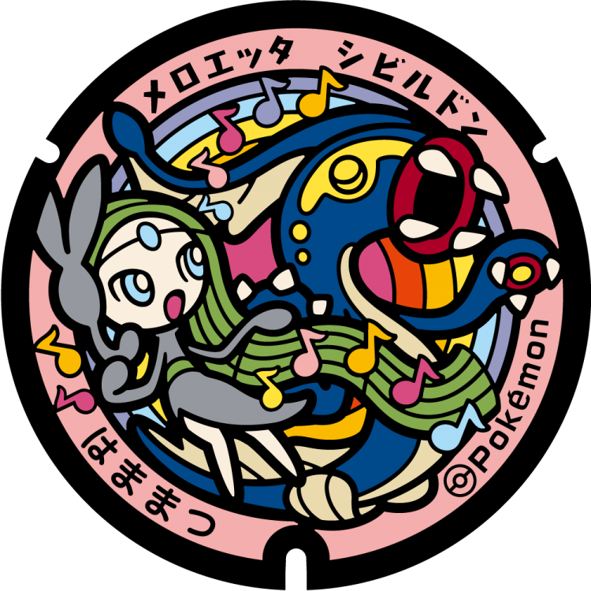
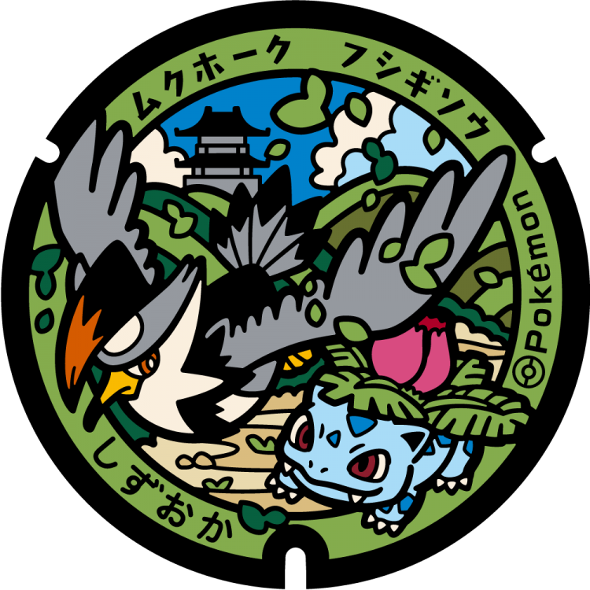

# Izu
## 351

### Pokémon Featured: Pancham, Pangoro
### Coordinates: 34.970285, 138.92774
---
# Fuji
## 350

### Pokémon Featured: Moltres
### Coordinates: 35.161532, 138.617705
---
# Numazu
## 349

### Pokémon Featured: Huntail, Relicanth, Gorebyss
### Coordinates: 35.081579, 138.854731
---
# Hamamatsu
## 348

### Pokémon Featured: Meloetta, Elektross
### Coordinates: 34.704017, 137.732587
----
# Shizuoka
## 347

### Pokémon Featured: Ivysaur, Staraptor
### Coordinates: 34.977499, 138.382564
---