# Biei
## 324

### Pokémon Featured: Alolan Vulpix, Hisuian Braviary
### Coordinates: 43.59198, 142.46372
---
# Bihoro
## 307
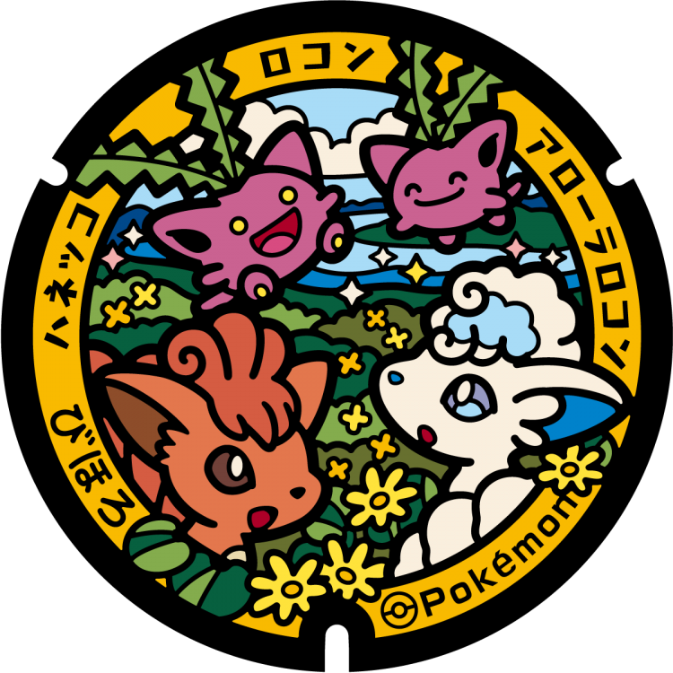
### Pokémon Featured: Vulpix, Alolan Vulpix, Hoppip
### Coordinates: 43.836455, 144.105878
---
# Sarafutsu
## 306
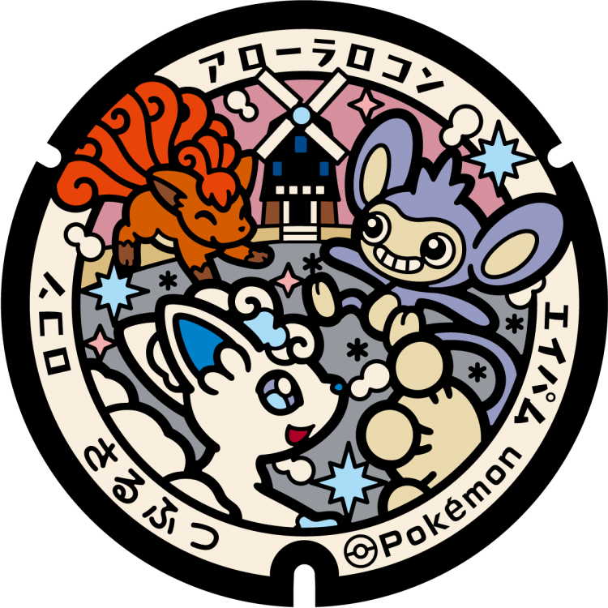
### Pokémon Featured: Vulpix, Alolan Vulpix, Aipom
### Coordinates: 45.329186, 142.177267
---
# Kikonai
## 305

### Pokémon Featured: Vulpix, Alolan Vulpix, Gossifleur
### Coordinates: 41.678024, 140.43558
---
# Utashinai
## 304
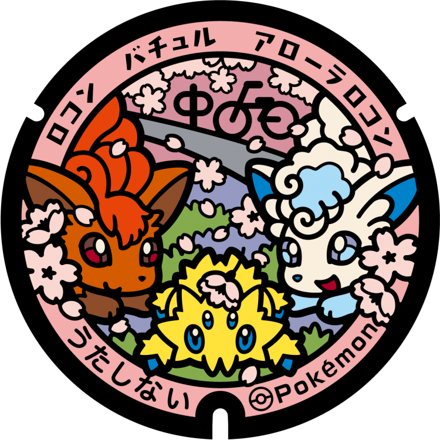
### Pokémon Featured: Vulpix, Alolan Vulpix, Joltik
### Coordinates: 43.503206, 142.005914
---
# Kitami
## 303
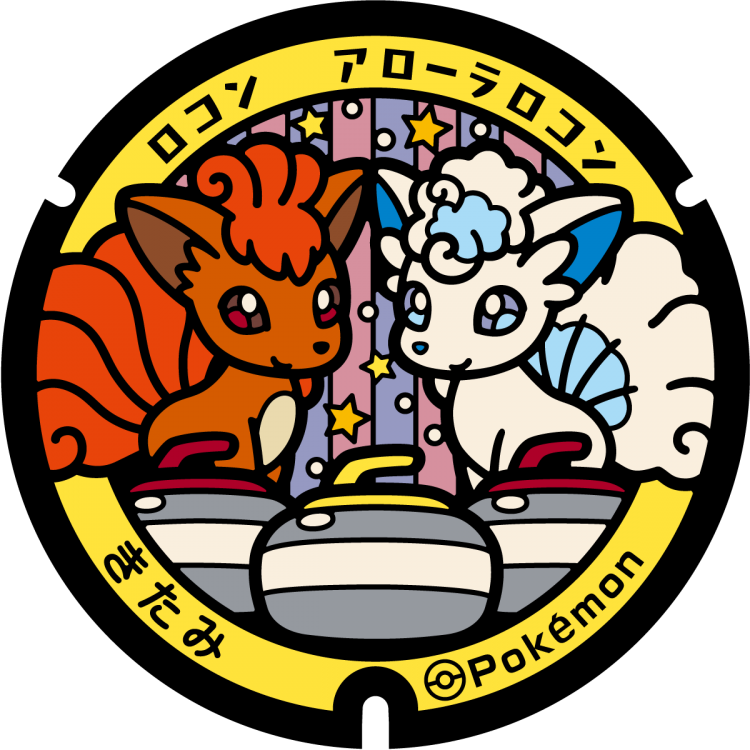
### Pokémon Featured: Vulpix, Alolan Vulpix
### Coordinates: 43.75359, 143.500587
---
# Muroran
## 302
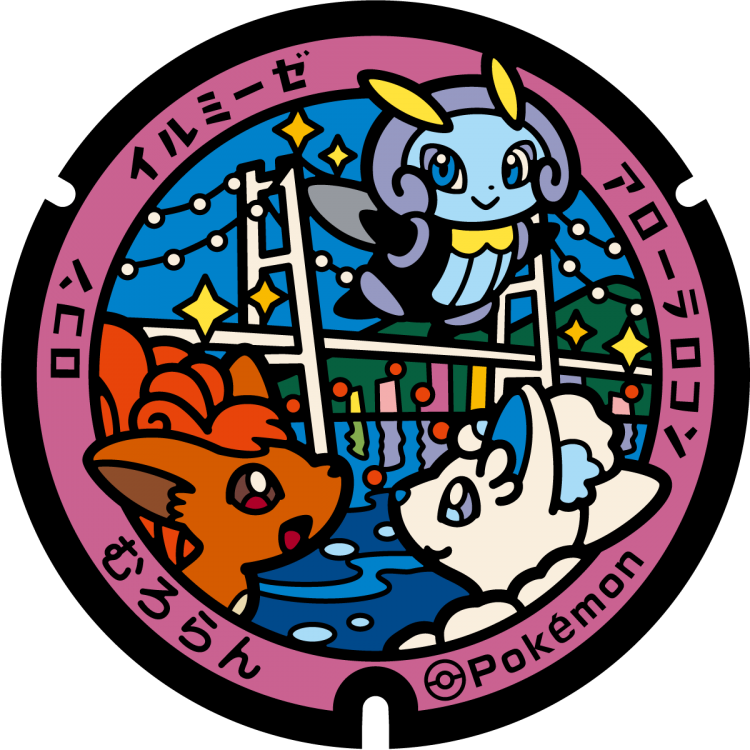
### Pokémon Featured: Vulpix, Alolan Vulpix, Illumise
### Coordinates: 42.313837, 140.973986
---
# Tōbetsu
## 278
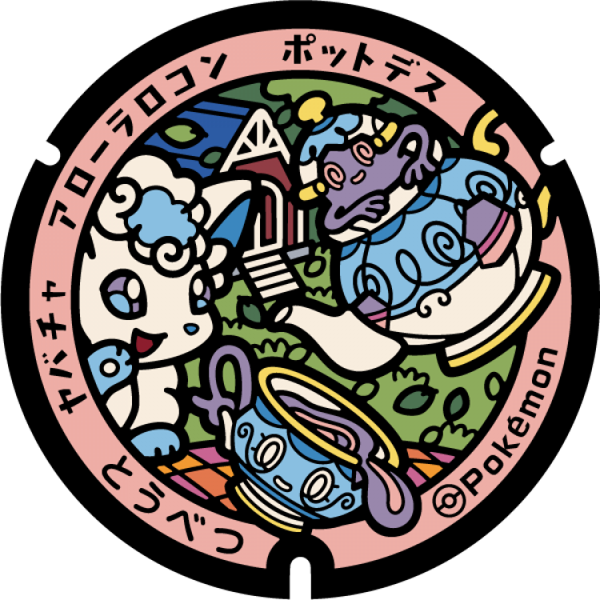
### Pokémon Featured: Alolan Vulpix, Sinistea, Polteageist
### Coordinates: 43.177162, 141.448523
---
# Erimo
## 221

### Pokémon Featured: Alolan Vulpix, Lycanroc
### Coordinates: 42.01782, 143.14619
---
# Shari
## 220
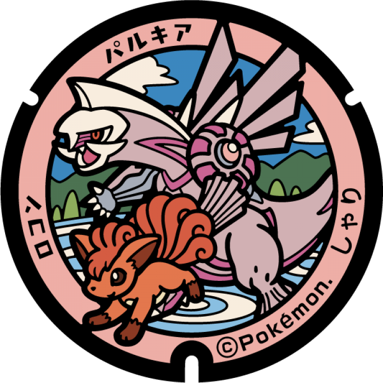
### Pokémon Featured: Vulpix, Palkia
### Coordinates: 44.06884, 144.99062
---
# Higasikawa
## 219

### Pokémon Featured: Alolan Vulpix, Dialga
### Coordinates: 43.698404, 142.507039
---
# Akaigawa
## 218

### Pokémon Featured: Alolan Vulpix, Vanillite, Hatenna
### Coordinates: 43.05125, 140.844262
---
# Abashiri
## 217

### Pokémon Featured: Alolan Vulpix, Weavile
### Coordinates: 44.021949, 144.274423
---
# Obihiro
## 216

### Pokémon Featured: Vulpix, Alolan Vulpix, Mudbray
### Coordinates: 42.918205, 143.202563
---
# Kushiro
## 215

### Pokémon Featured: Alolan Vulpix, Decidueye
### Coordinates: 43.144027, 144.14549
---
# Asahikawa
## 214

### Pokémon Featured: Alolan Vulpix, Eiscue, Cubchoo
### Coordinates: 43.759596, 142.348509
---
# Nakashibetsu
## 193
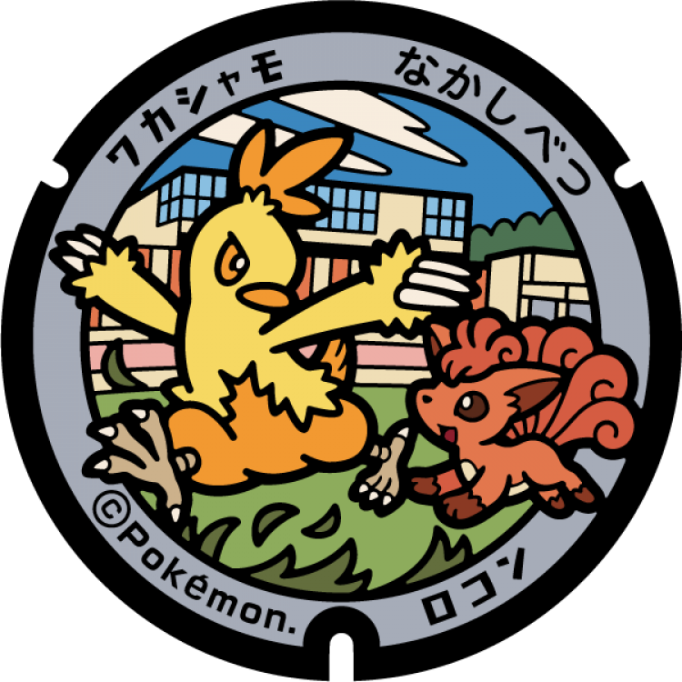
### Pokémon Featured: Vulpix, Combusken
### Coordinates: 43.554566, 144.969609
---
# Rikubetsu
## 192
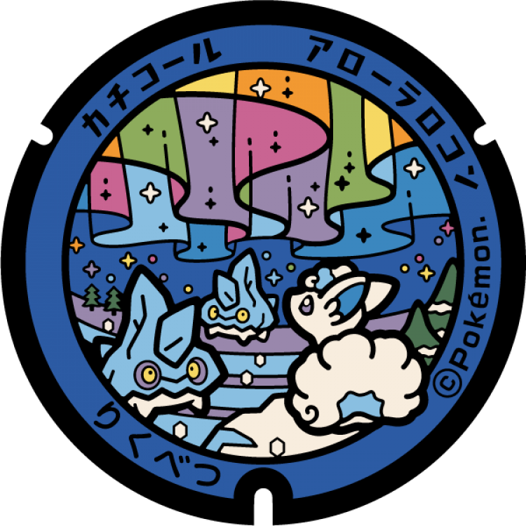
### Pokémon Featured: Alolan Vulpix, Bergmite
### Coordinates: 43.467701, 143.742721
---
# Honbetsu
## 191

### Pokémon Featured: Vulpix, Ditto
### Coordinates: 43.125781, 143.613441
---
# Noboribetsu
## 190
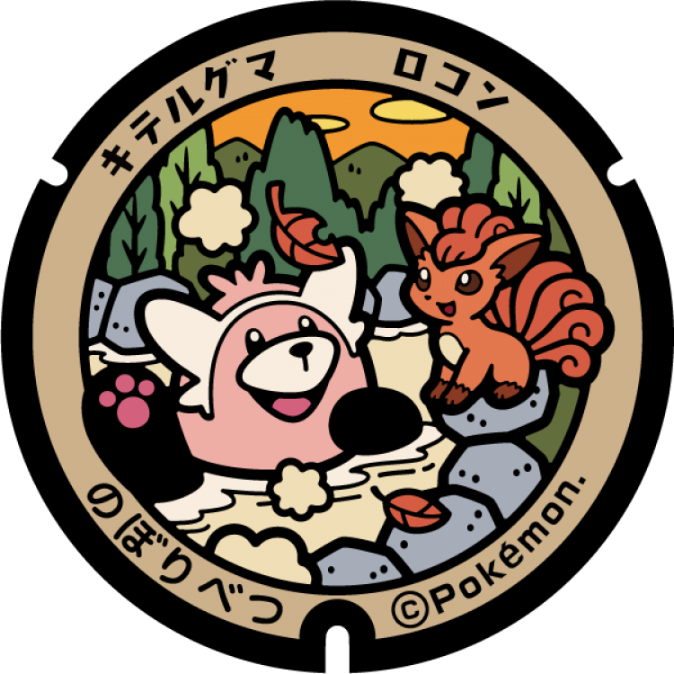
### Pokémon Featured: Vulpix, Bewear
### Coordinates: 42.455042, 141.181794
---
# Nemuro
## 189

### Pokémon Featured: Alolan Vulpix, Mr. Rime
### Coordinates: 43.335936, 145.598194
---
# Otaru
## 188
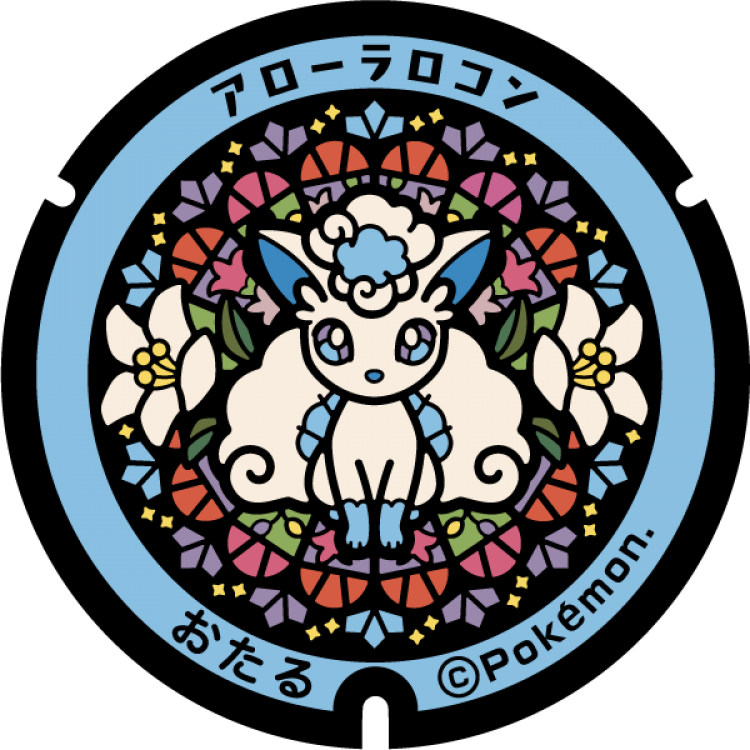
### Pokémon Featured: Alolan Vulpix
### Coordinates: 43.195544, 140.998285
---
# Hakodate
## 187
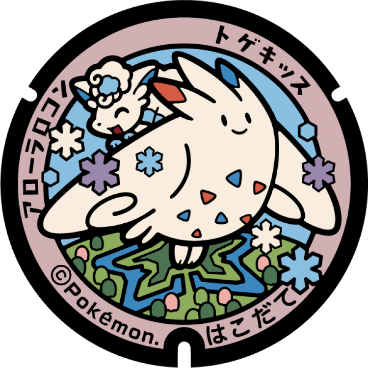
### Pokémon Featured: Alolan Vulpix, Togekiss
### Coordinates: 41.755926, 140.715684
---
# Kembuchi
## 143

### Pokémon Featured: Alolan Vulpix, Honedge
### Coordinates: 44.10003, 142.35931
---
# Kamifurano
## 142

### Pokémon Featured: Alolan Vulpix, Delcatty
### Coordinates: 43.462246, 142.479068
---
# Mikasa
## 141
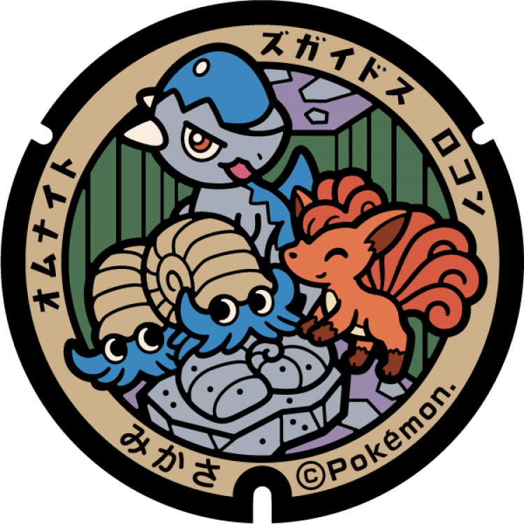
### Pokémon Featured: Vulpix, Omanyte, Cranidos
### Coordinates: 43.261317, 141.962667
---
# Tomakomai
## 140

### Pokémon Featured: Vulpix, Ninetails
### Coordinates: 42.635755, 141.61009
---
# Ashoro
## 73
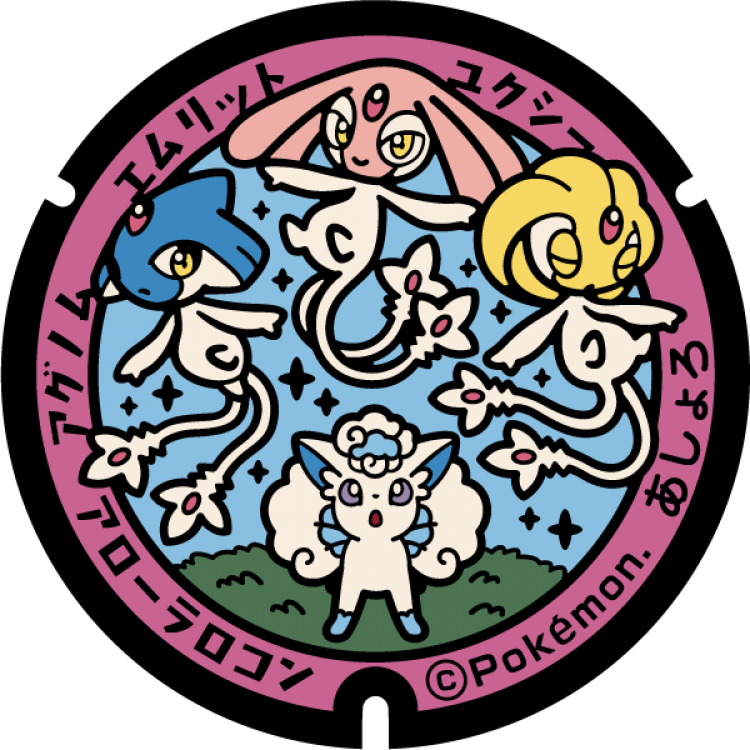
### Pokémon Featured: Alolan Vulpix, Uxie, Mesprit, Azelf
### Coordinates: 43.244229, 143.546753
---
# Shintoku
## 72
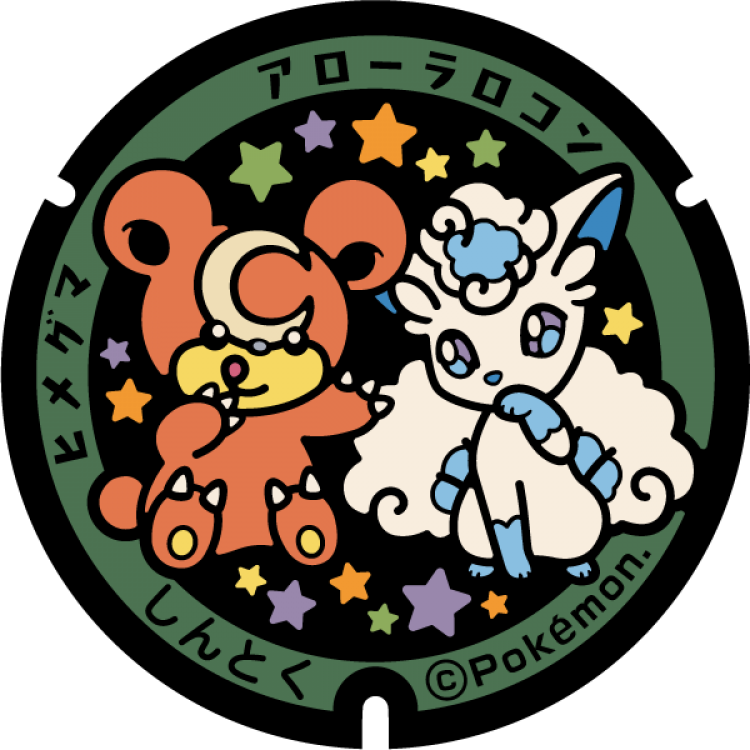
### Pokémon Featured: Alolan Vulpix, Teddiursa
### Coordinates: 43.082684, 142.832927
---
# Ōzora
## 71
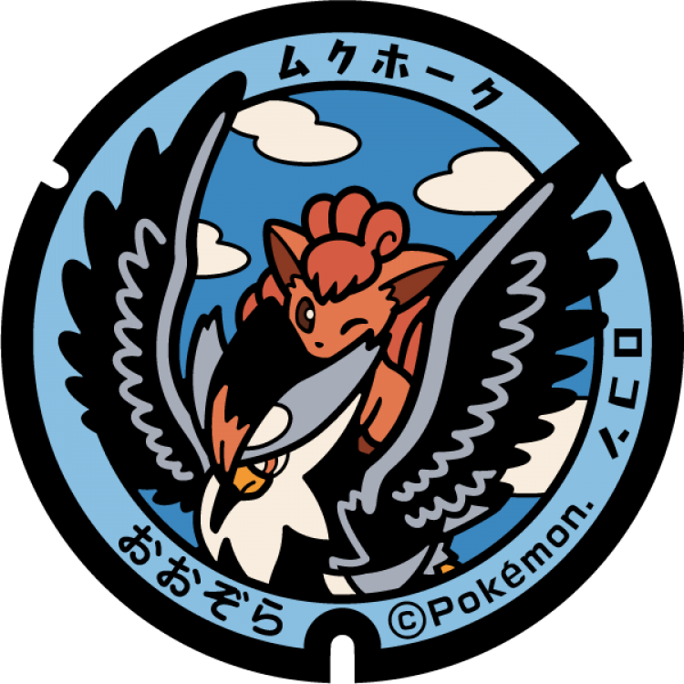
### Pokémon Featured: Vulpix, Staraptor
### Coordinates: 43.915555, 144.17137
---
# Engaru
## 70

### Pokémon Featured: Alolan Vulpix, Froslass
### Coordinates: 44.021878, 143.497131
---
# Mombetsu
## 69

### Pokémon Featured: Alolan Vulpix, Spheal
### Coordinates: 44.334641, 143.372211
---
# Toyotomi
## 68
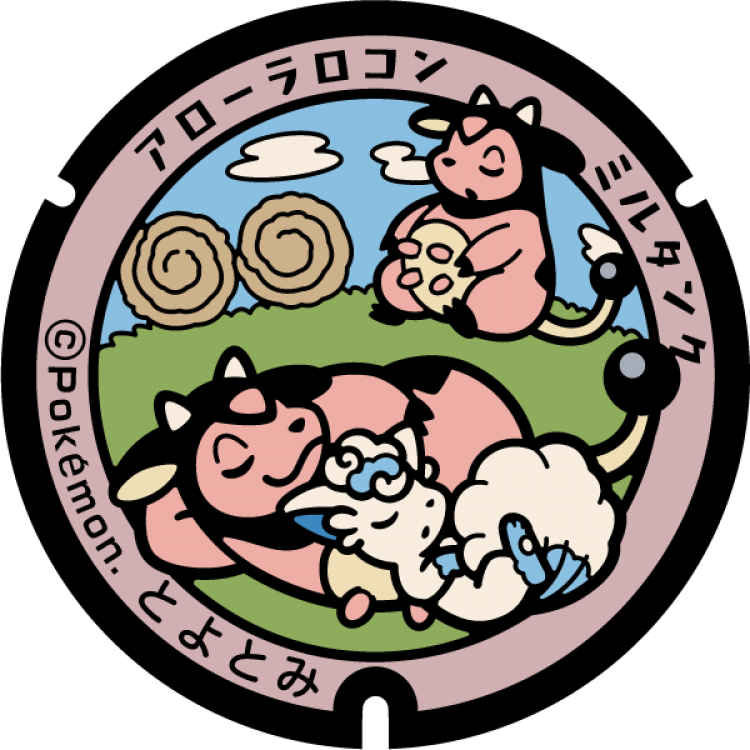
### Pokémon Featured: Alolan Vulpix, Miltank
### Coordinates: 45.103245, 141.778643
---
# Wakkai
## 67

### Pokémon Featured: Alolan Vulpix, Alolan Ninetails
### Coordinates: 45.417236, 141.677095
---
# Teshio
## 66

### Pokémon Featured: Vulpix, Alolan Vulpix
### Coordinates: 44.88452, 141.74797
---
# Pippu
## 65

### Pokémon Featured: Alolan Vulpix, Piplup
### Coordinates: 43.875033, 142.471699
---
# Shibetsu
## 64
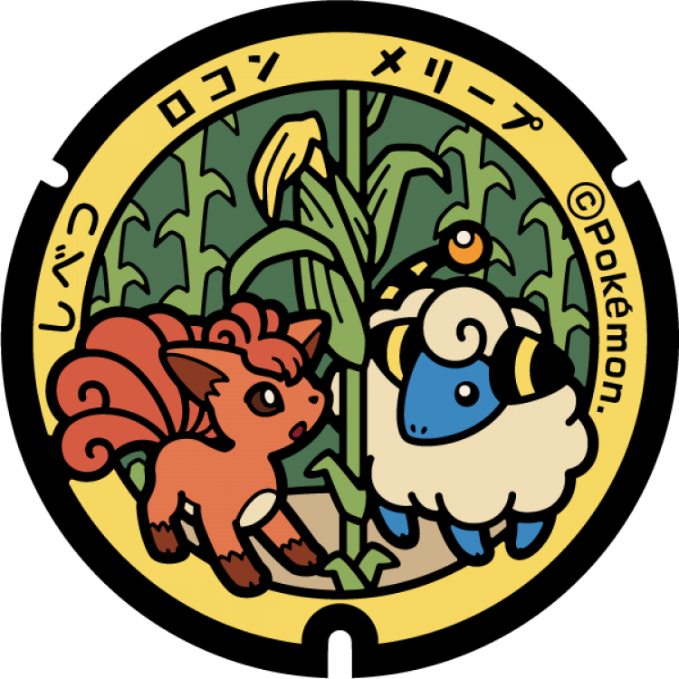
### Pokémon Featured: Vulpix, Mareep
### Coordinates: 44.175974, 142.392417
---
# Kaminokuni
## 63

### Pokémon Featured: Vulpix, Chimchar
### Coordinates: 41.808398, 140.095409
---
# Mori
## 62

### Pokémon Featured: Alolan Vulpix, Inkay
### Coordinates: 42.108855, 140.572941
---
# Tōyako
## 61

### Pokémon Featured: Vulpix, Swinub
### Coordinates: 42.566111, 140.819072
---
# Eniwa
## 60
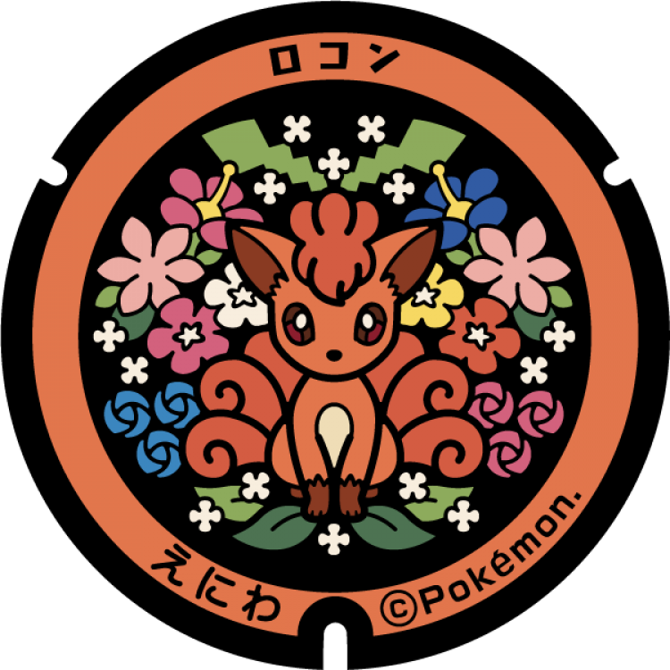
### Pokémon Featured: Vulpix
### Coordinates: 42.897132, 141.585789
---
# Ishikari
## 59
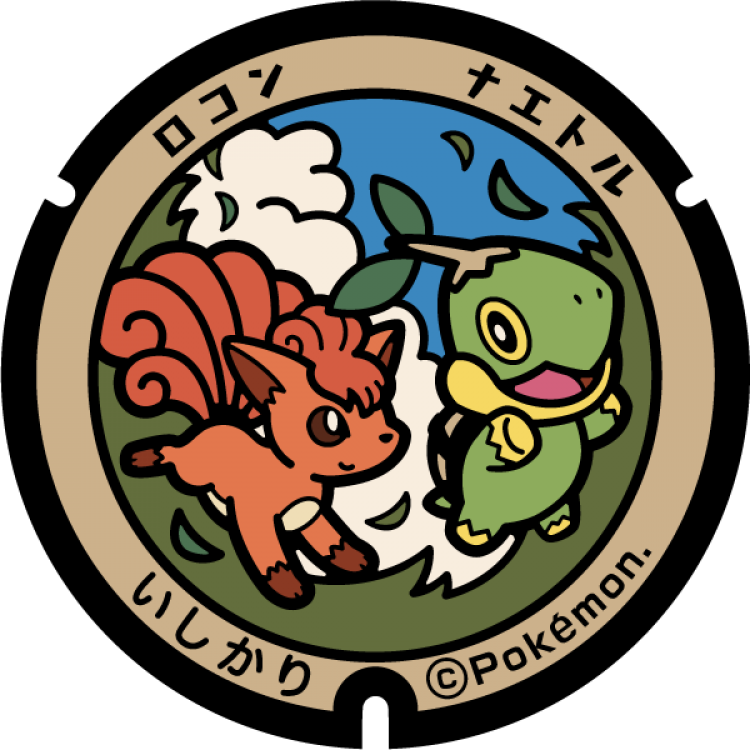
### Pokémon Featured: Vulpix, Turtwig
### Coordinates: 43.585848, 141.423898
---