# Kitakami
## 323

### Pokémon Featured: Golem, Bisharp
### Coordinates: 39.281115, 141.122747
---
# Ichinohe
## 270

### Pokémon Featured: Geodude, Baltoy
### Coordinates: 40.20885, 141.30468
---
# Kunohe
## 269
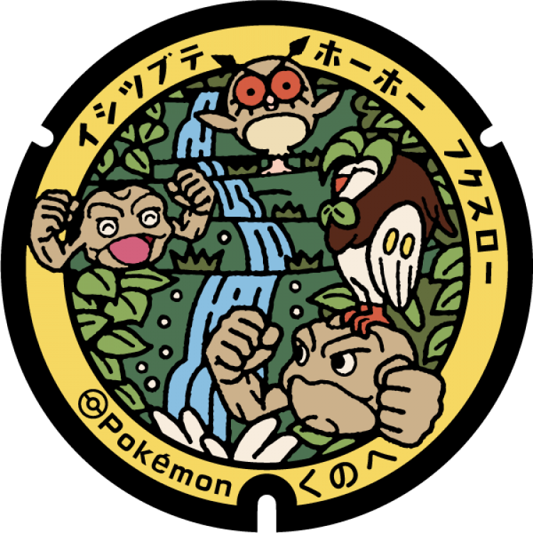
### Pokémon Featured: Geodude, Hoothoot, Dartrix
### Coordinates: 40.24854, 141.416759
---
# Karumai
## 268
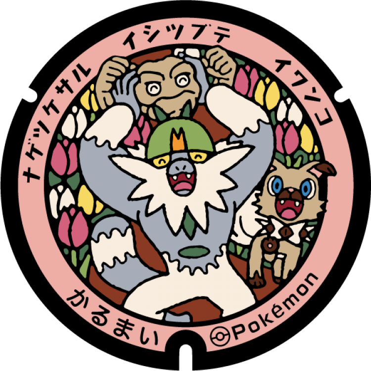
### Pokémon Featured: Geodude, Passimian, Rockruff
### Coordinates: 40.322649, 141.381779
---
# Hiraizumi
## 267
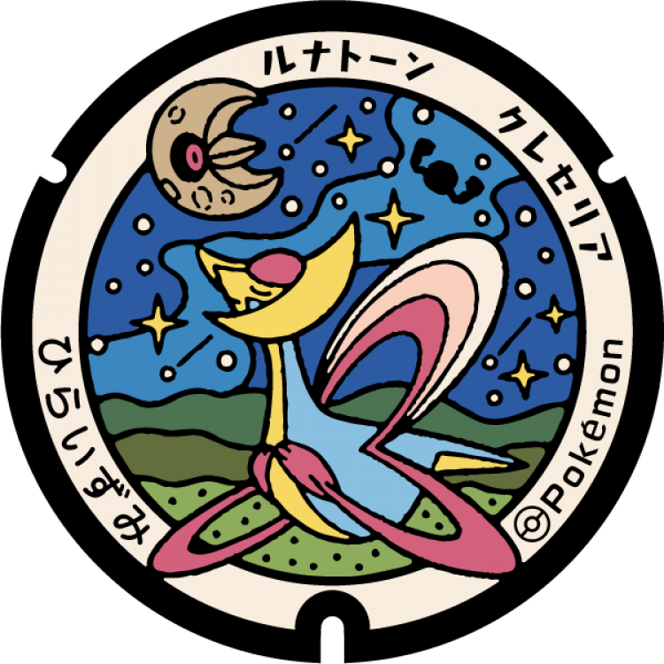
### Pokémon Featured: Cresselia, Lunatone
### Coordinates: 38.986635, 141.108167
---
# Nishiwaga
## 266
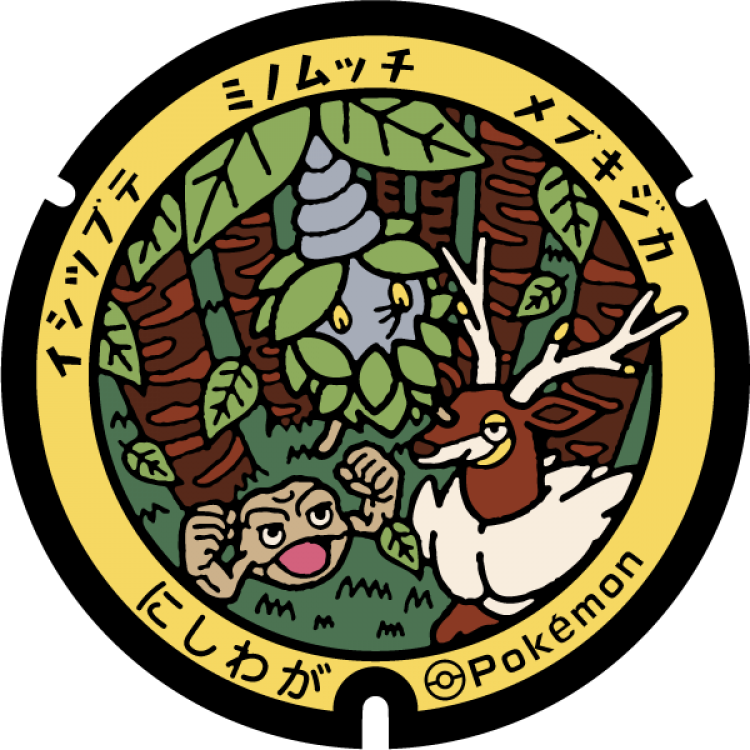
### Pokémon Featured: Geodude, Burmy, Sawsbuck
### Coordinates: 39.31446, 140.77649
---
# Shiwa
## 265

### Pokémon Featured: Geodude, Steenee
### Coordinates: 39.554641, 141.158293
---
# Iwate
## 264

### Pokémon Featured: Geodude, Ditto, Alolan Geodude
### Coordinates: 39.968579, 141.213736
---
# Takizawa
## 263
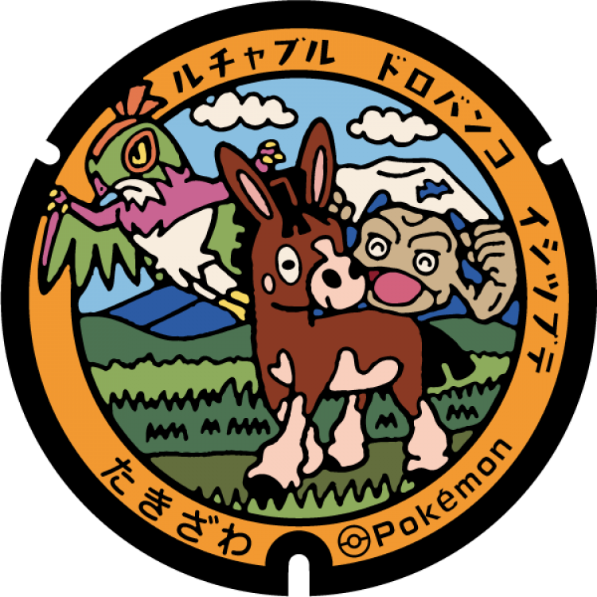
### Pokémon Featured: Geodude, Mudbray, Hawlucha
### Coordinates: 39.734, 141.07829
---
# Hachimantai
## 262
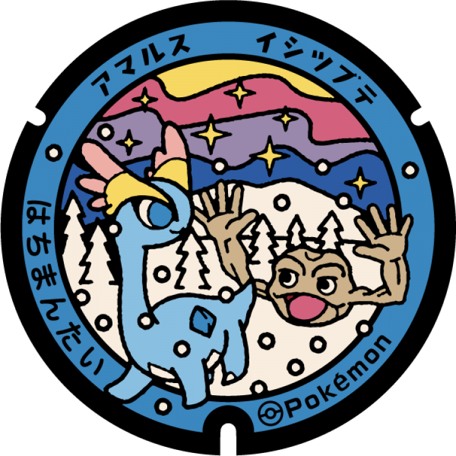
### Pokémon Featured: Geodude, Amaura
### Coordinates: 39.87958, 141.099388
---
# Ninohe
## 261
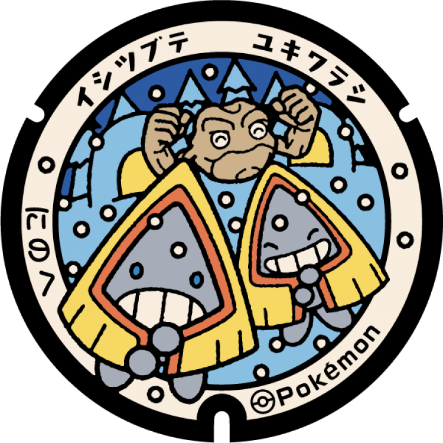
### Pokémon Featured: Geodude, Snorunt
### Coordinates: 40.320335, 141.318849
---
# Ichinoseki
## 260
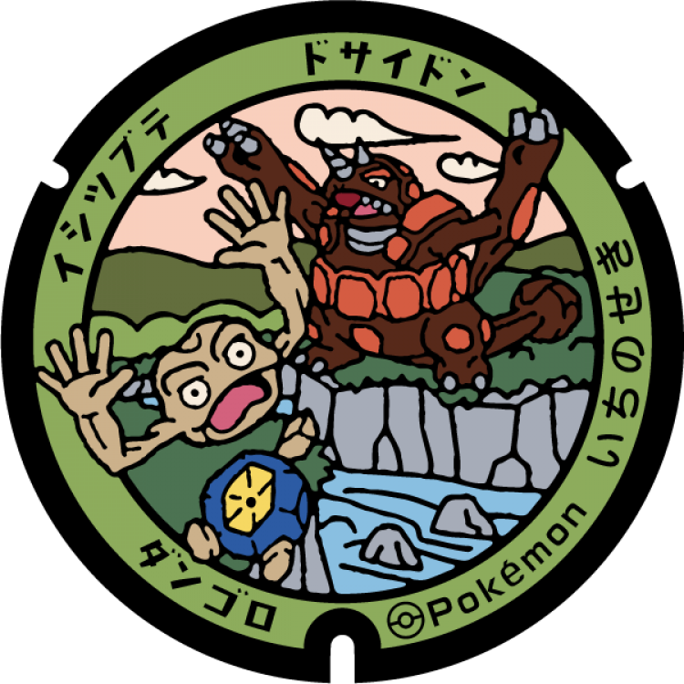
### Pokémon Featured: Geodude, Roggenrola, Rhyperior
### Coordinates: 38.98958, 141.25527
---
# Tono
## 259

### Pokémon Featured: Geodude, Lombre, Ludicolo
### Coordinates: 39.330638, 141.528872
---
# Hanamaki
## 258

### Pokémon Featured: Geodude, Cosmog, Rayquaza
### Coordinates: 39.392034, 141.11169
---
# Sumita
## 22
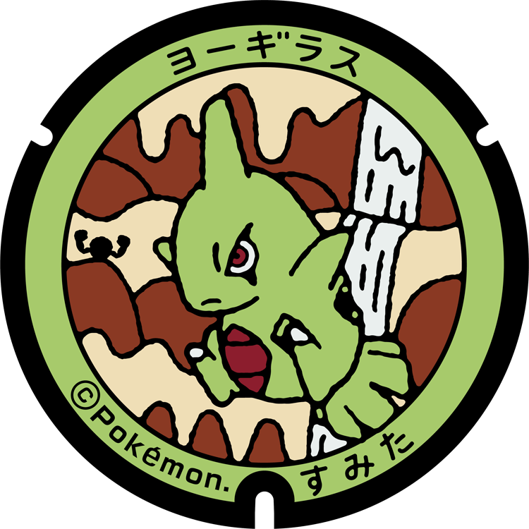
### Pokémon Featured: Larvitar
### Coordinates: 39.142287, 141.574456
---
# Rikuzentakata
## 21

### Pokémon Featured: Rockruff
### Coordinates: 39.01675, 141.628694
---
# Ōfunato
## 20

### Pokémon Featured: Rhyhorn
### Coordinates: 39.085906, 141.710256
---
# Kamaishi
## 19
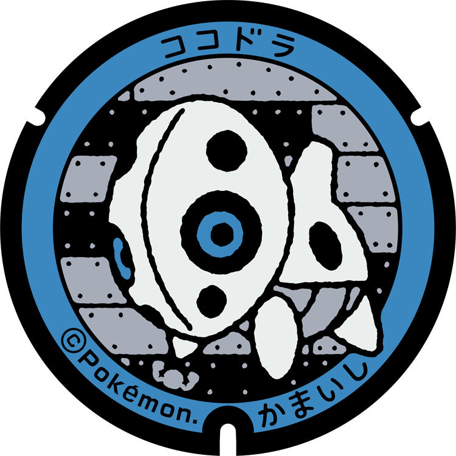
### Pokémon Featured: Aron
### Coordinates: 39.326865, 141.887862
---
# Ōtsuchi
## 18
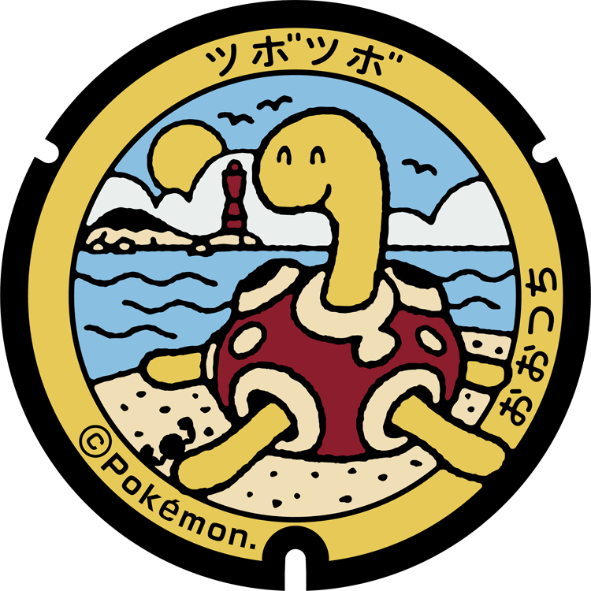
### Pokémon Featured: Shuckle
### Coordinates: 39.357255, 141.90316
---
# Yamada
## 17

### Pokémon Featured: Omanyte
### Coordinates: 39.464186, 141.951043
---
# Miyaka
## 16

### Pokémon Featured: Geodude
### Coordinates: 39.639471, 141.969701
---
# Tanohata
## 15

### Pokémon Featured: Nosepass
### Coordinates: 39.916682, 141.938688
---
# Iwaizumi
## 14
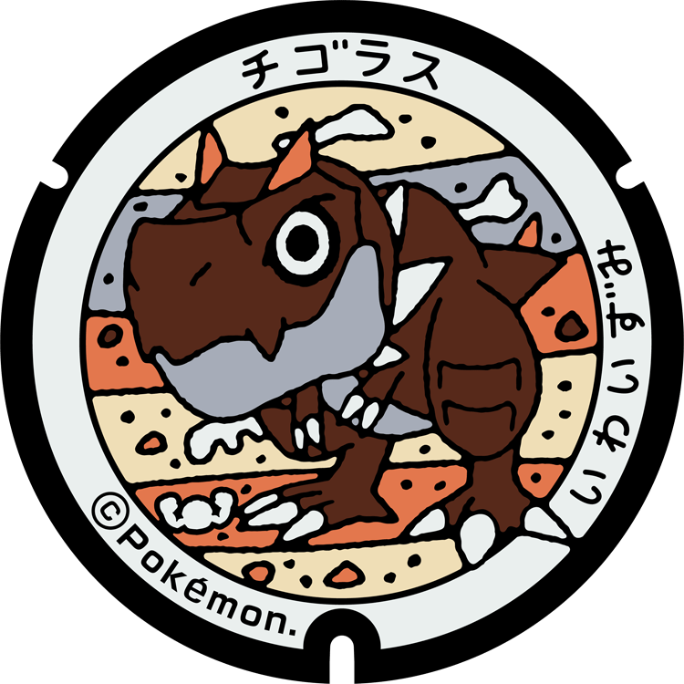
### Pokémon Featured: Tyrunt
### Coordinates: 39.86044, 141.796532
---
# Fudari
## 13
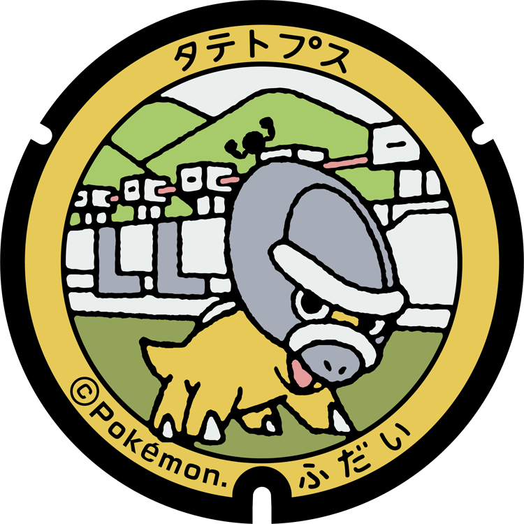
### Pokémon Featured: Shieldon
### Coordinates: 40.002821, 141.885736
---
# Noda
## 12

### Pokémon Featured: Onix
### Coordinates: 40.082726, 141.828678
---
# Kuji
## 299

### Pokémon Featured: Geodude, Aerodactyl, Bibarel
### Coordinates: 40.225538, 141.781703
---
## 11
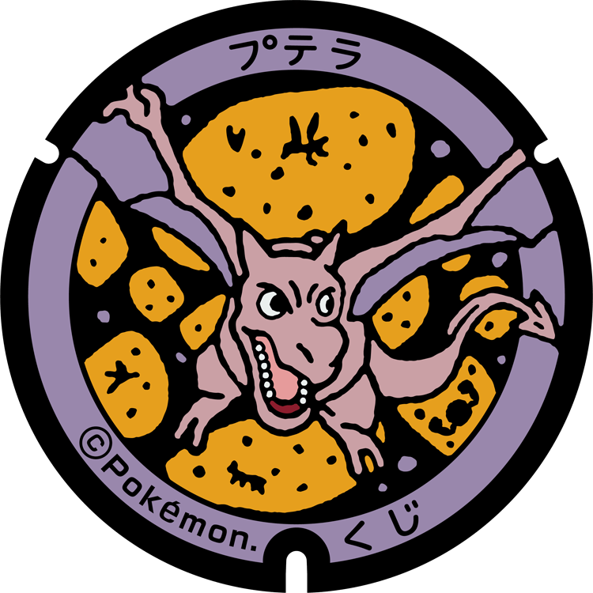
### Pokémon Featured: Aerodactyl
### Coordinates: 40.189742, 141.765832
---
# Hirono
## 10

### Pokémon Featured: Kabuto
### Coordinates: 40.406101, 141.719531
---