# Misato
## 139
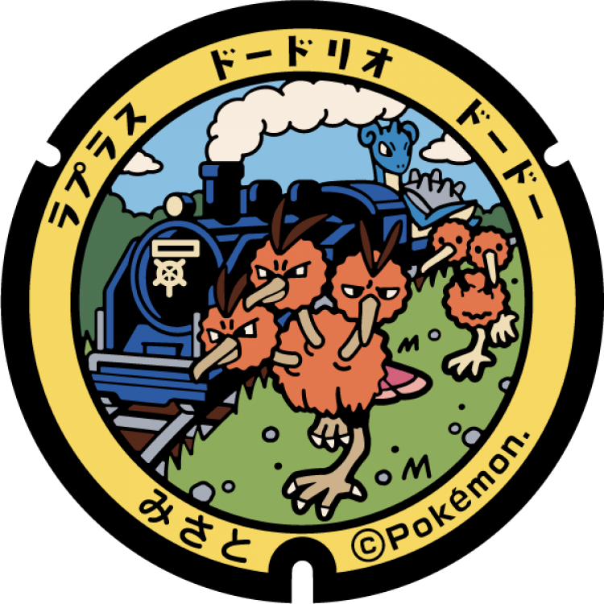
### Pokémon Featured: Lapras, Doduo, Dodrio
### Coordinates: 38.489061, 141.133053
---
# Wakuya
## 138
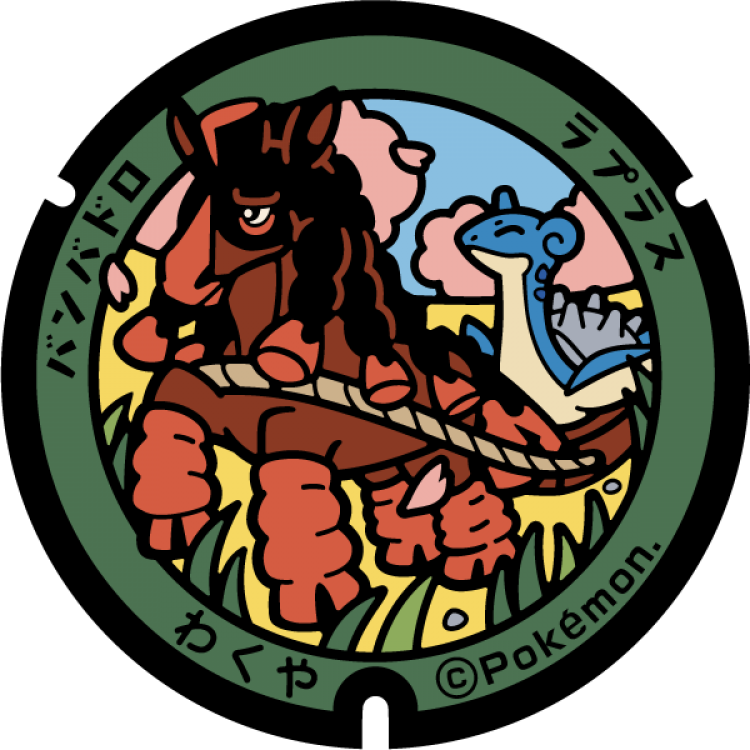
### Pokémon Featured: Lapras, Mudsdale
### Coordinates: 38.53927, 141.126743
---
# Kami
## 137

### Pokémon Featured: Lapras, Roselia
### Coordinates: 38.57215, 140.72859
---
# Shikama
## 136

### Pokémon Featured: Lapras, Lombre
### Coordinates: 38.530136, 140.86142
---
# Ōhira
## 135
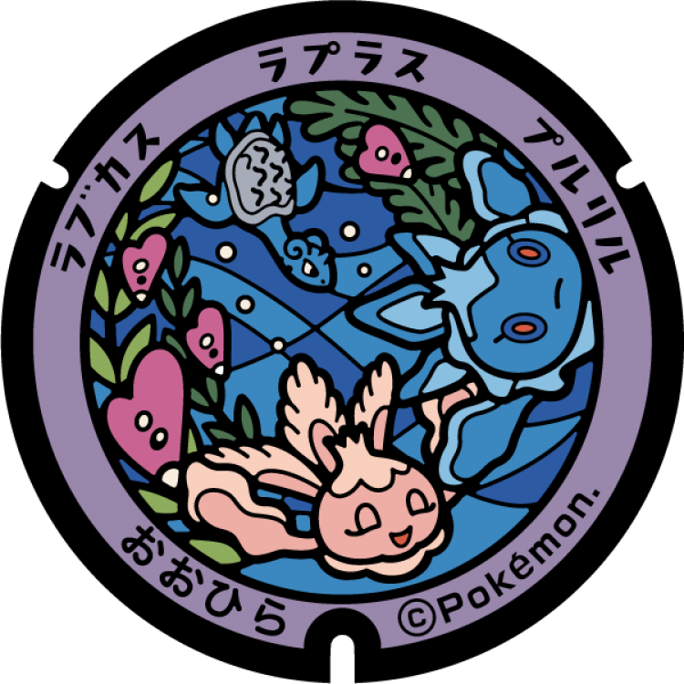
### Pokémon Featured: Lapras, Frillish, Luvdisc
### Coordinates: 38.469438, 140.890229
---
# Ōsato
## 134

### Pokémon Featured: Lapras, Petilil
### Coordinates: 38.424016, 140.992673
---
# Taiwa
## 133
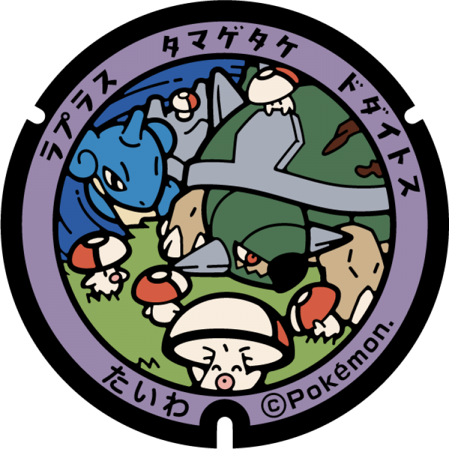
### Pokémon Featured: Lapras, Foongus, Torterra
### Coordinates: 38.437364, 140.885648
---
# Marumori
## 132

### Pokémon Featured: Lapras, Meowth, Espurr
### Coordinates: 37.913873, 140.762531
---
# Kawasaki
## 131
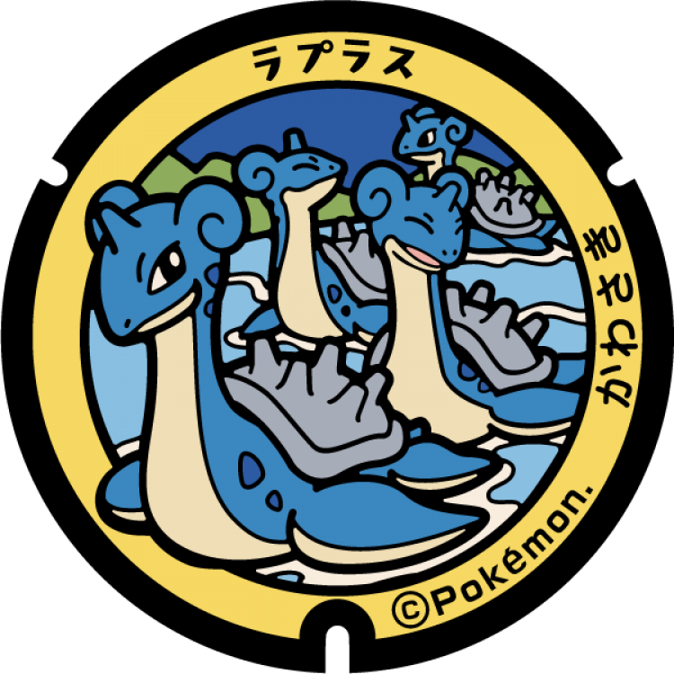
### Pokémon Featured: Lapras
### Coordinates: 38.177539, 140.646436
---
# Shibata
## 130
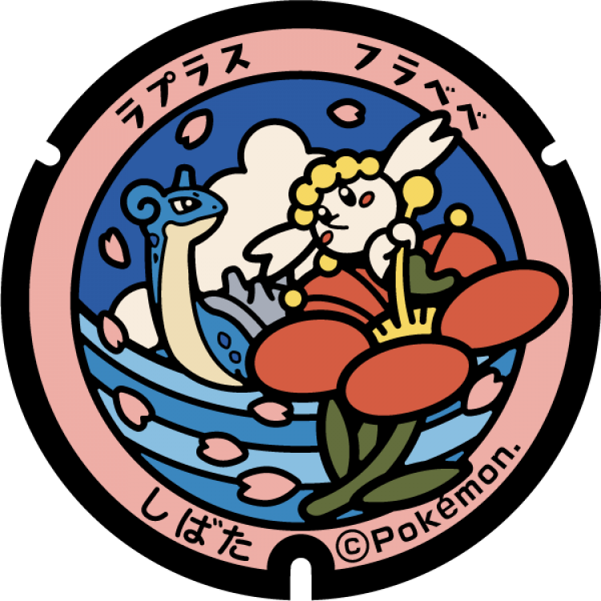
### Pokémon Featured: Lapras, Flabébé
### Coordinates: 38.059143, 140.768239
---
# Murata
## 129

### Pokémon Featured: Lapras, Lickilicky
### Coordinates: 38.119071, 140.717821
---
# Ōgawara
## 128

### Pokémon Featured: Lapras, Cherrim
### Coordinates: 38.048503, 140.738089
---
# Shichikashuku
## 127

### Pokémon Featured: Lapras, Bibarel
### Coordinates: 37.982523, 140.46662
---
# Zaō
## 126
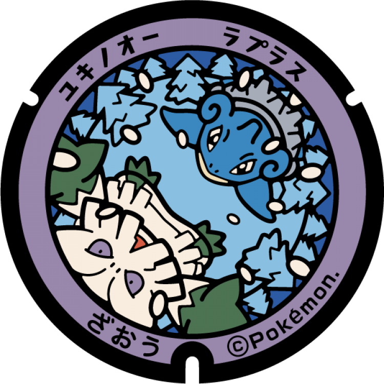
### Pokémon Featured: Lapras, Abomasnow
### Coordinates: 38.123663, 140.577192
---
# Tomiya
## 125
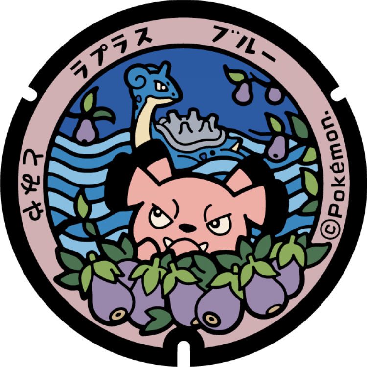
### Pokémon Featured: Lapras, Snubbull
### Coordinates: 38.398336, 140.8875
---
# Ōsaki
## 124
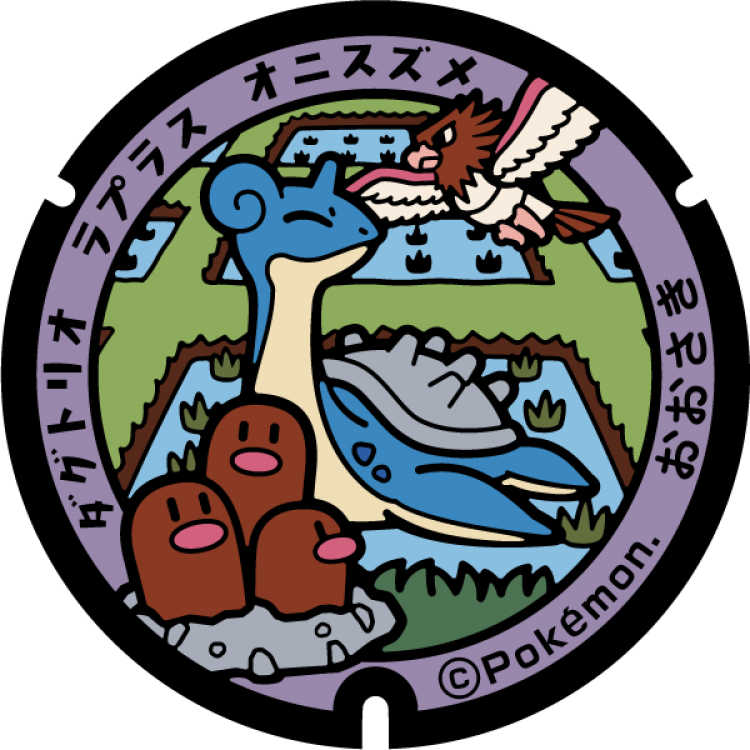
### Pokémon Featured: Lapras, Dugtrio, Spearow
### Coordinates: 38.575852, 140.955973
---
# Kurihara
## 123
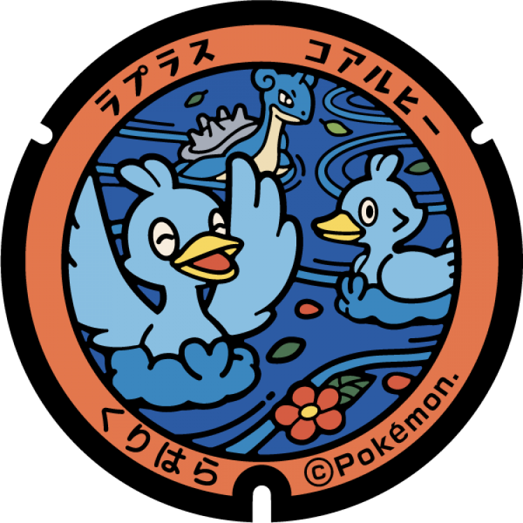
### Pokémon Featured: Lapras, Ducklett
### Coordinates: 38.794479, 140.844403
---
# Tome
## 122

### Pokémon Featured: Lapras, Lotad
### Coordinates: 38.616649, 141.235491
---
# Kakuda
## 121

### Pokémon Featured: Lapras, Latias
### Coordinates: 37.968694, 140.807077
---
# Shiroishi
## 120
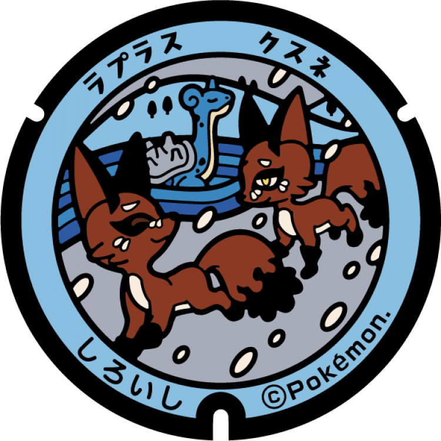
### Pokémon Featured: Lapras, Nickit
### Coordinates: 38.002511, 140.61735
---
# Yamamoto
## 58

### Pokémon Featured: Lapras, Chansey
### Coordinates: 37.923988, 140.900996
---
# Watari
## 57
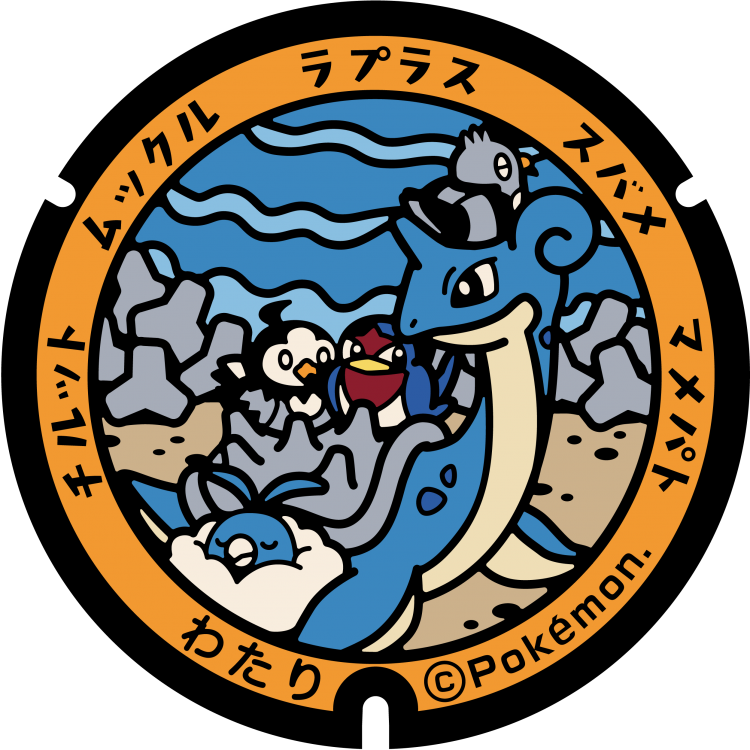
### Pokémon Featured: Lapras, Swablu, Starly, Taillow, Pidove
### Coordinates: 38.04217, 140.915724
---
# Iwanuma
## 56

### Pokémon Featured: Lapras, Togepi
### Coordinates: 38.105296, 140.866325
---
# Natori
## 55
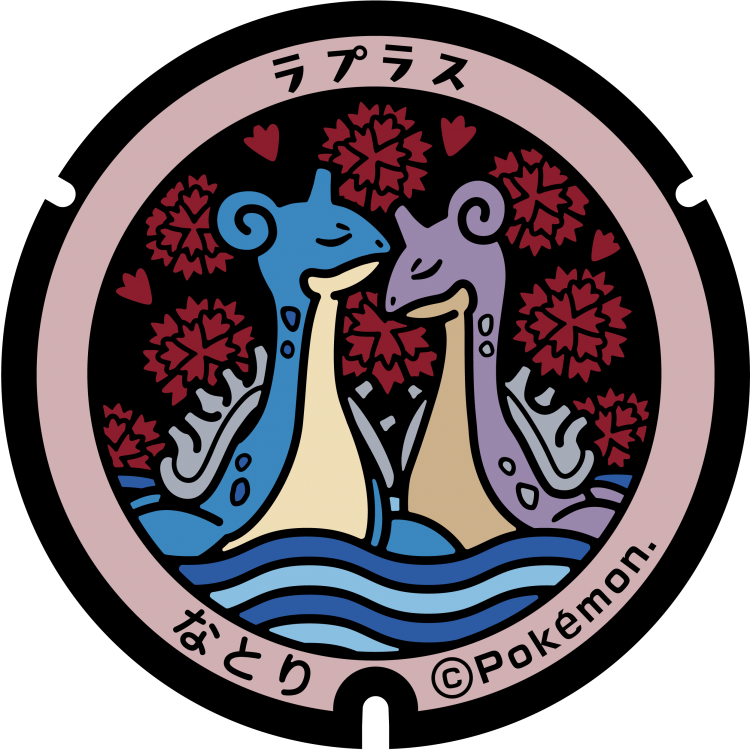
### Pokémon Featured: Lapras
### Coordinates: 38.17213, 140.954044
---
# Sendai
## 54

### Pokémon Featured: Lapras, Jirachi
### Coordinates: 38.258587, 140.872666
---
# Tagajō
## 53
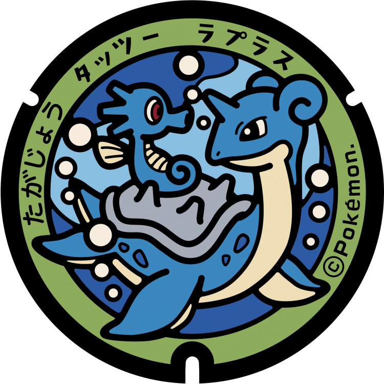
### Pokémon Featured: Lapras, Horsea
### Coordinates: 38.291943, 141.007158
---
# Shichigahama
## 52

### Pokémon Featured: Lapras, Ditto, Staryu
### Coordinates: 38.304315, 141.083342
---
# Rifu
## 51
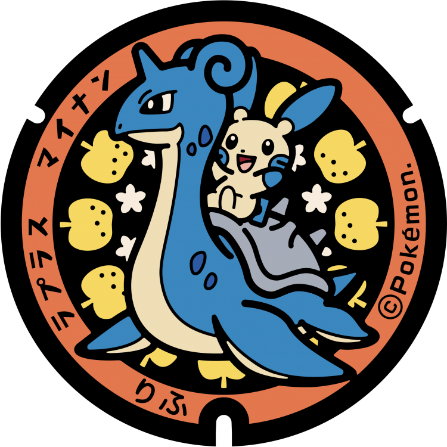
### Pokémon Featured: Lapras, Minun
### Coordinates: 38.329512, 140.975248
---
# Shiogama
## 50

### Pokémon Featured: Lapras, Plusle
### Coordinates: 38.318226, 141.023075
---
# Matsushima
## 49
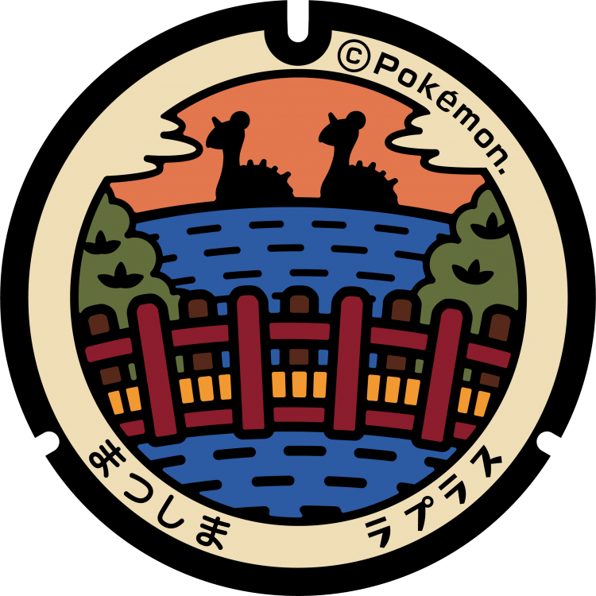
### Pokémon Featured: Lapras
### Coordinates: 38.368987, 141.061207
---
# Higashimatsushima
## 48
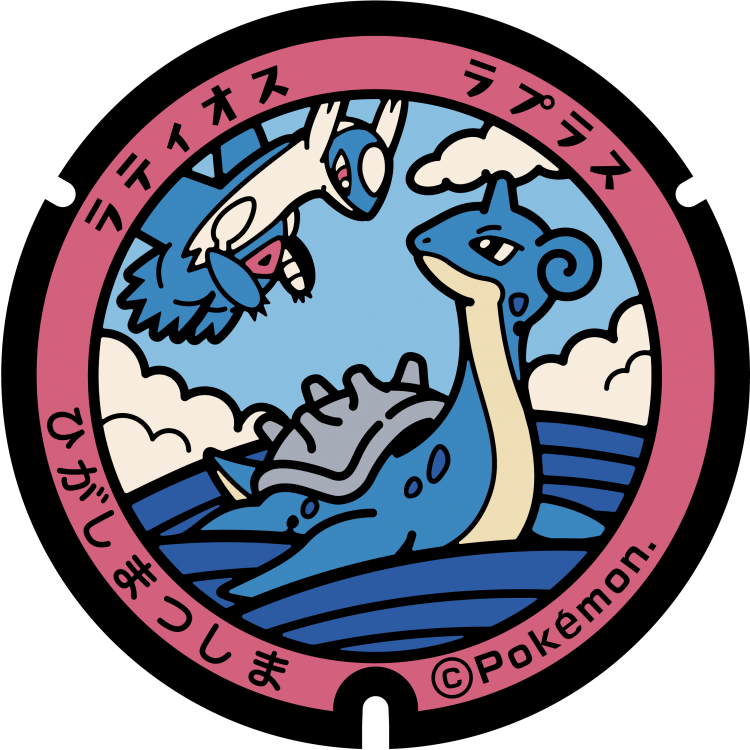
### Pokémon Featured: Lapras, Latios
### Coordinates: 38.379414, 141.15671
---
# Ishinomaki
## 47

### Pokémon Featured: Lapras, Meowth, Litten, Skitty, Glameow
### Coordinates: 38.433844, 141.303041
---
# Onagawa
## 46

### Pokémon Featured: Lapras, Wingull
### Coordinates: 38.445695, 141.44623
---
# Minamisanriku
## 45

### Pokémon Featured: Lapras, Octillery
### Coordinates: 38.717061, 141.52115
---
# Kesennuma
## 44
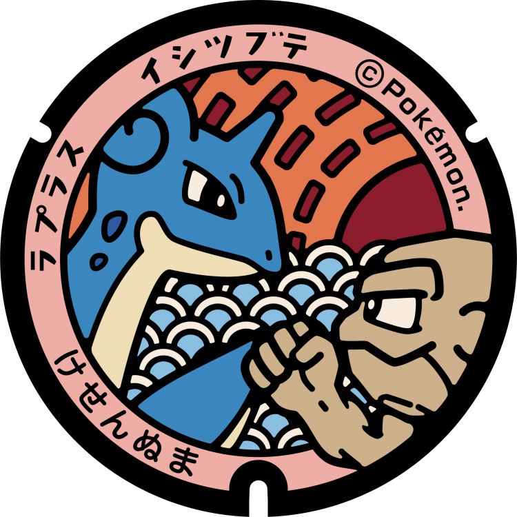
### Pokémon Featured: Lapras, Geodude
### Coordinates: 38.905694, 141.574667
---