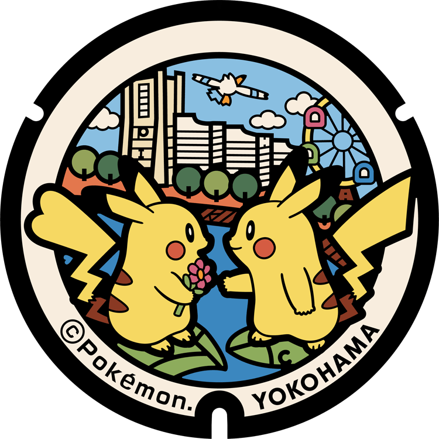

# Yokohama
## 314

### Pokémon Featured: Pikachu, Psyduck, Machop
### Coordinates: 35.453319, 139.631688
---
## 313

### Pokémon Featured: Pikachu, Victini, Munchlax
### Coordinates: 35.458698, 139.638331
---
## 312

### Pokémon Featured: Pikachu, Pelipper
### Coordinates: 35.443707, 139.650904
---
## 311

### Pokémon Featured: Pikachu, Raichu
### Coordinates: 35.451037, 139.644154
---
## 23

### Pokémon Featured: Pikachu
### Coordinates: 35.451167, 139.631501
---