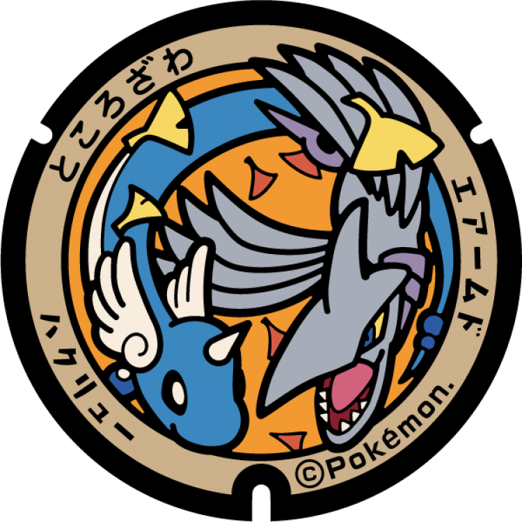

# Tokorozawa
## 213

### Pokémon Featured: Dragonite
### Coordinates: 35.798734, 139.471991
---
## 212

### Pokémon Featured: Dragonair, Skarmory
### Coordinates: 35.786887, 139.472881
---
## 211

### Pokémon Featured: Dratini, Corviknight
### Coordinates: 35.797482, 139.505528
---