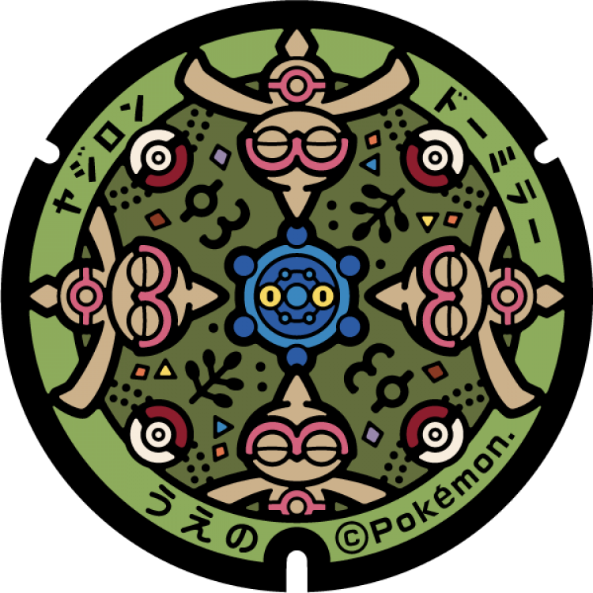
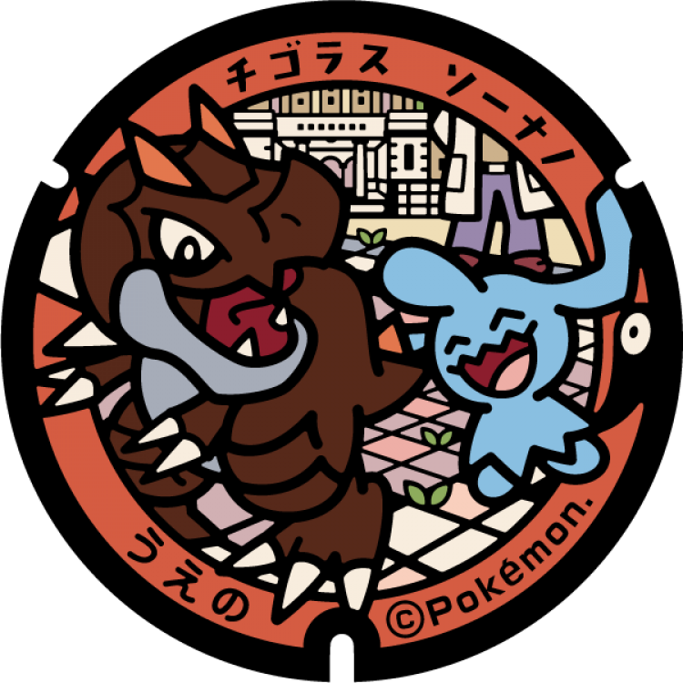
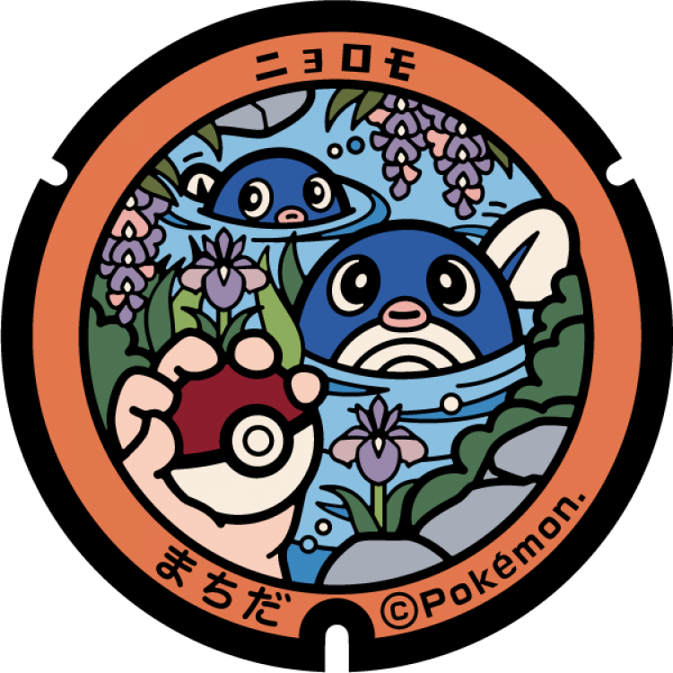

# Ueno
## 173

### Pokémon Featured: Baltoy, Bronzor
### Coordinates: 35.717715, 139.775397
---
## 172

### Pokémon Featured: Tyrunt, Wynaut
### Coordinates: 35.71681, 139.776397
---
# Ogasawara
## 156

### Pokémon Featured: Mew
### Coordinates: 27.09448, 142.19235
---
## 155

### Pokémon Featured: Blastoise
### Coordinates: 27.094596, 142.192781
---
## 154

### Pokémon Featured: Charizard
### Coordinates: 27.094708, 142.193279
---
## 153

### Pokémon Featured: Venusaur
### Coordinates: 27.094863, 142.194033
---
# Machida
## 103

### Pokémon Featured: Poliwag
### Coordinates: 35.546713, 139.45398
---
## 102

### Pokémon Featured: Pidgey, Rattata
### Coordinates: 35.545645, 139.45488
---
## 101

### Pokémon Featured: Oddish, Weedle, Caterpie
### Coordinates: 35.546111, 139.45436
---
## 100

### Pokémon Featured: Squirtle
### Coordinates: 35.545302, 139.45501
---
## 99

### Pokémon Featured: Charizard
### Coordinates: 35.548171, 139.4513
---
## 98

### Pokémon Featured: Bulbasaur
### Coordinates: 35.548108, 139.45034
---