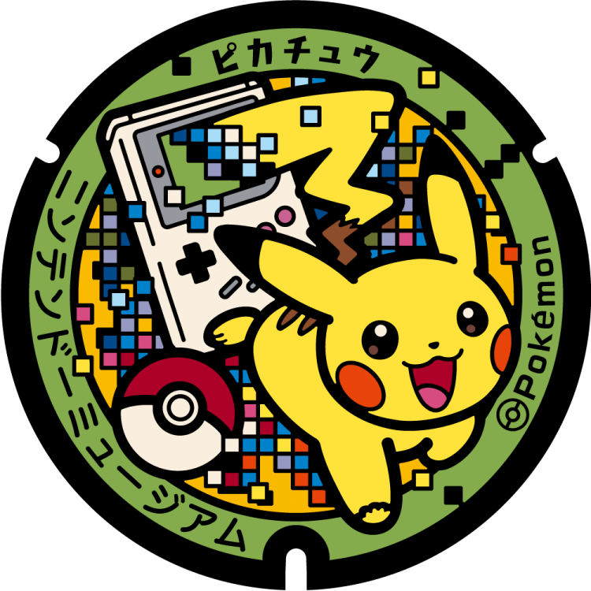
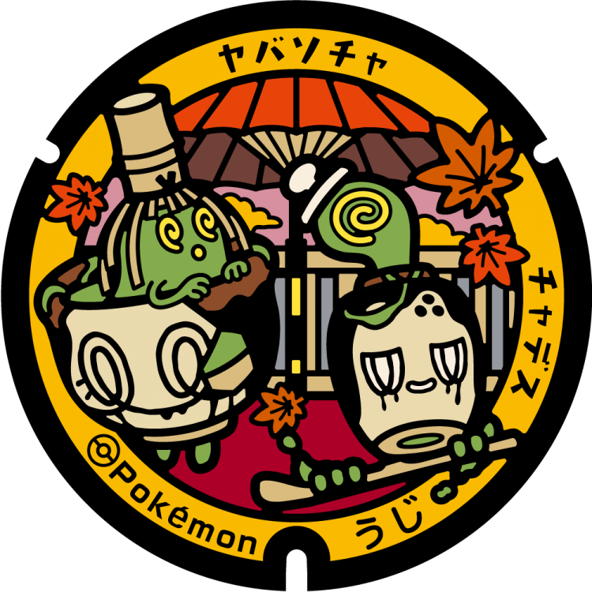
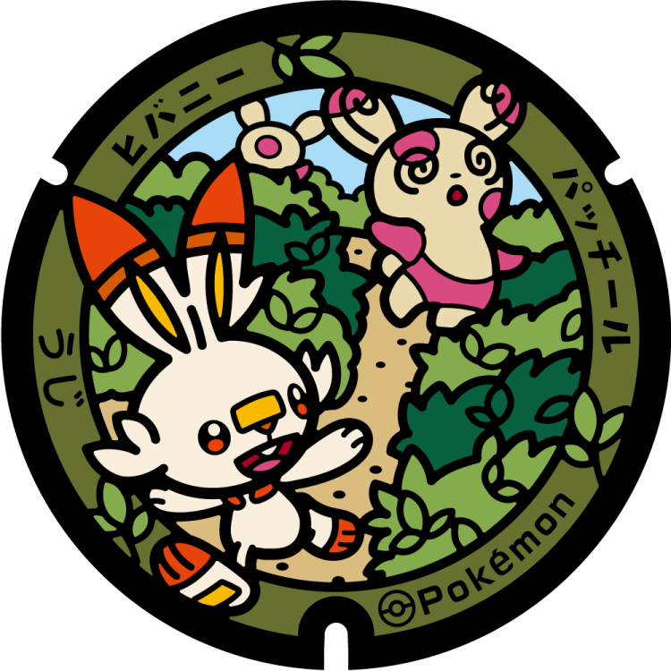
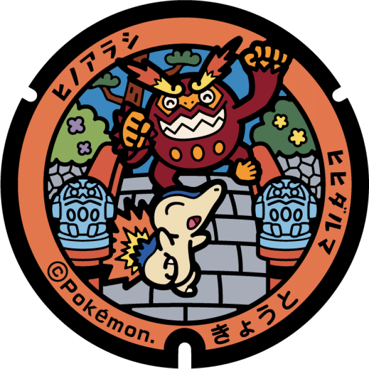
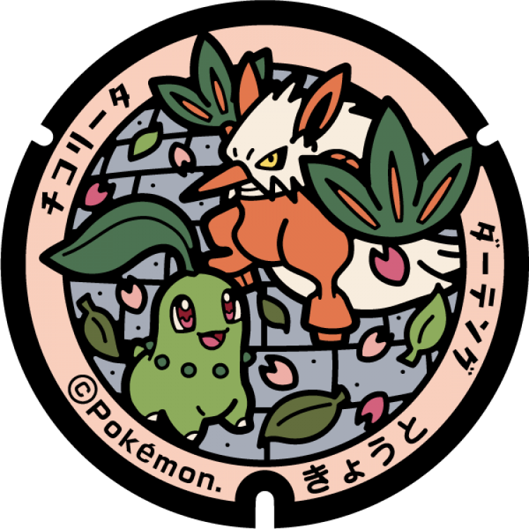
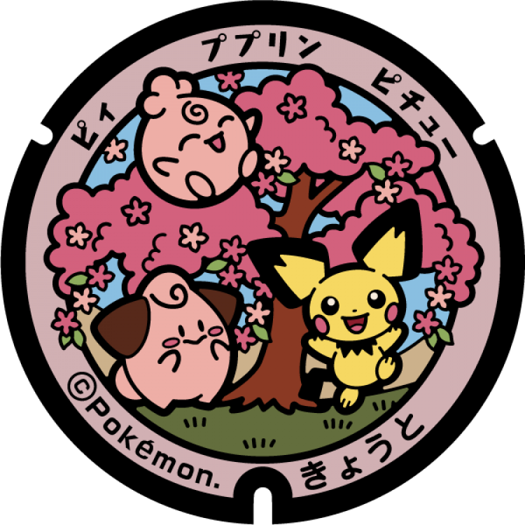
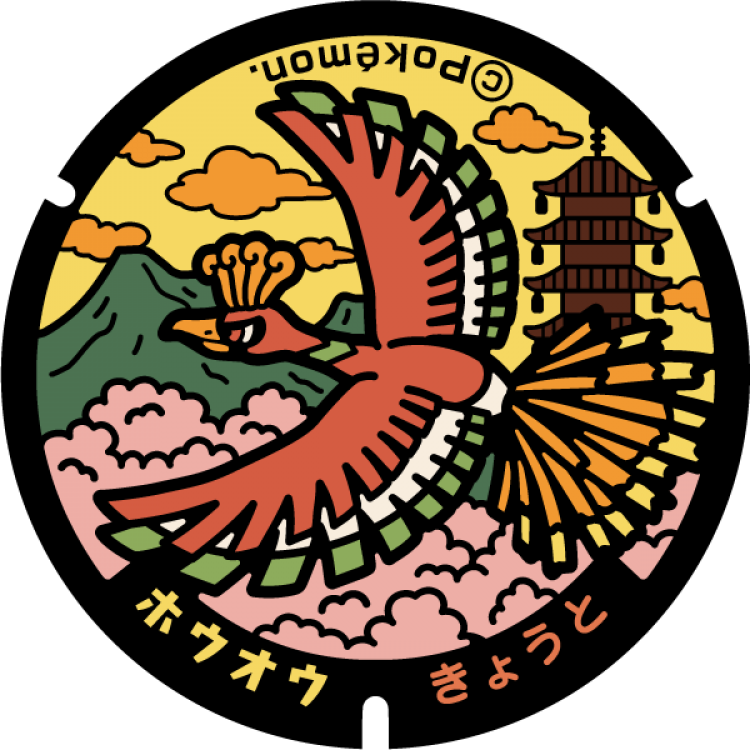

# Uji
## 382

### Pokémon Featured: Pikachu
### Coordinates: 34.892561, 135.784525
---
## 353

### Pokémon Featured: Poltchageist, Sinistcha
### Coordinates: 34.895547, 135.805962
---
## 352

### Pokémon Featured: Scorbunny, Spinda
### Coordinates: 34.890627, 135.809787
---
# Kyoto
## 163

### Pokémon Featured: Totodile, Azumarill
### Coordinates: 34.987804, 135.743538
---
## 162

### Pokémon Featured: Cyndaquil, Darmanitan
### Coordinates: 35.017283, 135.775533
---
## 161

### Pokémon Featured: Chikorita, Shiftry
### Coordinates: 34.994784, 135.714323
---
## 160

### Pokémon Featured: Pichu, Cleffa, Igglybuff
### Coordinates: 35.00337, 135.780573
---
## 159

### Pokémon Featured: Ho-Oh
### Coordinates: 35.011863, 135.678745
---