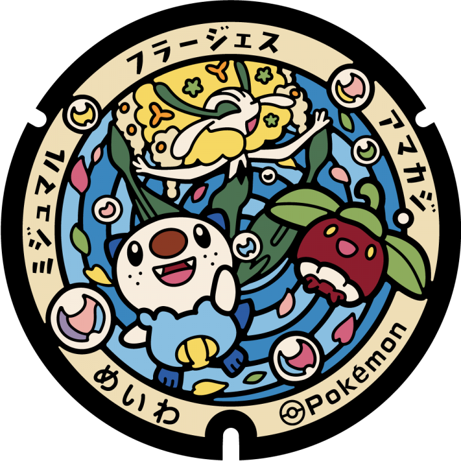

# Minamiise
## 335

### Pokémon Featured: Oshawott, Ditto
### Coordinates: 34.268997, 136.54891
---
# Tamaki
## 334

### Pokémon Featured: Oshawott, Spoink
### Coordinates: 34.467979, 136.587695
---
# Matsusaka
## 333

### Pokémon Featured: Oshawott, Meowth
### Coordinates: 34.578655, 136.519839
---
# Taki
## 332

### Pokémon Featured: Oshawott, Lechonk, Phanpy
### Coordinates: 34.46611, 136.55374
---
# Kawagoe
## 331

### Pokémon Featured: Oshawott, Tailow, Surskit
### Coordinates: 35.01731, 136.659834
---
# Suzuka
## 330

### Pokémon Featured: Oshawott, Cyclizar
### Coordinates: 34.823065, 136.584609
---
# Tōin
## 310

### Pokémon Featured: Oshawott, Mime Jr.
### Coordinates: 35.073792, 136.581108
---
# Kisosaki
## 309

### Pokémon Featured: Oshawott, Machoke
### Coordinates: 35.075575, 136.731805
---
# Nabari
## 308

### Pokémon Featured: Oshawott, Dewott
### Coordinates: 34.626212, 136.088911
---
# Kihō
## 297

### Pokémon Featured: Oshawott, Tirtouga
### Coordinates: 33.769742, 136.028632
---
# Watarai
## 296

### Pokémon Featured: Oshawott, Marill, Claydol
### Coordinates: 34.432076, 136.631333
---
# Odai
## 295

### Pokémon Featured: Oshawott, Pansage, Virizion
### Coordinates: 34.356007, 136.34766
---
# Meiwa
## 294

### Pokémon Featured: Oshawott, Bounsweet, Florges
### Coordinates: 34.53995, 136.61852
---
# Asahi
## 293

### Pokémon Featured: Oshawott, Whimsicott
### Coordinates: 35.037263, 136.658857
---
# Kameyama
## 292

### Pokémon Featured: Oshawott, Riolu, Torterra
### Coordinates: 34.859472, 136.447465
---
# Iga
## 246

### Pokémon Featured: Oshawott, Accelgor
### Coordinates: 34.767543, 136.130081
---
# Shima
## 245

### Pokémon Featured: Oshawott, Clamperl
### Coordinates: 34.275988, 136.898317
---
# Kumano
## 244

### Pokémon Featured: Oshawott, Stufful
### Coordinates: 33.891753, 136.116125
---
# Toba
## 243

### Pokémon Featured: Oshawott, Dewgong
### Coordinates: 34.48691, 136.844825
---
# Ise
## 242

### Pokémon Featured: Oshawott, Chingling
### Coordinates: 34.487787, 136.707097
---
# Yokkaichi
## 241

### Pokémon Featured: Oshawott, Samurott
### Coordinates: 34.952407, 136.611964
---
# Tsu
## 240

### Pokémon Featured: Oshawott
### Coordinates: 34.718493, 136.5108
---