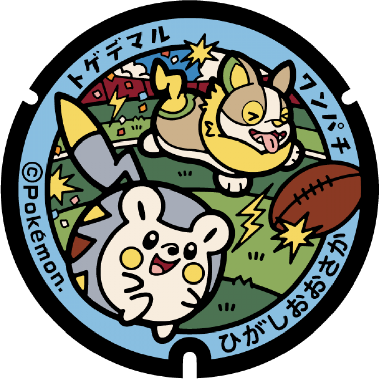
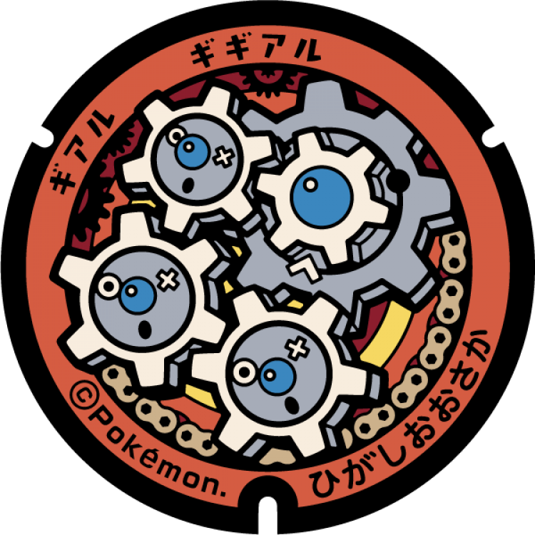

# Higashiōsaka
## 210

### Pokémon Featured: Yamper, Togedemaru
### Coordinates: 34.669486, 135.630586
---
## 209

### Pokémon Featured: Raikou
### Coordinates: 34.667678, 135.626309
---
## 208

### Pokémon Featured: Elekid, Mawile
### Coordinates: 34.680678, 135.650788
---
## 207

### Pokémon Featured: Klink, Klang
### Coordinates: 34.66771, 135.63989
---
## 206

### Pokémon Featured: Magnemite, Magneton
### Coordinates: 34.679788, 135.601221
---