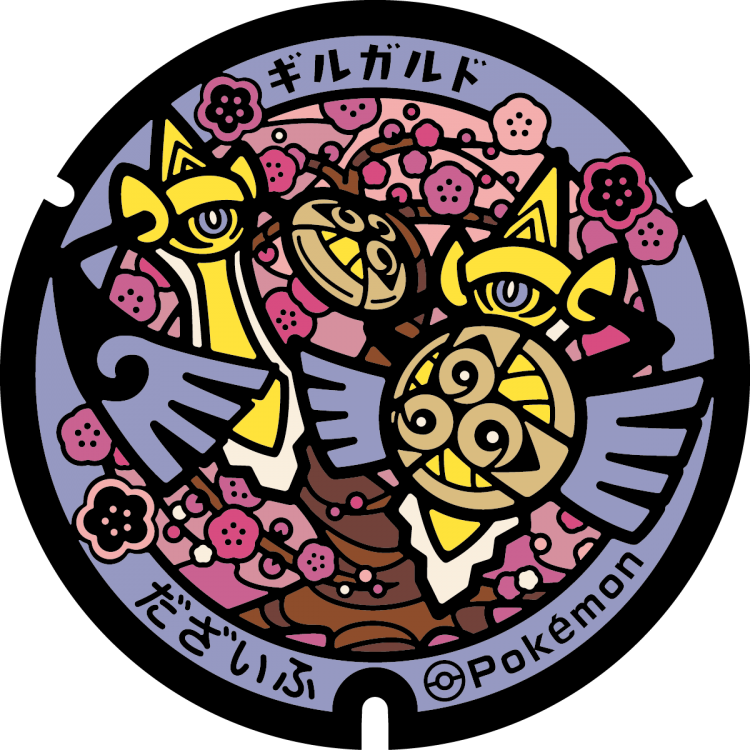
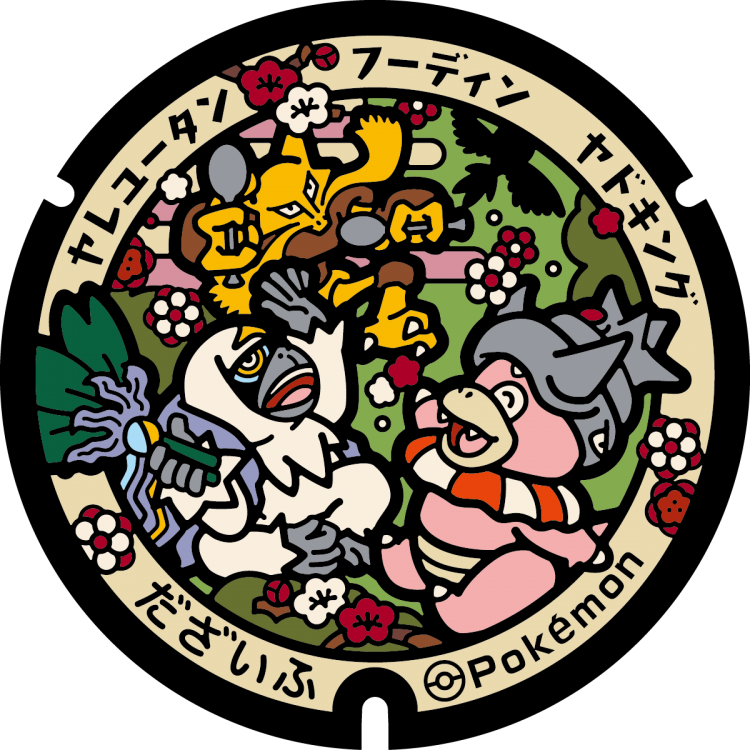
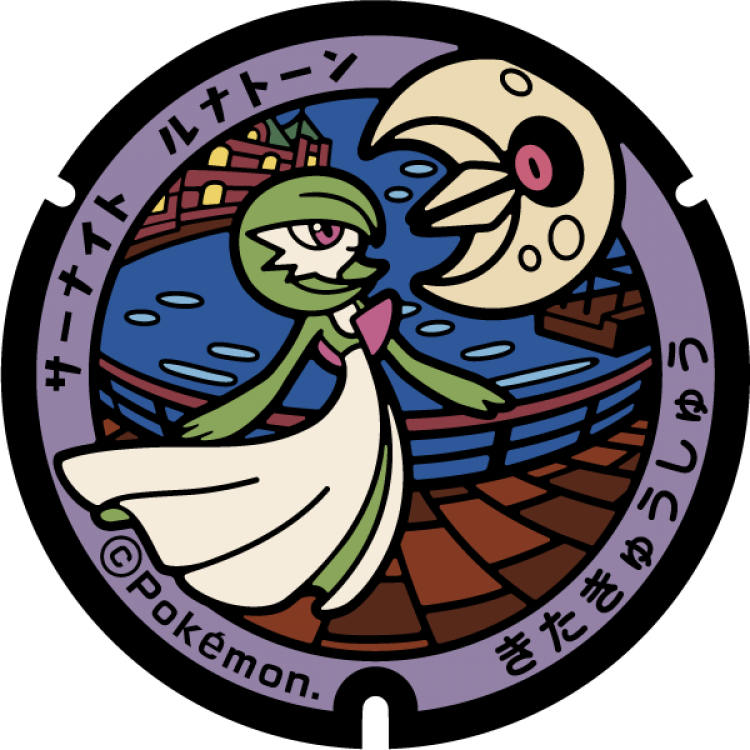

# Dazaifu
## 317

### Pokémon Featured: Aegislash
### Coordinates: 33.505199, 130.516571
---
## 316

### Pokémon Featured: Alakazam, Slowking, Oranguru
### Coordinates: 33.519356, 130.531372
---
## 315

### Pokémon Featured: Kirilia, Sawsbuck, Fletchling
### Coordinates: 33.513335, 130.515174
---
# Kitakyushu
## 202

### Pokémon Featured: Tropius
### Coordinates: 33.957206, 130.96161
---
## 201

### Pokémon Featured: Gardevoir, Lunatone
### Coordinates: 33.946285, 130.964119
---
## 200

### Pokémon Featured: Sableye, Duraludon
### Coordinates: 33.871791, 130.807495
---
## 199

### Pokémon Featured: Alolan Dugtrio, Carkol
### Coordinates: 33.890528, 130.884609
---
## 198

### Pokémon Featured: Aggron
### Coordinates: 33.884982, 130.876213
---