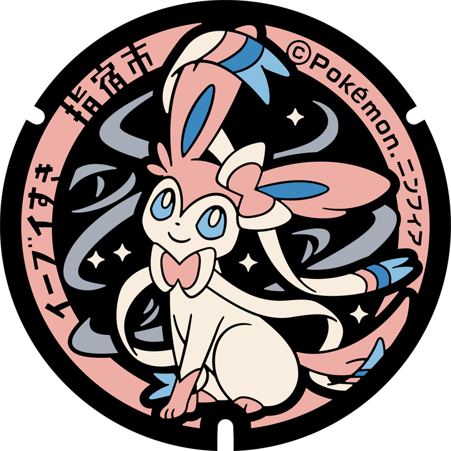
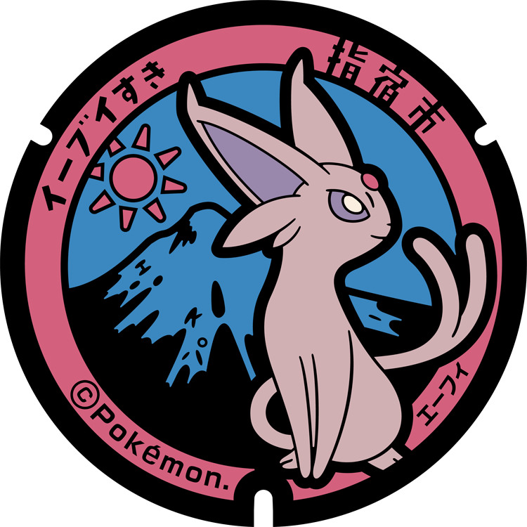
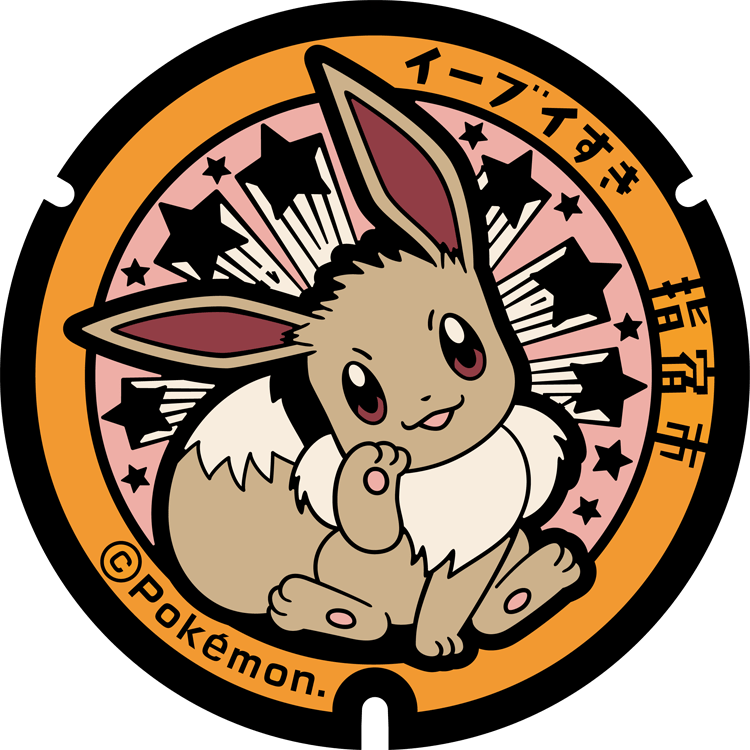

# Ibusuki
## 9

### Pokémon Featured: Sylveon
### Coordinates: 31.235444, 130.641389
---
## 8

### Pokémon Featured: Glaceon
### Coordinates: 31.231056, 130.644611
---
## 7

### Pokémon Featured: Leafeon
### Coordinates: 31.263889, 130.662917
---
## 6

### Pokémon Featured: Umbreon
### Coordinates: 31.236833, 130.642188
---
## 5

### Pokémon Featured: Espeon
### Coordinates: 31.238278, 130.645
---
## 4

### Pokémon Featured: Flareon
### Coordinates: 31.229417, 130.651972
---
## 3

### Pokémon Featured: Jolteon
### Coordinates: 31.255278, 130.647639
---
## 2

### Pokémon Featured: Vaporeon
### Coordinates: 31.228, 130.653028
---
## 1

### Pokémon Featured: Eevee
### Coordinates: 31.237194, 130.642861
---