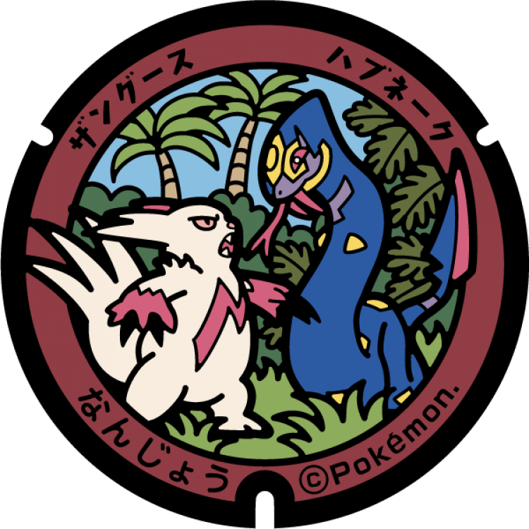
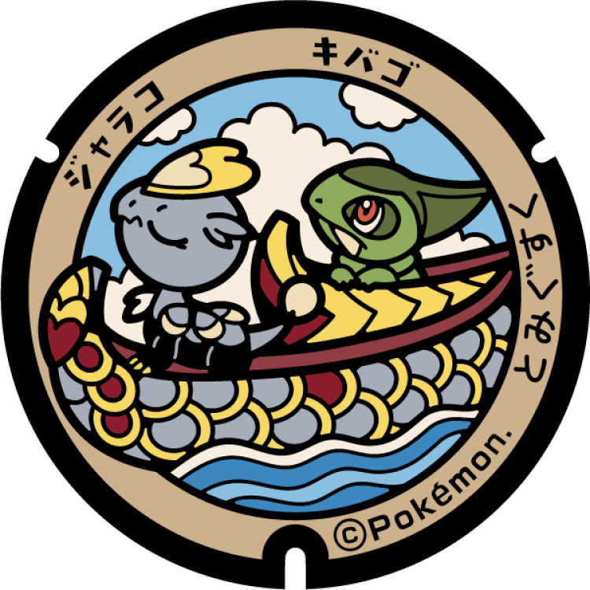
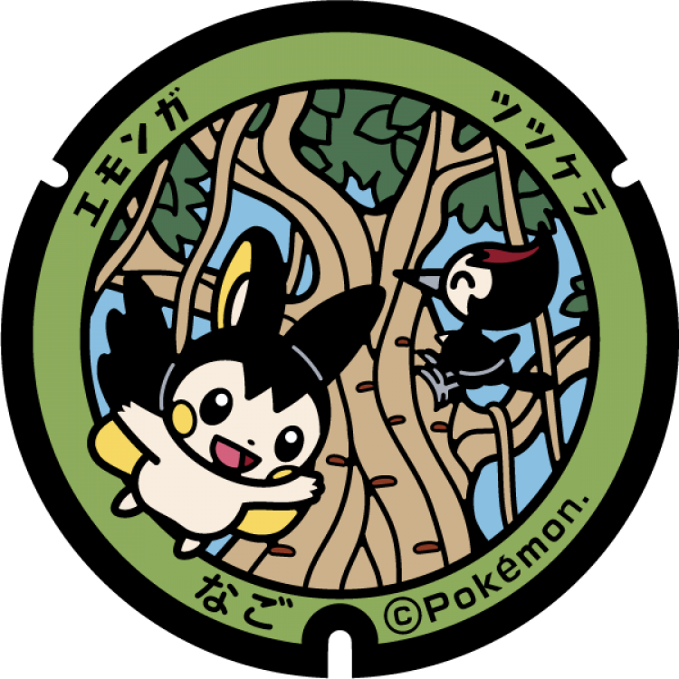
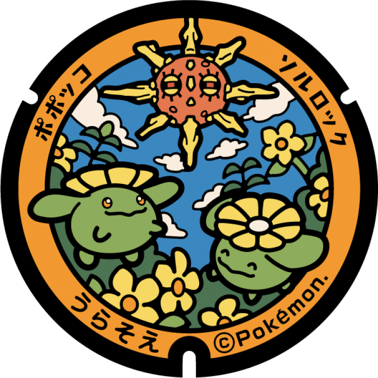
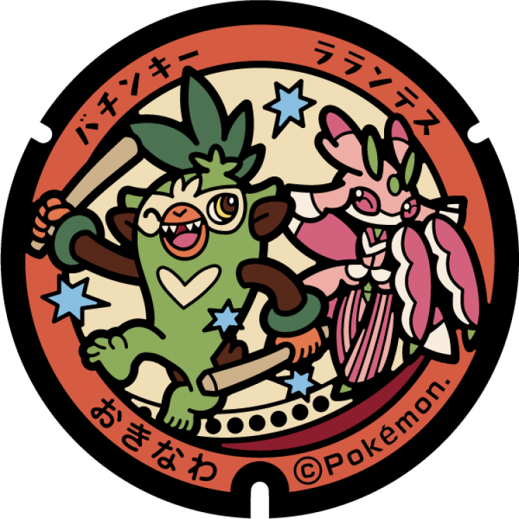

# Miyakojima
## 236

### Pokémon Featured: Kyogre
### Coordinates: 24.734962, 125.263088
---
# Ishigaki
## 235

### Pokémon Featured: Mantine, Remoraid
### Coordinates: 24.337418, 124.156947
---
# Nanjō
## 234

### Pokémon Featured: Seviper, Zangoose
### Coordinates: 26.169111, 127.827083
---
# Tomigusuku
## 233

### Pokémon Featured: Axew, Jangmo-o
### Coordinates: 26.157557, 127.656121
---
# Motobu
## 232

### Pokémon Featured: Wailord
### Coordinates: 26.691694, 127.877972
---
# Itoman
## 231

### Pokémon Featured: Wartortle, Sandygast
### Coordinates: 26.13828, 127.661336
---
# Nago
## 230

### Pokémon Featured: Emolga, Pikipek
### Coordinates: 26.587352, 127.985744
---
# Urasoe
## 229

### Pokémon Featured: Solrock, Skiploom
### Coordinates: 26.246168, 127.688346
---
# Uruma
## 177

### Pokémon Featured: Tauros
### Coordinates: 26.436181, 127.826113
---
# Okinawa
## 176

### Pokémon Featured: Thwackey, Lurantis
### Coordinates: 26.32766, 127.803001
---
# Ginowan
## 175

### Pokémon Featured: Corsola, Luvdisc
### Coordinates: 26.28139, 127.732214
---
# Naha
## 174

### Pokémon Featured: Arcanine
### Coordinates: 26.21641, 127.68942
---