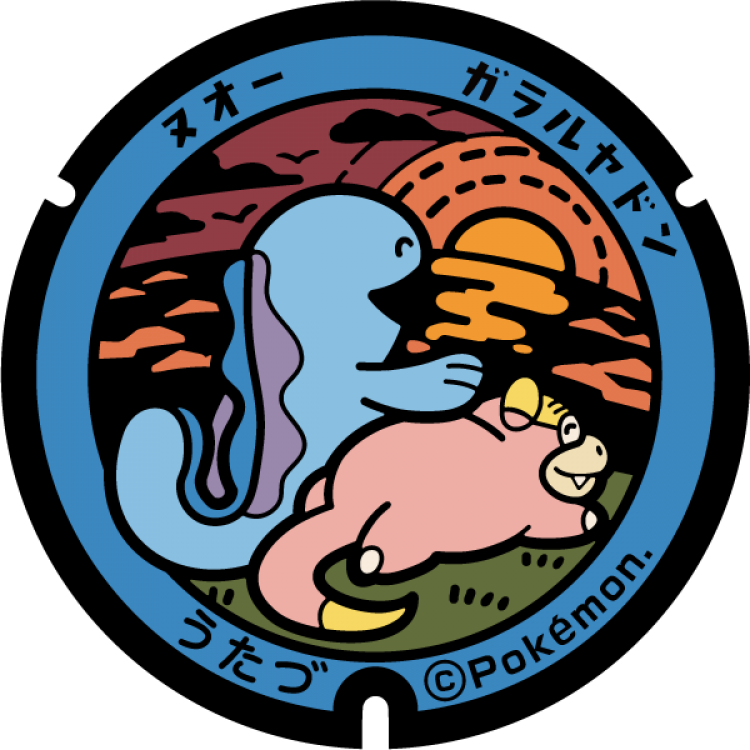
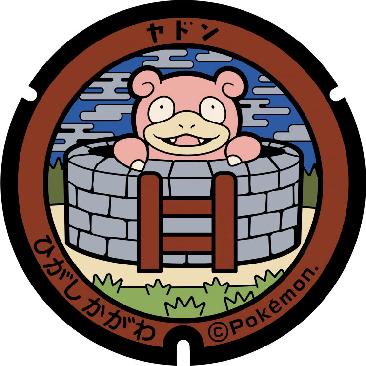

# 綾川町
## 298

### 注目のポケモン: ヤドン, ガラルヤドン, シェルダー
### 座標: 34.247395, 133.932774
---
# 宇多津町
## 97

### 注目のポケモン: ガラルヤドン, ヌオー
### 座標: 34.313426, 133.807526
---
# まんのう町
## 43

### 注目のポケモン: ヤドン
### 座標: 34.173339, 133.871387
---
# 多度津町
## 42

### 注目のポケモン: ヤドン
### 座標: 34.272282, 133.757247
---
# 琴平町
## 41

### 注目のポケモン: ヤドン
### 座標: 34.187735, 133.819896
---
# 綾川町
## 40

### 注目のポケモン: ヤドン
### 座標: 34.250399, 133.917073
---
# 直島町
## 39

### 注目のポケモン: ヤドン, コイキング
### 座標: 34.455827, 133.975492
---
# 三木町
## 38

### 注目のポケモン: ヤドン
### 座標: 34.268586, 134.134567
---
# 小豆島町
## 37

### 注目のポケモン: ヤドン
### 座標: 34.470854, 134.23587
---
# 土庄町
## 36

### 注目のポケモン: ヤドン, メタモン
### 座標: 34.482694, 134.187512
---
# 三豊市
## 35

### 注目のポケモン: ヤドン, シェルダー
### 座標: 34.268799, 133.632222
---
# 東かがわ市
## 34

### 注目のポケモン: ヤドン
### 座標: 34.251174, 134.333457
---
# さぬき市
## 33

### 注目のポケモン: ヤドン, ピッピ
### 座標: 34.321305, 134.173241
---
# 観音寺市
## 32

### 注目のポケモン: ヤドン, ヤドキング
### 座標: 34.125275, 133.655211
---
# 善通寺市
## 31

### 注目のポケモン: ヤドン, ヤドラン
### 座標: 34.22531, 133.7773
---
# 坂出市
## 30

### 注目のポケモン: ヤドン
### 座標: 34.312992, 133.856292
---
# 丸亀市
## 29

### 注目のポケモン: ヤドン
### 座標: 34.292014, 133.793951
---
# 高松市
## 28

### 注目のポケモン: ヤドン
### 座標: 34.338888, 134.049052
---