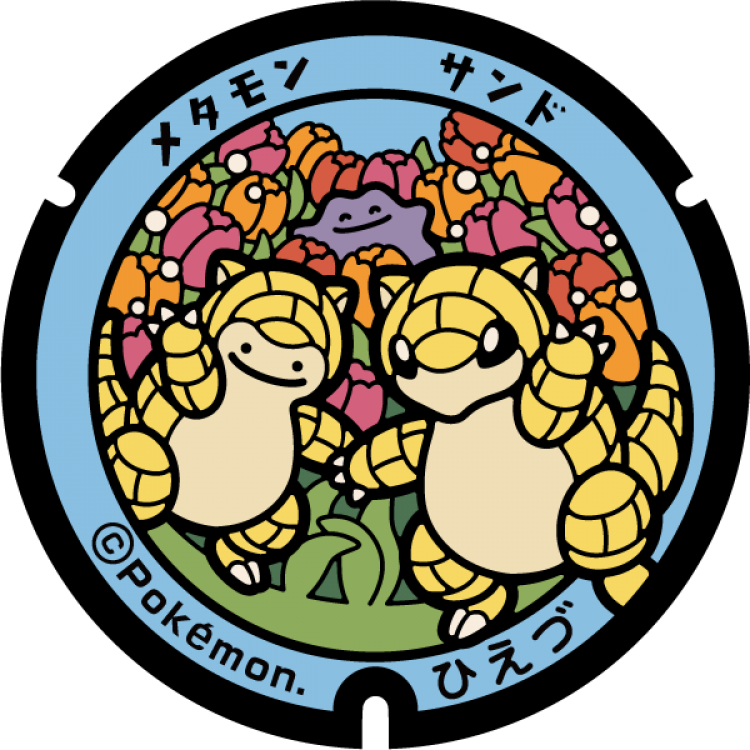
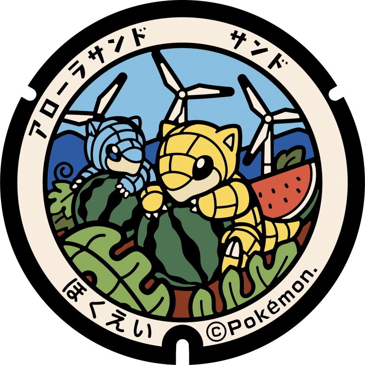
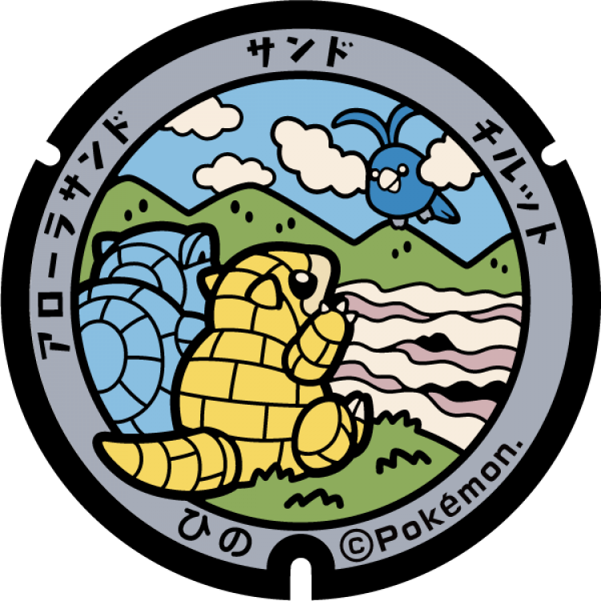
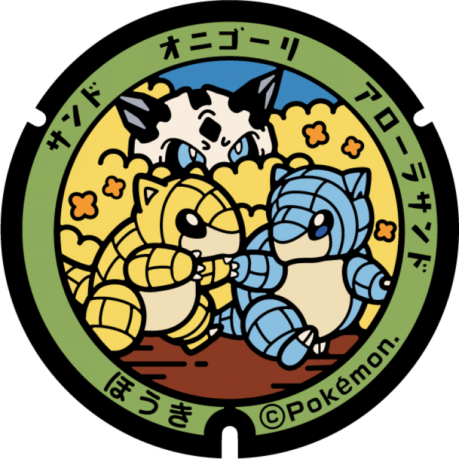
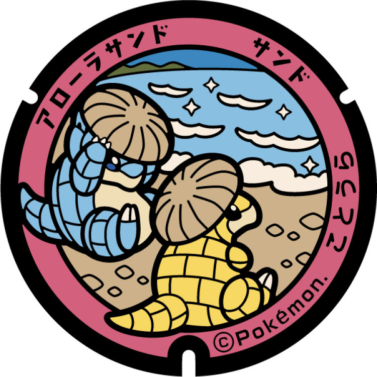
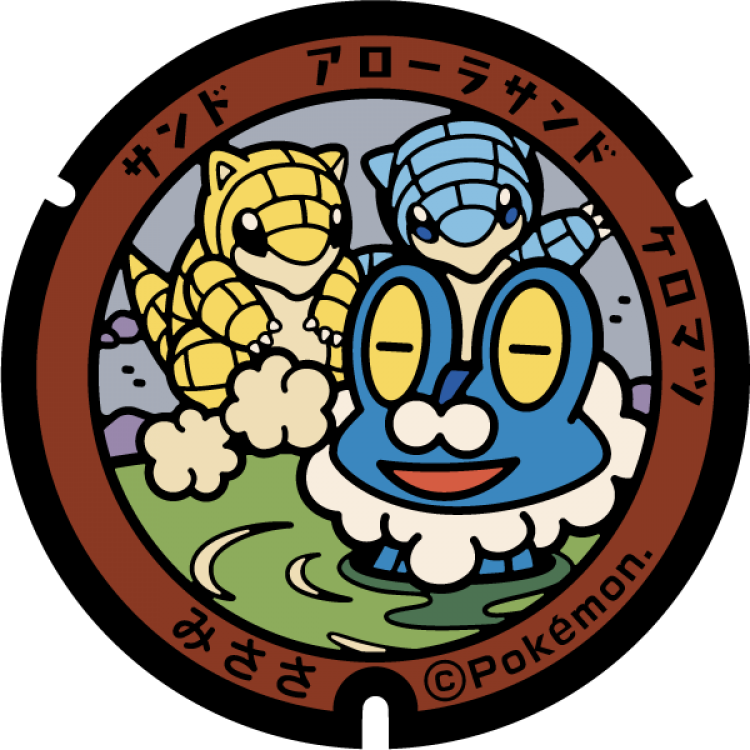
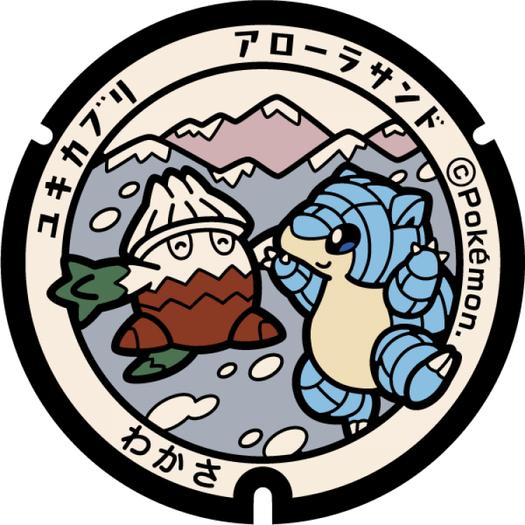
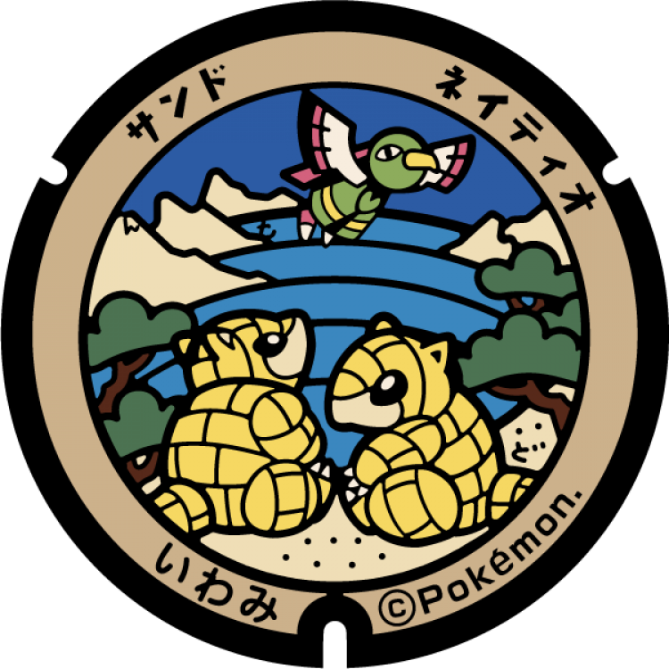
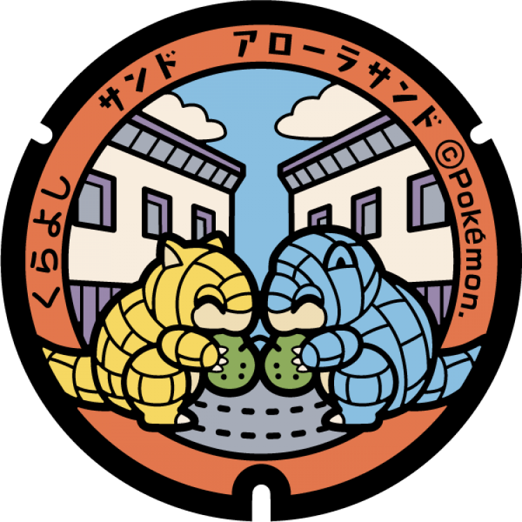
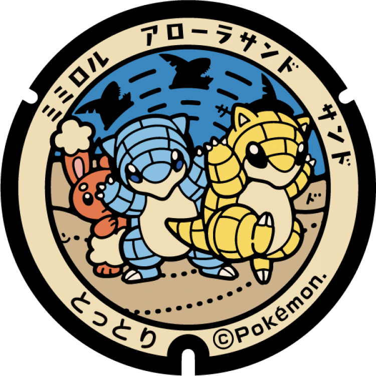

# 江府町
## 110

### 注目のポケモン: サンド, アローラサンド
### 座標: 35.295841, 133.474089
---
# 日吉津村
## 109

### 注目のポケモン: サンド, メタモン
### 座標: 35.441126, 133.379578
---
# 北栄町
## 108

### 注目のポケモン: サンド, アローラサンド
### 座標: 35.497927, 133.820024
---
# 八頭町
## 107

### 注目のポケモン: アローラサンド, アローラサンドパン
### 座標: 35.366456, 134.339426
---
# 智頭町
## 106

### 注目のポケモン: サンド, サンドパン, ウソッキー
### 座標: 35.265428, 134.226103
---
# 日野町
## 87

### 注目のポケモン: サンド, アローラサンド, チルット
### 座標: 35.24192, 133.441049
---
# 日南町
## 86

### 注目のポケモン: サンド, バルビート, イルミーゼ
### 座標: 35.170524, 133.31094
---
# 伯耆町
## 85

### 注目のポケモン: サンド, アローラサンド, オニゴーリ
### 座標: 35.383395, 133.458512
---
# 南部町
## 84

### 注目のポケモン: サンド, アローラサンド, ナックラー
### 座標: 35.347474, 133.423398
---
# 大山町
## 83

### 注目のポケモン: アローラサンド, ヒトモシ
### 座標: 35.504584, 133.502093
---
# 琴浦町
## 82

### 注目のポケモン: サンド, アローラサンド
### 座標: 35.506942, 133.661612
---
# 湯梨浜町
## 81

### 注目のポケモン: サンド, シェルダー
### 座標: 35.478166, 133.88401
---
# 三朝町
## 80

### 注目のポケモン: サンド, アローラサンド, ケロマツ
### 座標: 35.409324, 133.894397
---
# 若桜町
## 79

### 注目のポケモン: アローラサンド, ユキカブリ
### 座標: 35.343951, 134.400345
---
# 岩美町
## 78

### 注目のポケモン: サンド, ネイティオ
### 座標: 35.590938, 134.321556
---
# 境港市
## 77

### 注目のポケモン: サンド, アローラサンド, クラブ
### 座標: 35.521481, 133.258356
---
# 倉吉市
## 76

### 注目のポケモン: サンド, アローラサンド
### 座標: 35.454272, 133.850116
---
# 米子市
## 75

### 注目のポケモン: サンド, カモネギ, スワンナ
### 座標: 35.456258, 133.361525
---
# 鳥取市
## 300

### 注目のポケモン: サンド, アローラサンド, ホルビー
### 座標: 35.53395, 134.224478
---
## 74

### 注目のポケモン: サンド, アローラサンド
### 座標: 35.539668, 134.237266
---