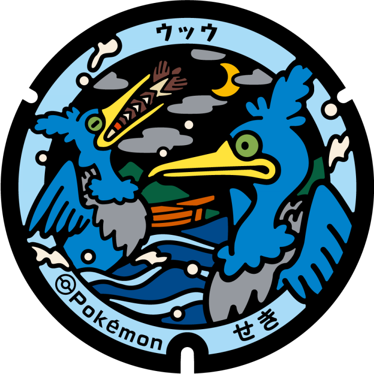
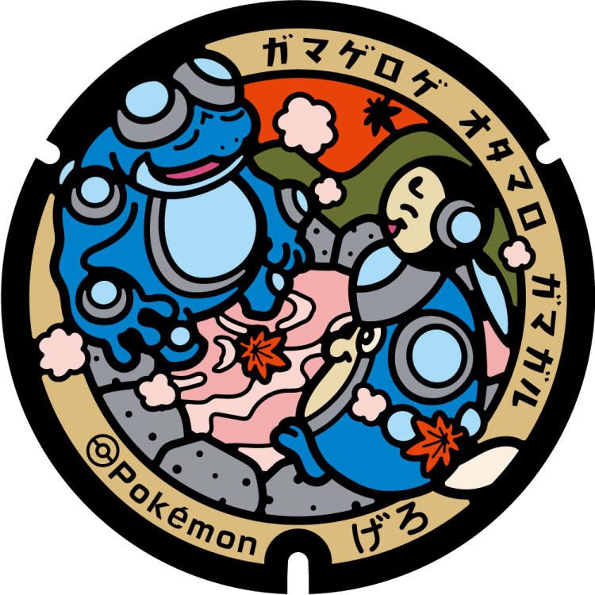

# 高山市
## 363

### 注目のポケモン: ヤナップ, バオップ, ヒヤップ
### 座標: 36.144911, 137.257235
---
# 関ケ原町
## 362

### 注目のポケモン: ドドゲザン, コマタナ
### 座標: 35.36402, 136.46842
---
# 関市
## 361

### 注目のポケモン: ウッウ
### 座標: 35.490472, 136.91225
---
# 下呂市
## 360

### 注目のポケモン: ガマゲロゲ, ガマガル, オタマロ
### 座標: 35.807771, 137.242963
---
# 各務原市
## 359

### 注目のポケモン: ナマズン, ドジョッチ
### 座標: 35.37067, 136.807773
---