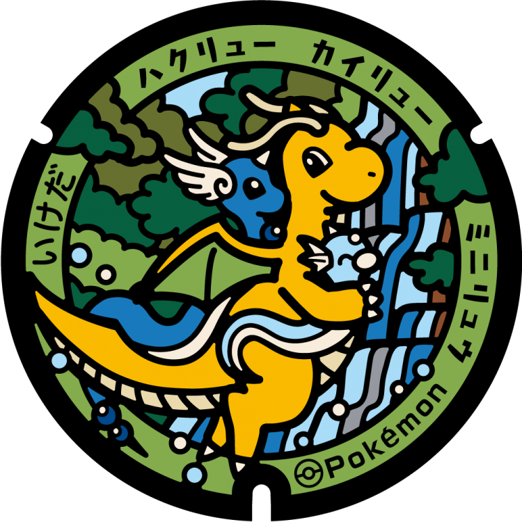
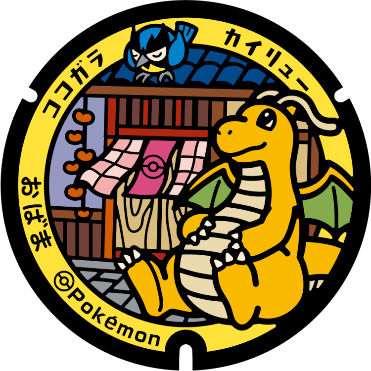
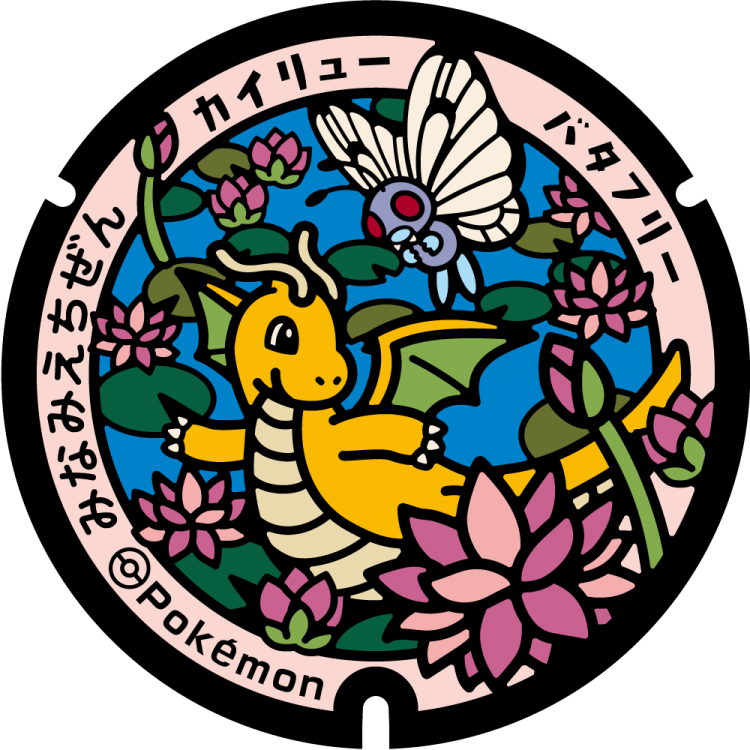
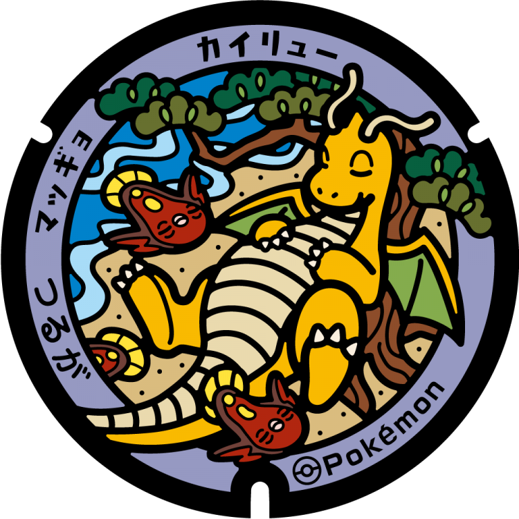
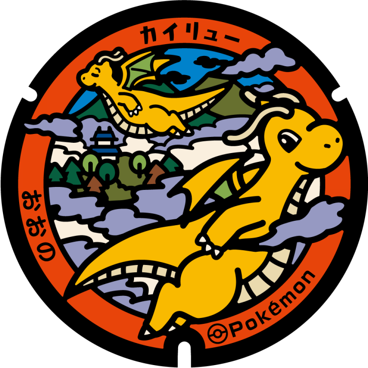
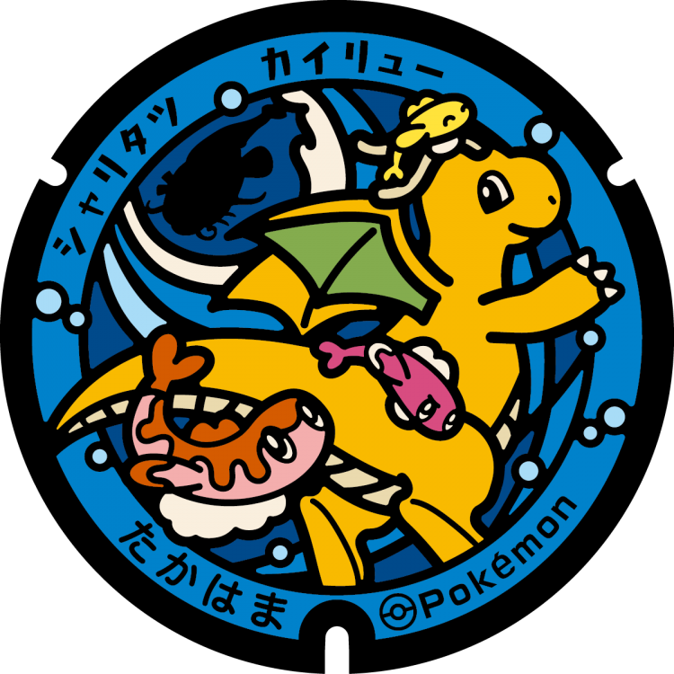
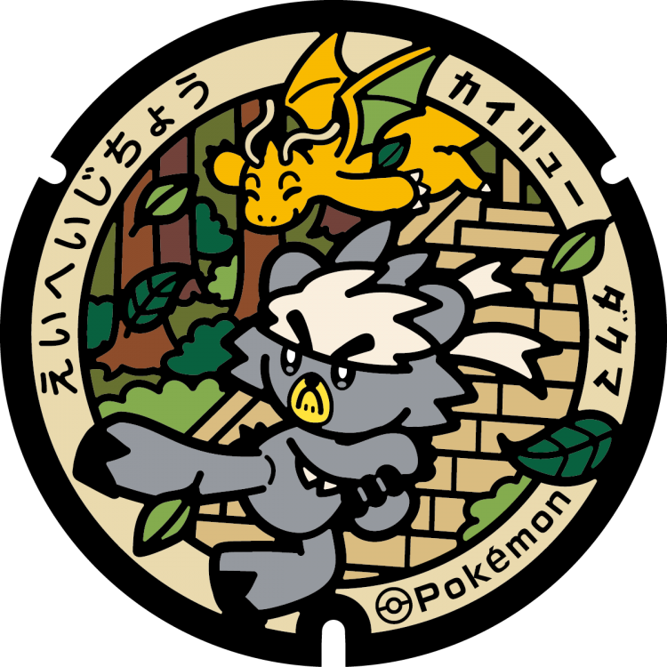
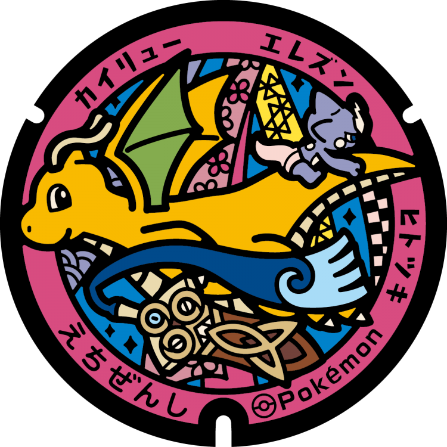
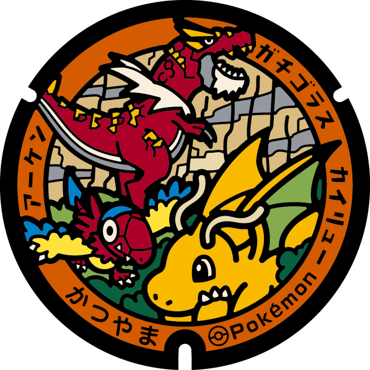

# 池田町
## 368

### 注目のポケモン: カイリュー, ハクリュー, ミニリュウ
### 座標: 35.890505, 136.339213
---
# 小浜市
## 367

### 注目のポケモン: カイリュー, ココガラ
### 座標: 35.494981, 135.741761
---
# 南越前町
## 366

### 注目のポケモン: カイリュー, バタフリー
### 座標: 35.82915, 136.2028
---
# 敦賀市
## 365

### 注目のポケモン: カイリュー, マッギョ
### 座標: 35.661865, 136.074281
---
# 大野市
## 364

### 注目のポケモン: カイリュー
### 座標: 35.984502, 136.485931
---
# 美浜町
## 341

### 注目のポケモン: カイリュー, ヒドイデ, ウミディグダ
### 座標: 35.604507, 135.936876
---
# 高浜町
## 340

### 注目のポケモン: カイリュー, シャリタツ
### 座標: 35.492951, 135.54556
---
# 永平寺町
## 339

### 注目のポケモン: カイリュー, ダクマ
### 座標: 36.079891, 136.399312
---
# 越前市
## 338

### 注目のポケモン: カイリュー, エレズン, ヒトツキ
### 座標: 35.895286, 136.198727
---
# あわら市
## 337

### 注目のポケモン: カイリュー, トゲチック, ジグザグマ
### 座標: 36.215613, 136.234226
---
# 勝山市
## 336

### 注目のポケモン: カイリュー, アーケン, ガチゴラス
### 座標: 36.056787, 136.492007
---