# 五ヶ瀬町
## 186
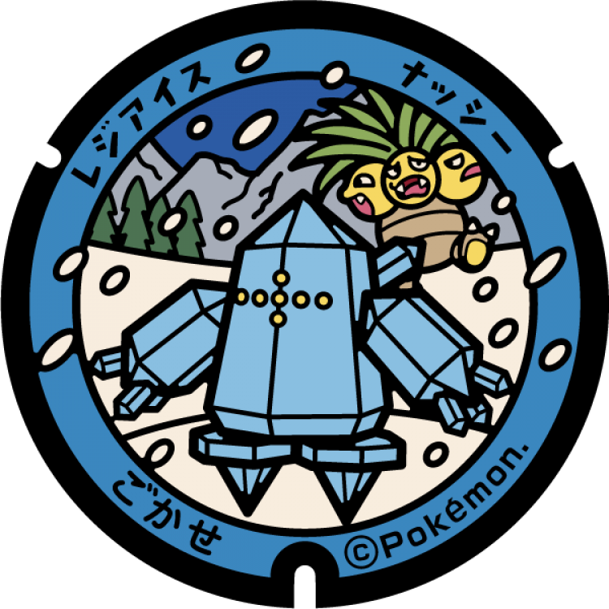
### 注目のポケモン: ナッシー, レジアイス
### 座標: 32.679051, 131.210041
---
# 日之影町
## 185

### 注目のポケモン: ナッシー, レジスチル
### 座標: 32.660643, 131.388639
---
# 高千穂町
## 184

### 注目のポケモン: ナッシー, レジギガス
### 座標: 32.707748, 131.305889
---
# 椎葉村
## 183
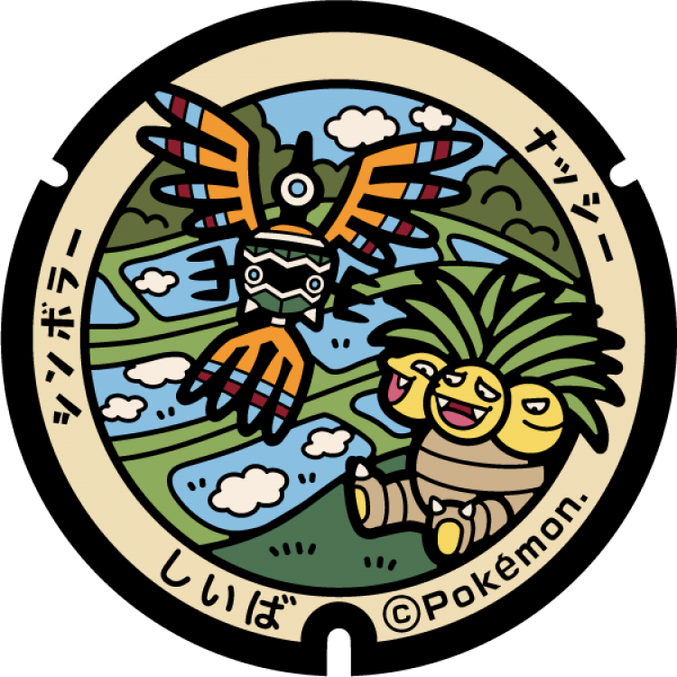
### 注目のポケモン: ナッシー, シンボラー
### 座標: 32.458153, 131.153831
---
# 諸塚村
## 182

### 注目のポケモン: ナッシー, レジロック
### 座標: 32.509811, 131.331498
---
# 西米良村
## 181
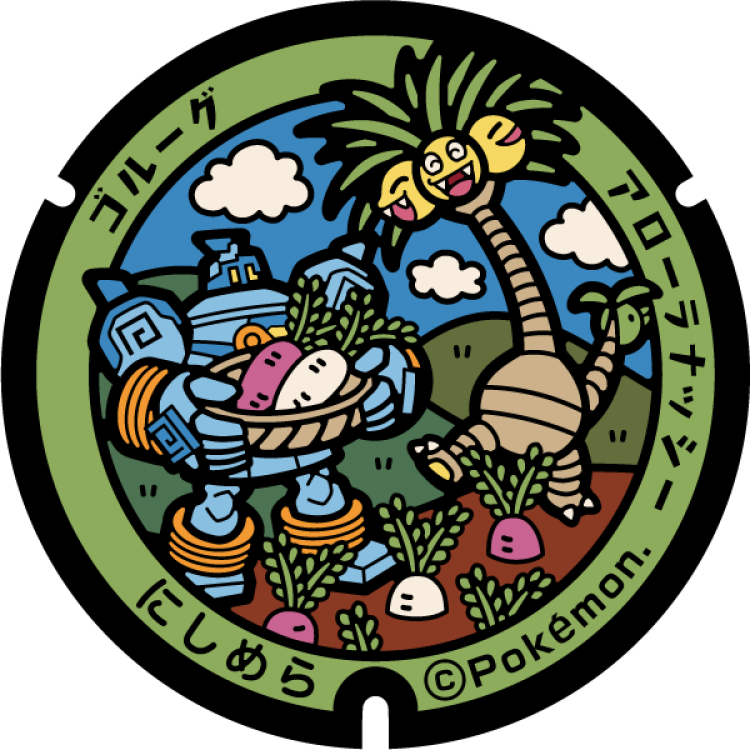
### 注目のポケモン: アローラナッシー, ゴルーグ
### 座標: 32.223238, 131.16329
---
# 綾町
## 180

### 注目のポケモン: ナッシー, ナマケロ
### 座標: 31.998975, 131.253754
---
# 国富町
## 179

### 注目のポケモン: アローラナッシー, ゴクリン
### 座標: 31.988591, 131.321916
---
# 高原町
## 178

### 注目のポケモン: ナッシー, ムチュール
### 座標: 31.907234, 130.960187
---
# 美郷町
## 171
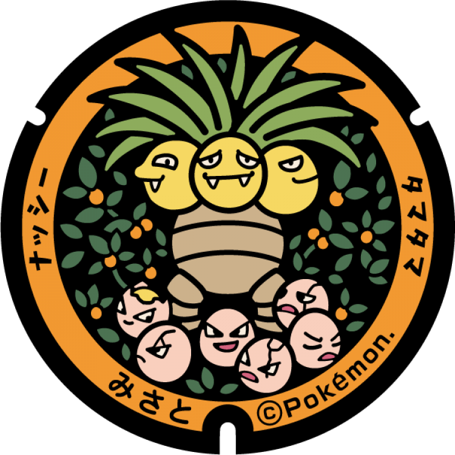
### 注目のポケモン: ナッシー, タマタマ
### 座標: 32.431976, 131.467551
---
# 門川町
## 170
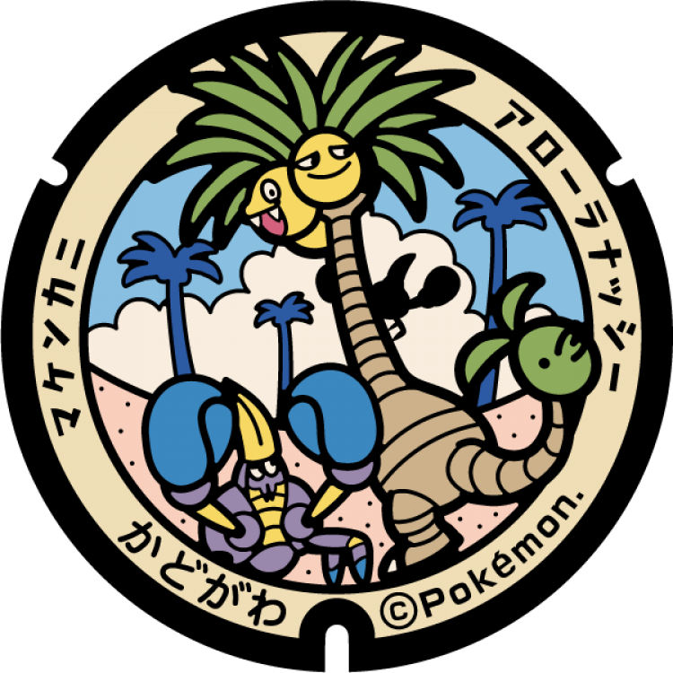
### 注目のポケモン: アローラナッシー, マケンカニ
### 座標: 32.487021, 131.676733
---
# 都農町
## 169
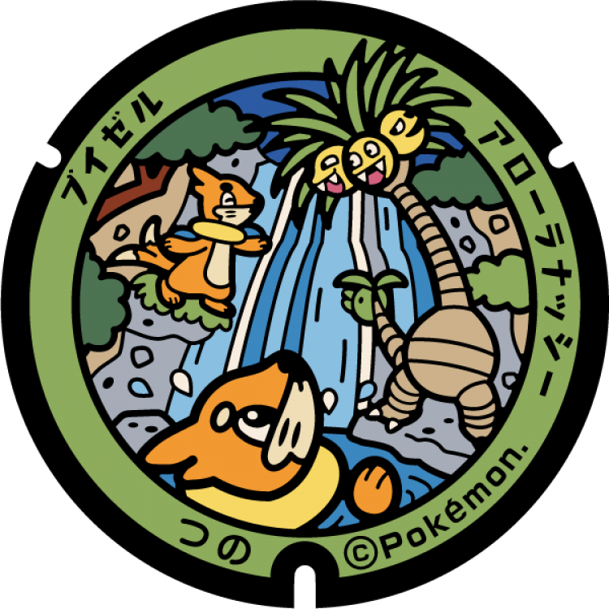
### 注目のポケモン: アローラナッシー, ブイゼル
### 座標: 32.260902, 131.557577
---
# 川南町
## 168
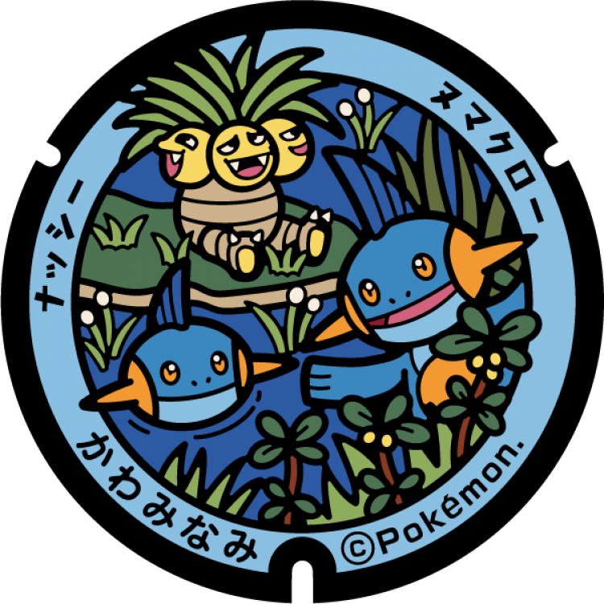
### 注目のポケモン: ナッシー, ヌマクロー
### 座標: 32.191491, 131.528984
---
# 木城町
## 167

### 注目のポケモン: ナッシー, メタモン
### 座標: 32.1699, 131.42974
---
# 新富町
## 166

### 注目のポケモン: アローラナッシー, マクノシタ
### 座標: 32.071055, 131.512198
---
# 高鍋町
## 165

### 注目のポケモン: アローラナッシー, アローラライチュウ
### 座標: 32.115956, 131.532841
---
# 三股町
## 164

### 注目のポケモン: ナッシー, コロモリ
### 座標: 31.73375, 131.120309
---
# えびの市
## 119

### 注目のポケモン: ナッシー, コータス
### 座標: 32.050305, 130.80595
---
# 西都市
## 118

### 注目のポケモン: ナッシー, キマワリ
### 座標: 32.106625, 131.404508
---
# 串間市
## 117
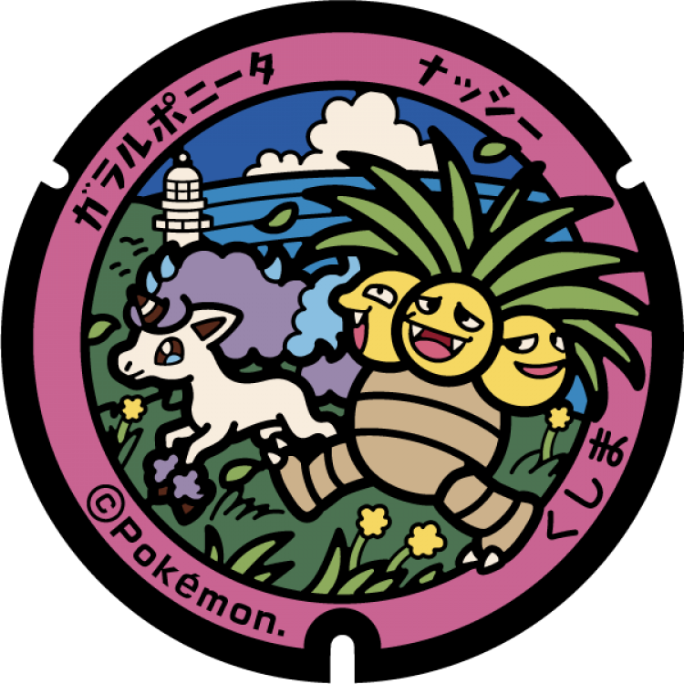
### 注目のポケモン: ナッシー, ガラルポニータ
### 座標: 31.36627, 131.332809
---
# 日向市
## 116

### 注目のポケモン: ナッシー, オドリドリ
### 座標: 32.425392, 131.627736
---
# 小林市
## 115

### 注目のポケモン: ナッシー, モクロー
### 座標: 31.957509, 131.125965
---
# 日南市
## 114

### 注目のポケモン: アローラナッシー, ダイノーズ
### 座標: 31.58793, 131.401706
---
# 延岡市
## 113
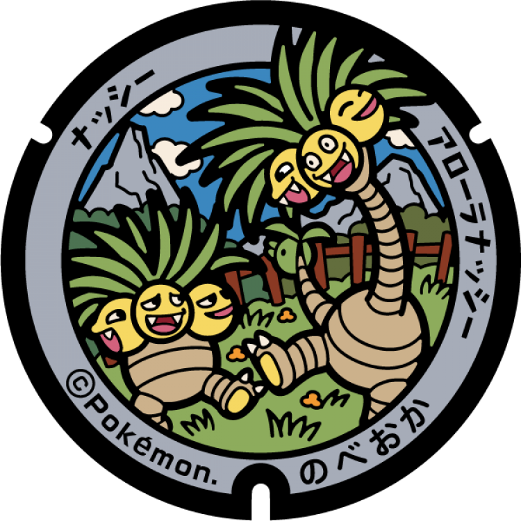
### 注目のポケモン: ナッシー, アローラナッシー
### 座標: 32.684711, 131.801103
---
# 都城市
## 112
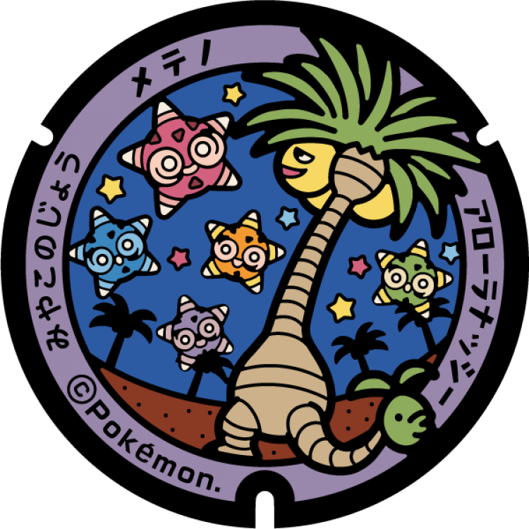
### 注目のポケモン: アローラナッシー, メテノ
### 座標: 31.725213, 131.066189
---
# 宮崎市
## 111
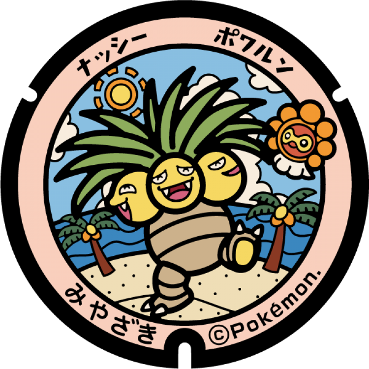
### 注目のポケモン: ナッシー, ポワルン
### 座標: 31.807505, 131.457839
---