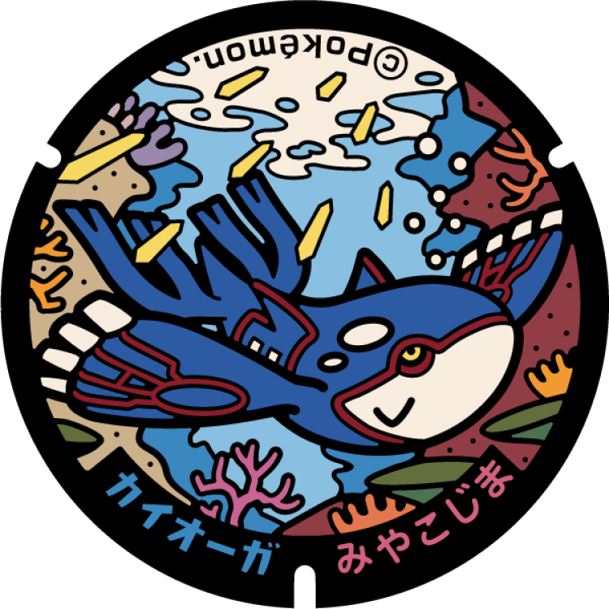
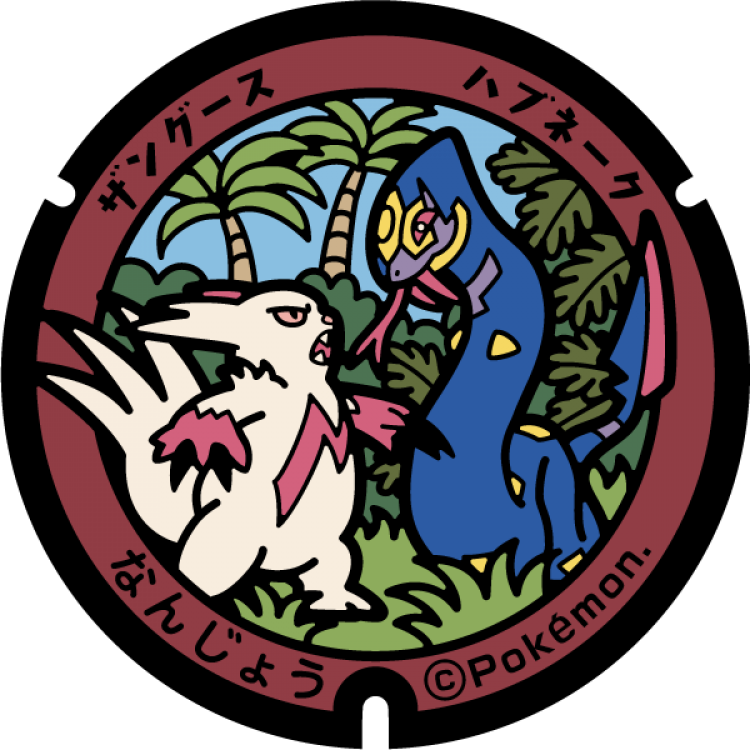
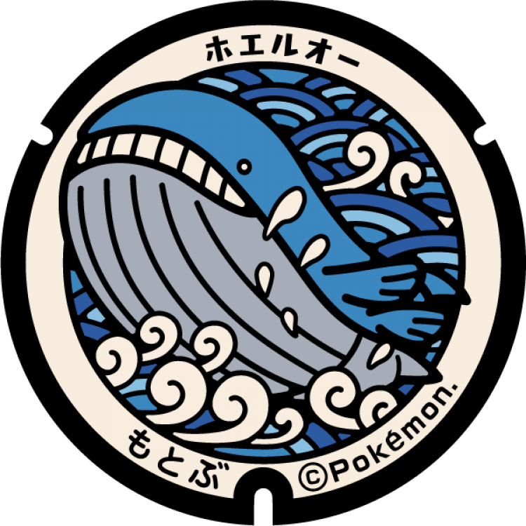
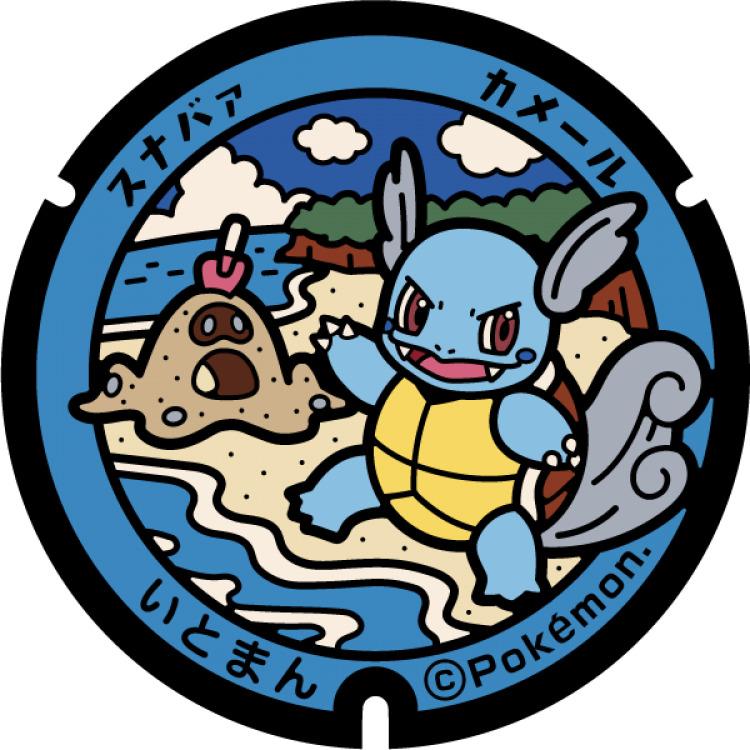
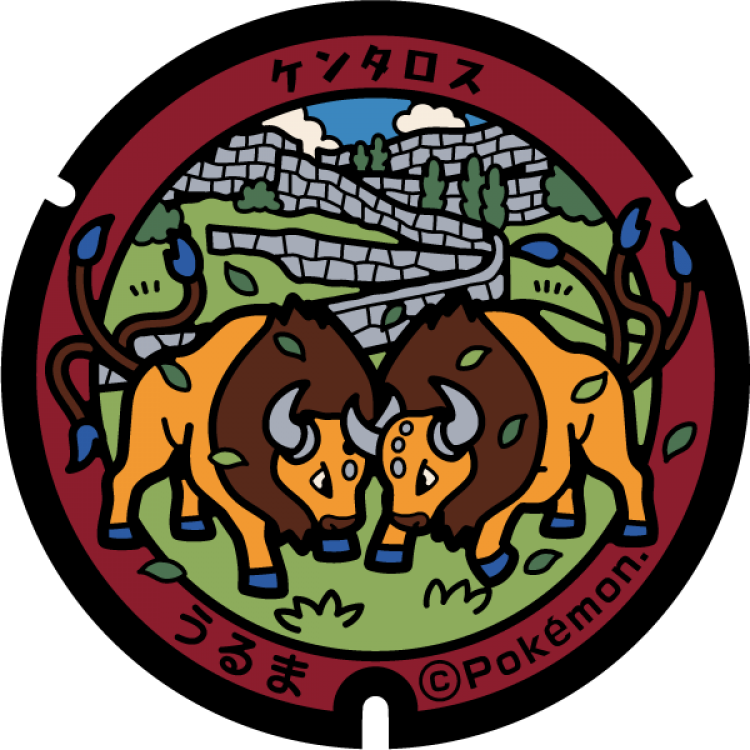

# 宮古島市
## 236

### 注目のポケモン: カイオーガ
### 座標: 24.734962, 125.263088
---
# 石垣市
## 235

### 注目のポケモン: マンタイン, マンタイン
### 座標: 24.337418, 124.156947
---
# 南城市
## 234

### 注目のポケモン: ハブネーク, ザングース
### 座標: 26.169111, 127.827083
---
# 豊見城市
## 233

### 注目のポケモン: キバゴ, ジャラコ
### 座標: 26.157557, 127.656121
---
# 本部町
## 232

### 注目のポケモン: ホエルオー
### 座標: 26.691694, 127.877972
---
# 糸満市
## 231

### 注目のポケモン: カメール, スナバァ
### 座標: 26.13828, 127.661336
---
# 名護市
## 230

### 注目のポケモン: エモンガ, ツツケラ
### 座標: 26.587352, 127.985744
---
# 浦添市
## 229

### 注目のポケモン: ソルロック, ポポッコ
### 座標: 26.246168, 127.688346
---
# うるま市
## 177

### 注目のポケモン: ケンタロス
### 座標: 26.436181, 127.826113
---
# 沖縄市
## 176

### 注目のポケモン: バチンキー, ラランテス
### 座標: 26.32766, 127.803001
---
# 宜野湾市
## 175

### 注目のポケモン: サニーゴ, ラブカス
### 座標: 26.28139, 127.732214
---
# 那覇市
## 174

### 注目のポケモン: ウインディ
### 座標: 26.21641, 127.68942
---