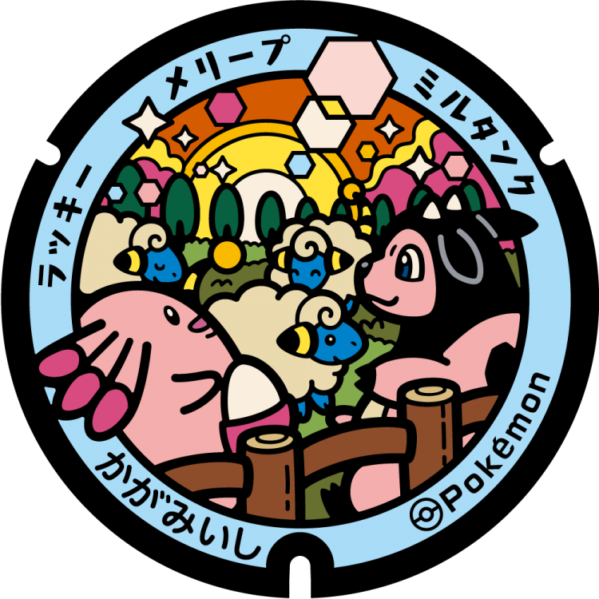
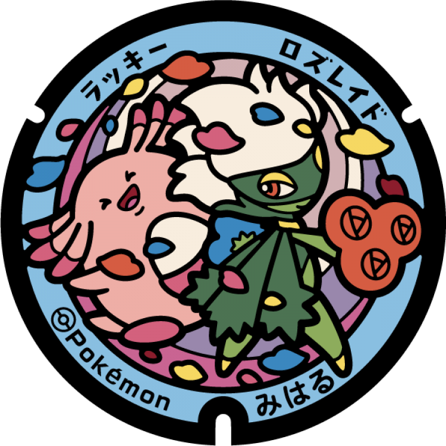
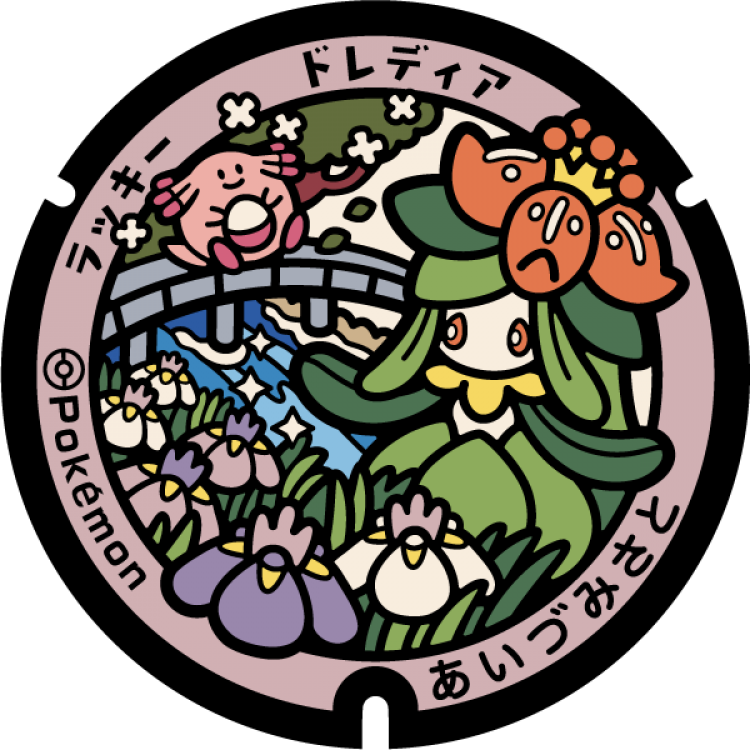

# 白河市
## 376

### 注目のポケモン: ラッキー, ダルマッカ
### 座標: 37.1296, 140.212974
---
# 平田村
## 375

### 注目のポケモン: ラッキー, カプサイジ, スコヴィラン
### 座標: 37.262128, 140.547538
---
# 広野町
## 374

### 注目のポケモン: ラッキー, ヤンヤンマ
### 座標: 37.23297, 141.0018
---
# 国見町
## 373

### 注目のポケモン: ラッキー, ピンプク, クルマユ, タブンネ
### 座標: 37.872639, 140.546861
---
# 湯川村
## 372

### 注目のポケモン: ラッキー, アブリー, ラルトス
### 座標: 37.55742, 139.862167
---
# 棚倉町
## 371

### 注目のポケモン: ラッキー, ニョロトノ, カジリガメ
### 座標: 37.029237, 140.387151
---
# 鏡石町
## 370

### 注目のポケモン: ラッキー, ミルタンク, メリープ
### 座標: 37.251117, 140.347153
---
# 会津坂下町
## 369

### 注目のポケモン: ラッキー, カイリキー
### 座標: 37.56046, 139.821186
---
# 三春町
## 287

### 注目のポケモン: ラッキー, ロズレイド
### 座標: 37.4433, 140.49124
---
# ファイアロー
## 286

### 注目のポケモン: ラッキー, ハピナス
### 座標: 37.093175, 140.529749
---
# 矢吹町
## 285

### 注目のポケモン: ラッキー, ファイアロー
### 座標: 37.21842, 140.335635
---
# 西郷村
## 284

### 注目のポケモン: ラッキー, ウパー
### 座標: 37.1399, 140.15467
---
# 会津美里町
## 283

### 注目のポケモン: ラッキー, ドレディア
### 座標: 37.455169, 139.840297
---
# 猪苗代町
## 282

### 注目のポケモン: ラッキー, ハヤシガメ, スワンナ
### 座標: 37.538118, 140.107717
---
# 北塩原村
## 281

### 注目のポケモン: ラッキー, バニリッチ
### 座標: 37.656175, 140.089399
---
# 伊達市
## 280

### 注目のポケモン: ラッキー, ゴリランダー
### 座標: 37.760799, 140.691402
---
# 二本松市
## 279

### 注目のポケモン: ラッキー, ペロッパフ
### 座標: 37.593347, 140.464001
---
# 飯舘村
## 254

### 注目のポケモン: ラッキー, フラエッテ
### 座標: 37.698145, 140.735552
---
# 双葉町
## 253

### 注目のポケモン: ラッキー, ヒマナッツ
### 座標: 37.45745, 141.02692
---
# 昭和村
## 252

### 注目のポケモン: ラッキー, クルミル
### 座標: 37.325691, 139.630641
---
# 柳津町
## 251

### 注目のポケモン: ラッキー, ピンプク
### 座標: 37.528189, 139.722662
---
# 南会津町
## 250

### 注目のポケモン: ラッキー, ドッコラー
### 座標: 37.20572, 139.777874
---
# 郡山市
## 249

### 注目のポケモン: ラッキー, プリン
### 座標: 37.396784, 140.35612
---
# 会津若松市
## 248

### 注目のポケモン: ラッキー, エルレイド
### 座標: 37.461146, 139.927445
---
# 福島市
## 247

### 注目のポケモン: ラッキー, モルペコ
### 座標: 37.80441, 140.41091
---
# 川内村
## 96

### 注目のポケモン: ラッキー, ヨワシ, サシカマス
### 座標: 37.329458, 140.82162
---
# 田村市
## 95

### 注目のポケモン: ラッキー, ヘラクロス
### 座標: 37.344423, 140.674289
---
# 川俣町
## 94

### 注目のポケモン: ラッキー, カラサリス, マユルド
### 座標: 37.667671, 140.57675
---
# いわき市
## 93

### 注目のポケモン: ラッキー, キレイハナ
### 座標: 37.107308, 140.993274
---
# 楢葉町
## 92

### 注目のポケモン: ラッキー, ラビフット
### 座標: 37.250144, 140.997579
---
# 浪江町
## 91

### 注目のポケモン: ラッキー
### 座標: 37.496395, 141.000919
---
# 南相馬市
## 90

### 注目のポケモン: ラッキー, ギャロップ
### 座標: 37.63577, 140.983041
---
# 相馬市
## 89

### 注目のポケモン: ラッキー, ポニータ
### 座標: 37.827708, 140.963244
---
# 新地町
## 88

### 注目のポケモン: ラッキー, オドシシ
### 座標: 37.878748, 140.925027
---