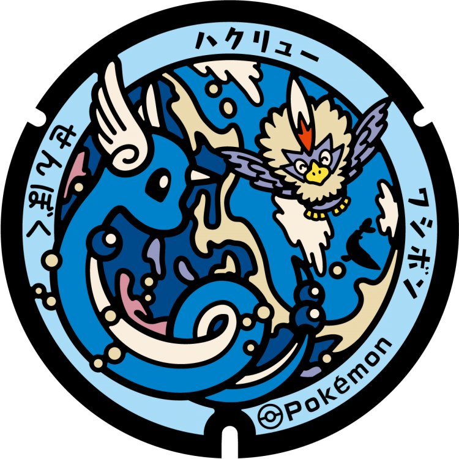
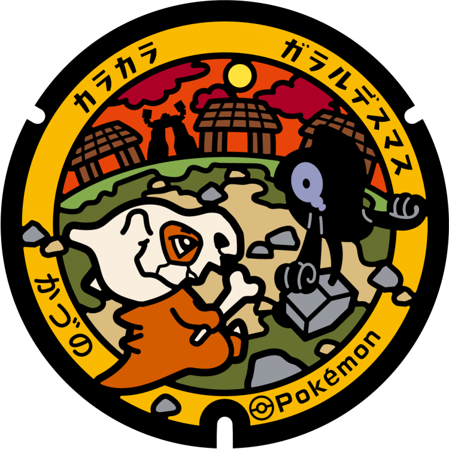

# 仙北市
## 322

### 注目のポケモン: ハクリュー, ワシボン
### 座標: 39.699992, 140.662631
---
# 鹿角市
## 321

### 注目のポケモン: カラカラ, ガラルデスマス
### 座標: 40.181213, 140.785474
---
# 男鹿市
## 320

### 注目のポケモン: オニゴーリ, ヘルガー, グランブル
### 座標: 39.88201, 139.84772
---
# 横手市
## 319

### 注目のポケモン: パピモッチ, ユキワラシ
### 座標: 39.293561, 140.545941
---
# 秋田市
## 318

### 注目のポケモン: ガーディ, イワンコ, バウッツェル
### 座標: 39.752642, 140.061295
---