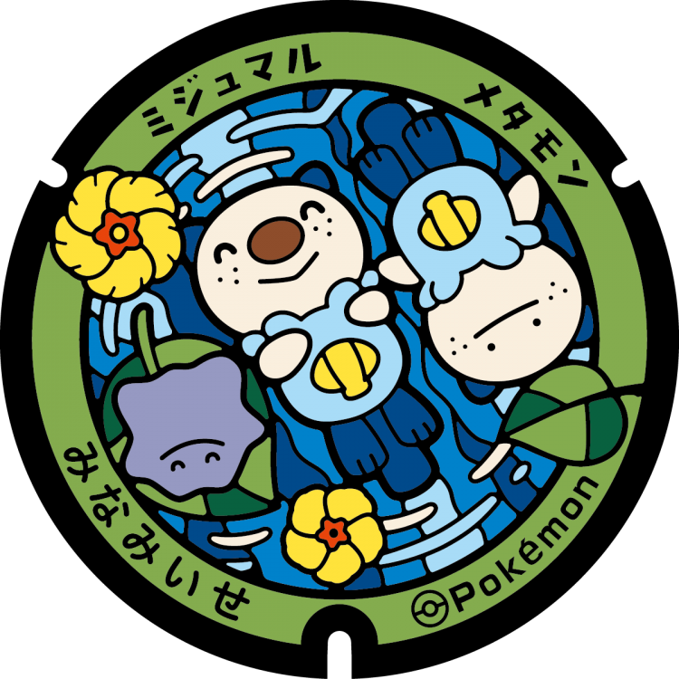
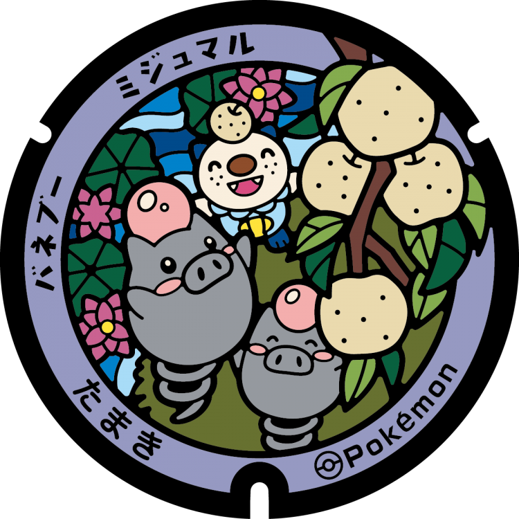
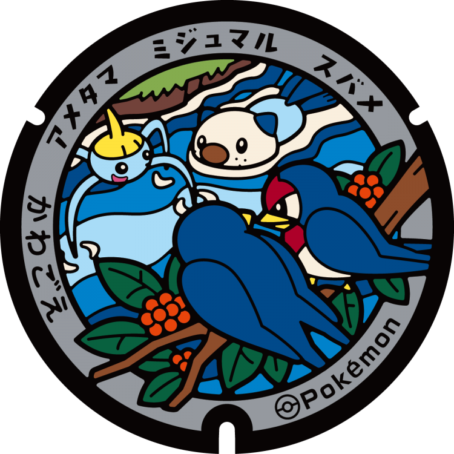
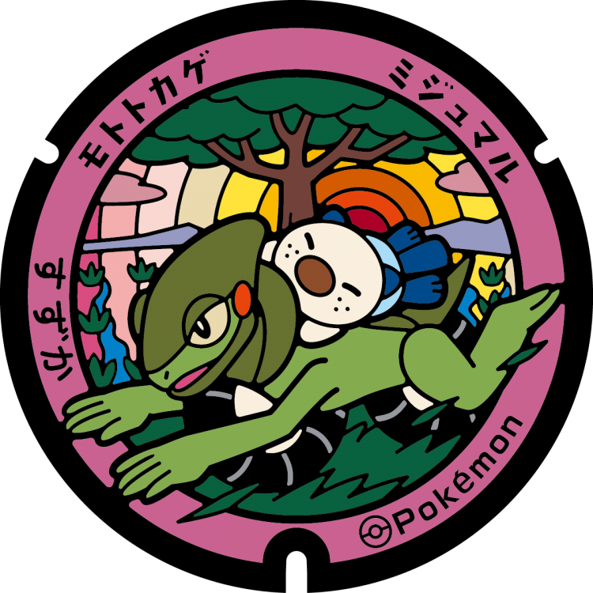
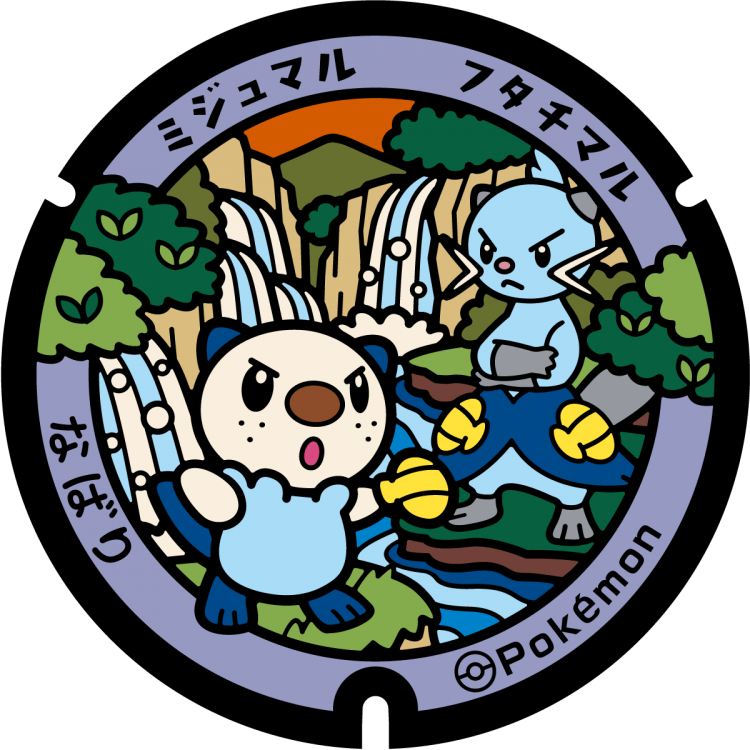
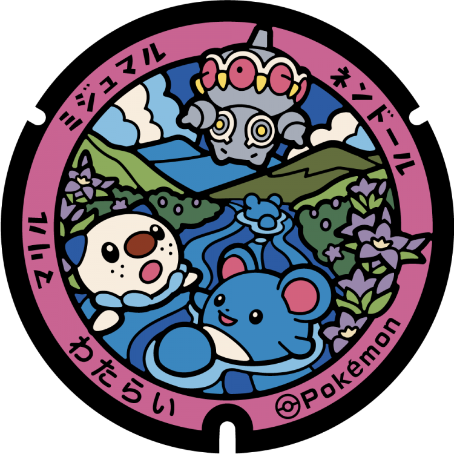
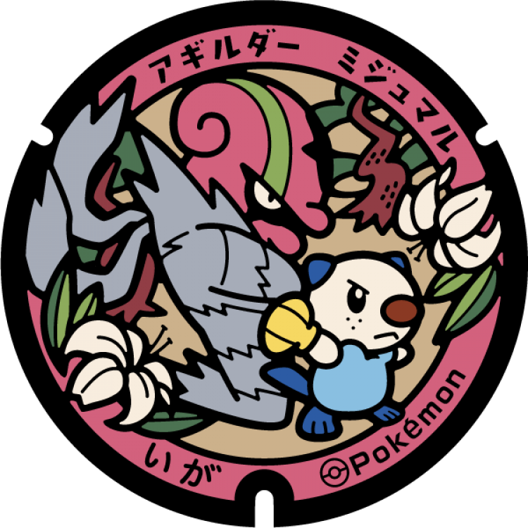

# 南伊勢町
## 335

### 注目のポケモン: ミジュマル, メタモン
### 座標: 34.268997, 136.54891
---
# 玉城町
## 334

### 注目のポケモン: ミジュマル, バネブー
### 座標: 34.467979, 136.587695
---
# 松阪市
## 333

### 注目のポケモン: ミジュマル, ニャース
### 座標: 34.578655, 136.519839
---
# 多気町
## 332

### 注目のポケモン: ミジュマル, グルトン, ゴマゾウ
### 座標: 34.46611, 136.55374
---
# 川越町
## 331

### 注目のポケモン: ミジュマル, スバメ, アメタマ
### 座標: 35.01731, 136.659834
---
# 鈴鹿市
## 330

### 注目のポケモン: ミジュマル, モトトカゲ
### 座標: 34.823065, 136.584609
---
# 東員町
## 310

### 注目のポケモン: ミジュマル, マネネ
### 座標: 35.073792, 136.581108
---
# 木曽岬町
## 309

### 注目のポケモン: ミジュマル, ゴーリキー
### 座標: 35.075575, 136.731805
---
# 名張市
## 308

### 注目のポケモン: ミジュマル, フタチマル
### 座標: 34.626212, 136.088911
---
# 紀宝町
## 297

### 注目のポケモン: ミジュマル, プロトーガ
### 座標: 33.769742, 136.028632
---
# 度会町
## 296

### 注目のポケモン: ミジュマル, マリル, ネンドール
### 座標: 34.432076, 136.631333
---
# 大台町
## 295

### 注目のポケモン: ミジュマル, ヤナップ, ビリジオン
### 座標: 34.356007, 136.34766
---
# 明和町
## 294

### 注目のポケモン: ミジュマル, アマカジ, フラージェス
### 座標: 34.53995, 136.61852
---
# 朝日町
## 293

### 注目のポケモン: ミジュマル, エルフーン
### 座標: 35.037263, 136.658857
---
# 亀山市
## 292

### 注目のポケモン: ミジュマル, リオル, ドダイトス
### 座標: 34.859472, 136.447465
---
# 伊賀市
## 246

### 注目のポケモン: ミジュマル, アギルダー
### 座標: 34.767543, 136.130081
---
# 志摩市
## 245

### 注目のポケモン: ミジュマル, パールル
### 座標: 34.275988, 136.898317
---
# 熊野市
## 244

### 注目のポケモン: ミジュマル, ヌイコグマ
### 座標: 33.891753, 136.116125
---
# 鳥羽市
## 243

### 注目のポケモン: ミジュマル, ジュゴン
### 座標: 34.48691, 136.844825
---
# 伊勢市
## 242

### 注目のポケモン: ミジュマル, リーシャン
### 座標: 34.487787, 136.707097
---
# 四日市市
## 241

### 注目のポケモン: ミジュマル, ダイケンキ
### 座標: 34.952407, 136.611964
---
# 津市
## 240

### 注目のポケモン: ミジュマル
### 座標: 34.718493, 136.5108
---