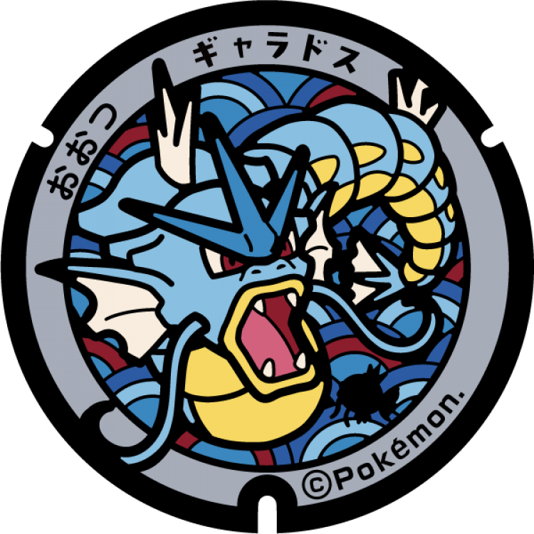

# 甲賀市
## 239

### 注目のポケモン: ゲッコウガ, ゲコガシラ
### 座標: 34.900437, 136.229399
---
## 238

### 注目のポケモン: ゲッコウガ
### 座標: 34.960528, 136.165168
---
## 237

### 注目のポケモン: ゲッコウガ
### 座標: 34.919591, 136.170196
---
# 大津市
## 105

### 注目のポケモン: ギャラドス
### 座標: 34.9981, 135.8946
---
## 104

### 注目のポケモン: ギャラドス
### 座標: 35.0102, 135.8699
---