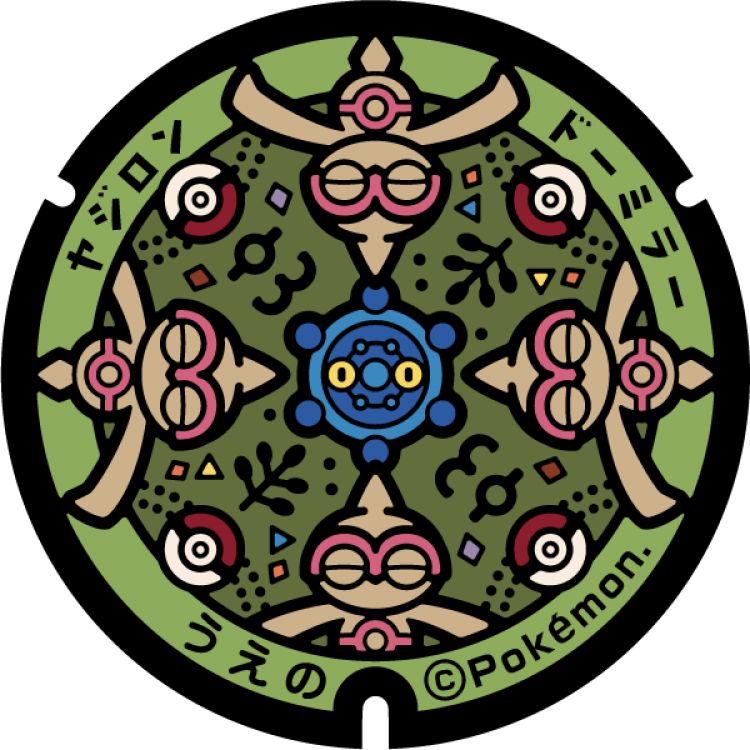
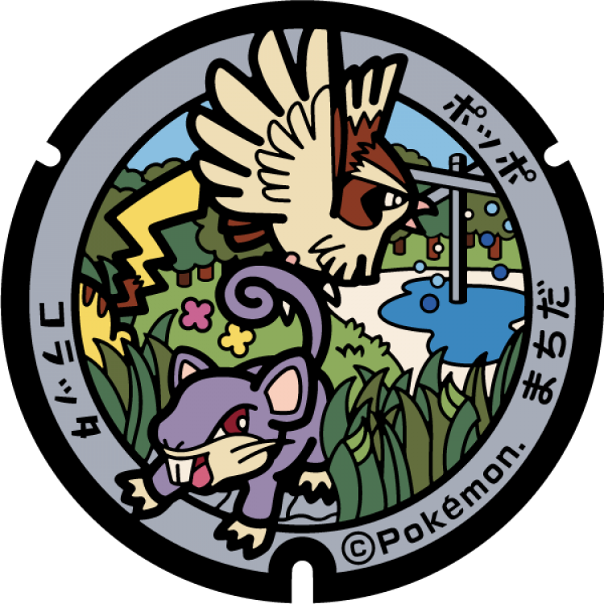

# 台東区上野
## 173

### 注目のポケモン: ヤジロン, ドーミラー
### 座標: 35.717715, 139.775397
---
## 172

### 注目のポケモン: チゴラス, ポケモンずかんへ
### 座標: 35.71681, 139.776397
---
# 小笠原村
## 156

### 注目のポケモン: ミュウ
### 座標: 27.09448, 142.19235
---
## 155

### 注目のポケモン: カメックス
### 座標: 27.094596, 142.192781
---
## 154

### 注目のポケモン: リザードン
### 座標: 27.094708, 142.193279
---
## 153

### 注目のポケモン: フシギバナ
### 座標: 27.094863, 142.194033
---
# 町田市
## 103

### 注目のポケモン: ニョロモ
### 座標: 35.546713, 139.45398
---
## 102

### 注目のポケモン: ポッポ, コラッタ
### 座標: 35.545645, 139.45488
---
## 101

### 注目のポケモン: ナゾノクサ, ビードル, キャタピー
### 座標: 35.546111, 139.45436
---
## 100

### 注目のポケモン: ゼニガメ
### 座標: 35.545302, 139.45501
---
## 99

### 注目のポケモン: ヒトカゲ
### 座標: 35.548171, 139.4513
---
## 98

### 注目のポケモン: フシギダネ
### 座標: 35.548108, 139.45034
---